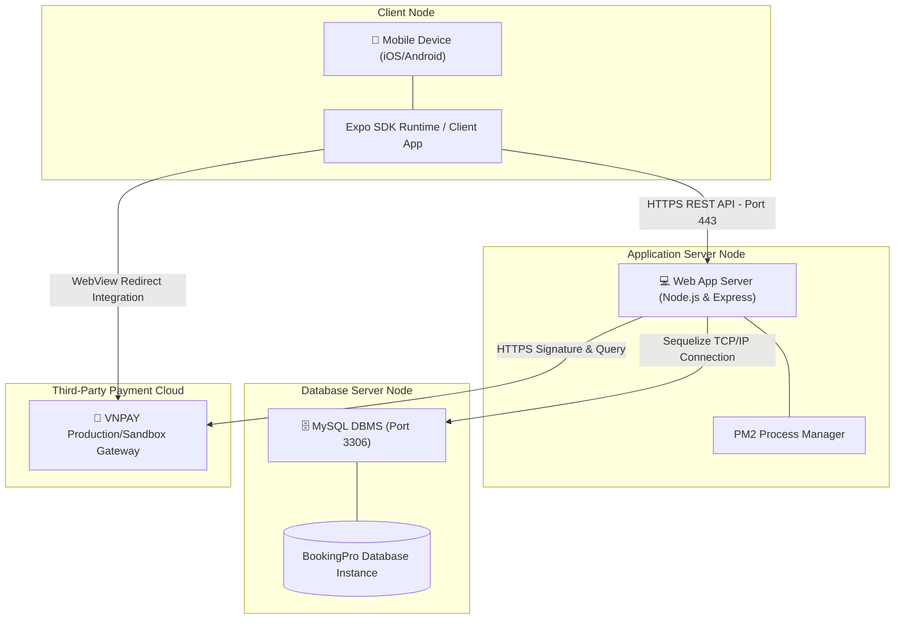

# BÁO CÁO ĐỒ ÁN: HỆ THỐNG QUẢN LÝ ĐẶT LỊCH & THANH TOÁN DỊCH VỤ (BOOKINGPRO)

---

## CHƯƠNG 1. GIỚI THIỆU ĐỀ TÀI

### 1.1 Giới thiệu bài toán

#### Bối cảnh
Trong kỷ nguyên số, nhu cầu đặt lịch dịch vụ trực tuyến (làm đẹp, y tế, giáo dục, sửa chữa, tư vấn...) đang tăng trưởng mạnh mẽ. Khách hàng mong muốn sự tiện lợi, nhanh chóng, có thể chủ động lựa chọn thời gian và nhân viên phục vụ mọi lúc mọi nơi mà không cần gọi điện thoại hay đến trực tiếp chờ đợi.

#### Vấn đề thực tế
Các doanh nghiệp cung cấp dịch vụ đối mặt với nhiều thách thức lớn trong việc vận hành thủ công:
*   **Trùng lịch (Overbooking):** Việc ghi chép thủ công dễ dẫn đến tình trạng hai khách hàng đặt cùng một nhân viên vào cùng một khung giờ.
*   **Quản lý lịch làm việc phức tạp:** Lịch làm việc của nhân viên thay đổi liên tục theo tuần/ngày, việc phân bổ dịch vụ và slot thời gian rất khó kiểm soát.
*   **Hủy lịch và thất thu:** Khách hàng đặt lịch nhưng không đến (no-show) gây lãng phí tài nguyên và thất thu cho doanh nghiệp nếu không có cơ chế đặt cọc hoặc thanh toán trước trực tuyến.
*   **Thông tin không đồng bộ:** Khách hàng không nhận được nhắc nhở lịch hẹn, nhân viên không nắm bắt được lịch làm việc thời gian thực.

#### Nhu cầu hệ thống đặt lịch
Từ thực trạng trên, việc xây dựng một hệ thống quản lý đặt lịch chuyên nghiệp như **BookingPro** là vô cùng cấp thiết. Hệ thống này cần phải giải quyết triệt để các vấn đề tự động hóa quy trình đặt lịch, kiểm tra chồng chéo thời gian thực, hỗ trợ thanh toán trực tuyến qua các cổng thanh toán uy tín và tự động hóa việc gửi thông báo, nhắc nhở.

### 1.2 Mục tiêu đề tài

#### Mục tiêu nghiệp vụ
*   Xây dựng quy trình đặt lịch khép kín và tự động: Tìm kiếm dịch vụ -> Chọn nhân viên -> Chọn thời gian trống -> Thanh toán trực tuyến -> Xác nhận và thực hiện -> Đánh giá hoàn thành.
*   Quản lý lịch làm việc của nhân viên theo ngày/giờ thời gian thực.
*   Hỗ trợ thanh toán đa phương thức (VNPAY, COD) và áp dụng chính sách hủy lịch, hoàn tiền tự động dựa trên thời gian hủy thực tế.
*   Quản trị viên có bảng điều khiển trực quan để quản lý dịch vụ, nhân viên, lịch trực và báo cáo doanh thu chi tiết.

#### Mục tiêu kỹ thuật
Để đảm bảo hệ thống có thể vận hành ổn định lâu dài và thích ứng tốt với sự thay đổi của doanh nghiệp, kiến trúc phần mềm cần đáp ứng các tiêu chuẩn:
*   **Dễ mở rộng (Extensibility):** Dễ dàng thêm cổng thanh toán mới (như MoMo, ZaloPay), thêm trạng thái lịch hẹn mới, hoặc tích hợp thêm kênh gửi thông báo (Email, SMS) mà không phá vỡ kiến trúc cũ.
*   **Dễ bảo trì (Maintainability):** Codebase phân tách rạch ròi các tầng nghiệp vụ, mỗi lớp giữ một nhiệm vụ duy nhất để khi xảy ra lỗi có thể nhanh chóng cô lập và xử lý.
*   **Tái sử dụng (Reusability):** Các thành phần xử lý truy cập dữ liệu, định cấu hình hoặc logic nghiệp vụ dùng chung được đóng gói để tái sử dụng ở nhiều nơi.
*   **Áp dụng Design Pattern bài bản:** Hiện thực hóa các mẫu thiết kế hướng đối tượng (Singleton, Strategy, State, Observer, Repository) nhằm giải quyết các bài toán biến động phức tạp trong nghiệp vụ đặt lịch và thanh toán.

### 1.3 Công nghệ sử dụng

Hệ thống được thiết kế theo định hướng đa nền tảng và tối ưu hóa hiệu năng:
*   **React Native (Expo SDK 54):** Framework phát triển ứng dụng di động đa nền tảng (iOS & Android) giúp chia sẻ codebase chung, giao diện hiện đại, mượt mà.
*   **NodeJS & Express:** Nền tảng phía backend nhẹ, hiệu năng cao, cơ chế non-blocking I/O phù hợp xử lý lượng request đồng thời lớn.
*   **MySQL:** Hệ quản trị cơ sở dữ liệu quan hệ mạnh mẽ, đảm bảo tính toàn vẹn dữ liệu (ACID) cho các giao dịch đặt lịch và thanh toán.
*   **Sequelize ORM:** Thư viện ánh xạ cơ sở dữ liệu quan hệ sang đối tượng (ORM) cho NodeJS, giúp quản lý database schema, quan hệ giữa các bảng và truy vấn an toàn, dễ dàng.
*   **JWT (JSON Web Token):** Cơ chế xác thực không trạng thái (stateless authentication) an toàn giữa Client di động và Server Backend.
*   **VNPAY Gateway:** Cổng thanh toán quốc gia uy tín giúp xử lý các giao dịch thẻ ATM nội địa, thẻ quốc tế và ứng dụng ngân hàng thông qua QR Code.

---

## CHƯƠNG 2. PHÂN TÍCH YÊU CẦU

### 2.1 Các tác nhân (Actors)

Hệ thống bao gồm 5 tác nhân tương tác chính:
1.  **Khách hàng (Customer):** Người dùng ứng dụng để đăng ký tài khoản, xem dịch vụ, thực hiện đặt lịch, thanh toán trực tuyến, xem lịch sử đặt lịch và nhận thông báo.
2.  **Nhân viên (Staff):** Người trực tiếp thực hiện dịch vụ. Nhân viên có thể xem lịch làm việc cá nhân của mình, xác nhận booking, cập nhật trạng thái hoàn thành dịch vụ và nhận thông báo khi có lịch hẹn mới.
3.  **Quản trị viên (Admin):** Người quản lý toàn bộ hệ thống. Admin có quyền quản lý danh mục, dịch vụ, phân công lịch làm việc cho nhân viên, phê duyệt các yêu cầu hoàn tiền và xem báo cáo thống kê doanh thu.
4.  **Hệ thống VNPAY (External System):** Xử lý giao dịch thanh toán trực tuyến, mã hóa chữ ký số và gọi webhook (IPN) gửi kết quả giao dịch về cho server của ứng dụng.
5.  **Hệ thống Scheduler (Cron Job):** Tác nhân tự động chạy ngầm theo chu kỳ thời gian (ví dụ: mỗi 5 phút) để quét các booking quá hạn thanh toán hoặc quá giờ hẹn để tự động hủy lịch.

### 2.2 Sơ đồ Use Case (Use Case Diagram)

Dưới đây là sơ đồ Use Case tổng thể mô tả mối quan hệ giữa các tác nhân và chức năng hệ thống:

```mermaid
graph TB
    subgraph "Hệ thống BookingPro"
        UC1["UC01: Đăng ký tài khoản"]
        UC2["UC02: Đăng nhập"]
        UC3["UC03: Xem danh sách dịch vụ"]
        UC5["UC05: Đặt lịch hẹn"]
        UC6["UC06: Thanh toán"]
        UC7["UC07: Xem lịch sử đặt lịch"]
        UC8["UC08: Hủy lịch hẹn & Hoàn tiền"]
        UC9["UC09: Xem thông báo"]

        UC10["UC10: Xem lịch làm việc"]
        UC11["UC11: Xác nhận booking"]
        UC12["UC12: Hoàn thành booking"]

        UC13["UC13: Quản lý danh mục & dịch vụ"]
        UC15["UC15: Quản lý nhân viên & lịch trực"]
        UC17["UC17: Xem báo cáo doanh thu"]

        UC18["UC18: Xử lý thanh toán online"]
        UC19["UC19: Callback IPN"]
        UC20["UC20: Tự động hủy booking quá hạn"]
    end

    Customer["👤 Khách hàng"]
    Staff["👨‍💼 Nhân viên"]
    Admin["👑 Quản trị viên"]
    VNPAY["🏦 VNPAY Gateway"]
    CRON["⏰ Hệ thống Cron Job"]

    Customer --> UC1
    Customer --> UC2
    Customer --> UC3
    Customer --> UC5
    Customer --> UC6
    Customer --> UC7
    Customer --> UC8
    Customer --> UC9

    Staff --> UC2
    Staff --> UC10
    Staff --> UC11
    Staff --> UC12
    Staff --> UC9

    Admin --> UC2
    Admin --> UC13
    Admin --> UC15
    Admin --> UC17

    UC6 --> VNPAY
    VNPAY --> UC18
    VNPAY --> UC19

    CRON --> UC20
```



### 2.3 Đặc tả các Use Case chính

#### UC05: Đặt lịch hẹn (Booking)
*   **Actor:** Khách hàng
*   **Mô tả:** Khách hàng chọn dịch vụ, lựa chọn nhân viên mong muốn, ngày hẹn và khung giờ trống để tiến hành đặt lịch.
*   **Tiền điều kiện:** Khách hàng đã đăng nhập vào ứng dụng di động.
*   **Hậu điều kiện:** Một bản ghi booking được tạo với trạng thái ban đầu là `pending` hoặc `draft`, các bên liên quan được gửi thông báo.
*   **Luồng sự kiện chính:**
    1. Khách hàng lựa chọn dịch vụ từ trang chủ.
    2. Hệ thống tải danh sách các nhân viên có lịch làm việc hỗ trợ dịch vụ này trong ngày được chọn.
    3. Khách hàng chọn nhân viên và chọn ngày muốn hẹn.
    4. Hệ thống kiểm tra lịch bận của nhân viên và hiển thị các khung giờ (slots) còn trống.
    5. Khách hàng chọn khung giờ phù hợp và nhập ghi chú yêu cầu.
    6. Hệ thống thực thi **Thuật toán kiểm tra xung đột slot thời gian** để đảm bảo không bị trùng lặp lịch bận thực tế.
    7. Hệ thống khởi tạo bản ghi booking với trạng thái mặc định.
    8. Hệ thống kích hoạt gửi thông báo qua Observer đến nhân viên được đặt lịch.

#### UC06: Thanh toán (Payment)
*   **Actor:** Khách hàng, Cổng thanh toán VNPAY
*   **Mô tả:** Khách hàng chọn phương thức thanh toán để thanh toán hóa đơn booking dịch vụ đã đặt.
*   **Tiền điều kiện:** Bản ghi booking đã được khởi tạo thành công.
*   **Hậu điều kiện:** Hóa đơn thanh toán được cập nhật trạng thái `success`, trạng thái booking chuyển từ `draft` sang `confirmed` (nếu trả trước qua VNPAY).
*   **Luồng sự kiện chính:**
    1. Khách hàng lựa chọn phương thức thanh toán mong muốn (VNPAY hoặc COD - thanh toán tại quầy).
    2. Hệ thống áp dụng **Strategy Pattern** dựa trên lựa chọn của khách hàng:
        *   **Nếu chọn VNPAY:** Hệ thống chuyển giao dịch cho `VNPayStrategy` để tạo URL liên kết thanh toán an toàn kèm chữ ký HMAC SHA512. Ứng dụng di động mở WebView hiển thị giao diện thanh toán VNPAY để khách hàng nhập thông tin thẻ.
        *   **Nếu chọn COD:** Hệ thống áp dụng `CODStrategy`, tạo hóa đơn thanh toán trực tiếp ở trạng thái chờ xử lý tại quầy (`pending`).
    3. Sau khi khách hàng hoàn tất thao tác thanh toán trên cổng VNPAY, cổng thanh toán sẽ redirect khách hàng về ứng dụng di động và gửi một callback an toàn (IPN) về Backend.
    4. Backend xác thực chữ ký bảo mật từ VNPAY. Nếu hợp lệ, hệ thống cập nhật trạng thái hóa đơn là thành công (`success`).
    5. Áp dụng **State Pattern**, trạng thái booking tự động chuyển dịch sang `confirmed`.
    6. Gửi thông báo tự động (thông qua Observer) cho khách hàng và nhân viên.

#### UC11: Xác nhận booking (Confirm Booking)
*   **Actor:** Nhân viên, Quản trị viên
*   **Mô tả:** Nhân viên kiểm tra và xác nhận lịch hẹn của khách hàng đặt mình khi khách hàng chọn hình thức thanh toán tại quầy (COD).
*   **Tiền điều kiện:** Booking có trạng thái `pending` và phương thức thanh toán là COD.
*   **Hậu điều kiện:** Booking chuyển sang trạng thái `confirmed`.
*   **Luồng sự kiện chính:**
    1. Nhân viên truy cập vào Dashboard cá nhân trên ứng dụng.
    2. Hệ thống hiển thị danh sách các booking đang ở trạng thái chờ xác nhận (`pending`).
    3. Nhân viên nhấn nút "Xác nhận lịch hẹn".
    4. Hệ thống thực thi cơ chế của **State Pattern** để kiểm tra tính hợp lệ của việc chuyển dịch trạng thái: `pending` -> `confirmed`.
    5. Trạng thái được cập nhật thành công xuống cơ sở dữ liệu.
    6. Observer Pattern tự động kích hoạt gửi thông báo đẩy đến điện thoại của khách hàng để thông báo lịch hẹn đã được xác nhận.

### 2.4 Yêu cầu phi chức năng (Non-Functional Requirements)

*   **Security (Bảo mật):** 
    *   Mật khẩu người dùng bắt buộc phải được mã hóa một chiều bằng thuật toán `bcrypt` trước khi lưu vào DB.
    *   Toàn bộ API yêu cầu bảo mật phải được bảo vệ qua tầng Middleware kiểm tra tính hợp lệ của JSON Web Token (JWT).
    *   Giao thức thanh toán trực tuyến phải đảm bảo tính toàn vẹn dữ liệu bằng mã xác thực hash HMAC-SHA512.
*   **Maintainability (Dễ bảo trì):** Codebase phân tách cấu trúc thư mục rõ ràng theo các tầng nghiệp vụ riêng biệt. Mỗi file mã nguồn logic nghiệp vụ khống chế tối đa dưới 300 dòng code.
*   **Extensibility (Dễ mở rộng):** Khi phát sinh nhu cầu tích hợp cổng thanh toán mới (như Momo, PayPal) hoặc kênh thông báo mới (SMS, Email), hệ thống có thể tích hợp bằng cách viết các lớp kế thừa mới mà không cần can thiệp chỉnh sửa logic cốt lõi có sẵn.
*   **Reliability (Độ tin cậy):** Đảm bảo xử lý tranh chấp tài nguyên (Concurrency control) khi nhiều khách hàng cùng đặt một slot thời gian của một nhân viên cùng lúc, không để xảy ra tình trạng "đặt chồng chéo".
*   **Performance (Hiệu năng):** Thời gian phản hồi trung bình của các API kiểm tra trống slot và tạo lịch hẹn phải dưới 200ms trong điều kiện mạng bình thường.

### 2.5 Các vấn đề thiết kế cần giải quyết

Để xây dựng một hệ thống đặt lịch đạt chuẩn doanh nghiệp, kiến trúc phần mềm bắt buộc phải giải quyết triệt để 4 vấn đề thiết kế lớn sau:
*   **P1 - Tích hợp nhiều phương thức thanh toán biến động:** Nghiệp vụ thanh toán đòi hỏi hệ thống phải hỗ trợ nhiều phương thức: thanh toán trực tuyến (VNPAY), thanh toán tiền mặt tại quầy (COD) và tương lai có thể tích hợp ví điện tử MoMo, ZaloPay. Nếu viết bằng các câu lệnh rẽ nhánh `if-else` lồng nhau trong Service, code sẽ cực kỳ dài, khó đọc, vi phạm nguyên tắc Đóng/Mở (Open/Closed Principle).
*   **P2 - Quản lý vòng đời Booking phức tạp:** Một lịch hẹn có vòng đời chuyển trạng thái liên tục: `Draft` -> `Pending` -> `Confirmed` -> `Completed` / `Cancelled`. Các quy tắc chuyển dịch cực kỳ chặt chẽ (ví dụ: Không thể hủy lịch đã hoàn thành, không thể hoàn thành lịch đã hủy). Viết các điều kiện kiểm tra trạng thái thủ công bằng `switch-case` khắp nơi sẽ gây rò rỉ logic nghiệp vụ và khó kiểm soát lỗi.
*   **P3 - Tách biệt logic xử lý tác vụ ngoại biên khi có sự kiện (Event-Driven Notification):** Mỗi khi một booking được tạo hoặc thay đổi trạng thái, rất nhiều tác vụ phụ trợ phải diễn ra đồng thời: Lưu thông báo vào DB, gửi thông báo đẩy đến app, ghi log hệ thống, gửi email xác nhận. Logic này nếu gộp chung vào hàm xử lý nghiệp vụ chính sẽ làm cho Service bị phình to, vi phạm nguyên tắc Đơn trách nhiệm (Single Responsibility Principle).
*   **P4 - Độc lập logic nghiệp vụ với công nghệ truy cập Database:** Hệ thống hiện tại đang sử dụng Sequelize ORM để giao tiếp với MySQL. Nếu trong tương lai doanh nghiệp chuyển đổi sang một cơ sở dữ liệu khác (như PostgreSQL) hoặc đổi ORM khác, ta không thể đi sửa lại toàn bộ code xử lý nghiệp vụ ở tầng Service. Logic nghiệp vụ cần được cô lập hoàn toàn khỏi công nghệ truy cập dữ liệu.

---

## CHƯƠNG 3. QUYẾT ĐỊNH KIẾN TRÚC HỆ THỐNG

### 3.1 Các phương án kiến trúc

Khi thiết kế hệ thống BookingPro, nhóm phát triển đã đặt lên bàn cân 3 mô hình kiến trúc phổ biến hiện nay:
1.  **Client/Server truyền thống (2-Tier):** Ứng dụng client giao tiếp trực tiếp với cơ sở dữ liệu hoặc thông qua một tầng backend mỏng không phân lớp.
2.  **Kiến trúc 3 tầng (3-Tier Architecture):** Phân tách hệ thống thành 3 tầng vật lý/logic hoàn toàn độc lập: Presentation Tier (Giao diện), Business Logic Tier (Xử lý nghiệp vụ), và Data Tier (Cơ sở dữ liệu).
3.  **Kiến trúc hướng dịch vụ nhỏ (Microservices):** Chia nhỏ hệ thống thành các service chạy độc lập (Auth Service, Booking Service, Payment Service...), giao tiếp qua HTTP REST hoặc Message Queue.

### 3.2 Lý do lựa chọn 3-Tier

Nhóm phát triển quyết định lựa chọn **Kiến trúc 3 tầng (3-Tier)** kết hợp mô hình phân lớp **MVC** ở Backend vì các lý do sau:

#### Bảng so sánh và quyết định kiến trúc:

| Tiêu chí so sánh | Client/Server (2-Tier) | Kiến trúc 3-Tier (Lựa chọn) | Microservices |
| :--- | :--- | :--- | :--- |
| **Độ phức tạp triển khai** | Rất thấp, nhanh chóng | Trung bình, đòi hỏi phân tách lớp rõ ràng | Rất cao, đòi hỏi hạ tầng mạng và quản trị container phức tạp |
| **Khả năng bảo mật** | Rất thấp (dễ rò rỉ tài khoản DB về Client) | Cao (Client chỉ giao tiếp qua API Gateway bảo mật) | Rất cao (mỗi service có tường lửa và cơ chế bảo mật riêng) |
| **Khả năng bảo trì** | Khó khăn khi quy mô dự án tăng | Dễ dàng nhờ phân tách độc lập các tầng | Dễ bảo trì từng service nhưng khó kiểm soát toàn bộ hệ thống |
| **Khả năng mở rộng (Scale)** | Kém | Tốt (có thể scale độc lập Server API mà không đổi DB) | Cực tốt (scale độc lập từng dịch vụ chịu tải cao) |
| **Chi phí hạ tầng** | Thấp | Trung bình | Rất cao (cần nhiều server ảo hóa, log management) |

**Kết luận:** Kiến trúc 3-Tier là lựa chọn hài hòa nhất cho đồ án BookingPro. Kiến trúc này cung cấp tính bảo mật tốt (nhờ giấu database phía sau Express API), dễ dàng bảo trì mã nguồn, vừa đủ phức tạp để áp dụng các Design Pattern nâng cao mà không làm quá tải hạ tầng triển khai như Microservices.

### 3.3 Kiến trúc tổng thể

Sơ đồ dưới đây mô tả kiến trúc tổng thể của hệ thống BookingPro bao gồm các tầng logic và cách thức tương tác giữa chúng:

```mermaid
graph TB
    subgraph "PRESENTATION TIER (Client)"
        A["React Native App (Expo SDK 54)"]
        A1[Screens]
        A2[Components]
        A3[Navigation]
        A4["Theme / Design Tokens"]
        A --> A1
        A --> A2
        A --> A3
        A --> A4
    end

    subgraph "BUSINESS LOGIC TIER (Express API)"
        B[Express.js Server]
        B1[API Routes]
        B2[Controllers]
        B3[Services]
        B4[Middlewares]
        B5["Patterns (Strategy, State, Observer)"]
        B6["Cron Jobs (Reminder)"]
        B --> B1 --> B2 --> B3
        B --> B4
        B3 --> B5
        B --> B6
        B6 --> B3
    end

    subgraph "DATA TIER (Database)"
        C[MySQL Database]
        C1[Repositories]
        C2[Sequelize Models]
        C1 --> C2 --> C
    end

    A -->|"REST API (HTTP/JSON)"| B
    B3 --> C1

Để đảm bảo nguyên tắc phân tách trách nhiệm (Separation of Concerns), Backend của BookingPro triển khai mô hình cải tiến của MVC truyền thống, tích hợp thêm tầng Repository để tạo ra cấu trúc phân tầng nghiêm ngặt:

```
Request ──> Route ──> Middleware ──> Controller ──> Service ──> Repository ──> Model ──> Database
                                                                                            │
Response <──────────────────────────────────────────────────────────────────────────────────┘
```

*   **Tầng Route:** Định nghĩa các đường dẫn URL API và chuyển hướng request đến đúng Controller xử lý.
*   **Tầng Middleware:** Thực hiện kiểm tra quyền truy cập (Authentication/Authorization) và validate cấu trúc dữ liệu đầu vào của request trước khi cho phép đi sâu vào hệ thống.
*   **Tầng Controller:** Nhận dữ liệu đầu vào từ HTTP Request, phân tách tham số (body, query, params), gọi hàm nghiệp vụ tương ứng ở tầng Service và định dạng dữ liệu trả về dưới dạng JSON Response (kèm mã HTTP Status phù hợp).
*   **Tầng Service:** Nơi chứa **100% logic nghiệp vụ cốt lõi** của hệ thống. Tầng này trực tiếp áp dụng các Design Pattern để đưa ra quyết định xử lý và điều phối dữ liệu. Tầng Service hoàn toàn không biết đến sự tồn tại của HTTP request/response và cũng không tương tác trực tiếp với Database.
*   **Tầng Repository:** Đóng vai trò là lớp trừu tượng (Abstraction Layer) trung gian. Tầng này cung cấp các giao diện truy xuất dữ liệu chung (CRUD) và các query phức tạp, che giấu công nghệ ORM bên dưới.
*   **Tầng Model:** Khai báo cấu trúc bảng dữ liệu, kiểu dữ liệu và mối quan hệ ràng buộc (One-to-Many, Many-to-Many) giữa các thực thể bằng Sequelize.

### 3.6 Deployment Diagram

Sơ đồ triển khai dưới đây mô tả cách các thành phần phần mềm được phân bổ trên các node phần cứng thực tế và cách thức kết nối vật lý giữa chúng:



---

## CHƯƠNG 4. THIẾT KẾ HỆ THỐNG
### 4.1 Thiết kế dữ liệu và Mô hình thực thể liên kết (ERD)

Cơ sở dữ liệu đóng vai trò nền tảng trong việc định hình cách thức lưu trữ, truy xuất và quản lý toàn bộ thông tin của hệ thống BookingPro. Dựa trên tính chất của một hệ thống đặt lịch trực tuyến đòi hỏi tính nhất quán cao về dữ liệu giao dịch và các quan hệ thực thể chặt chẽ, hệ thống quyết định sử dụng cơ sở dữ liệu quan hệ (Relational Database) với hệ quản trị MySQL kết hợp cùng thư viện ánh xạ đối tượng Sequelize ORM. 

Mô hình thực thể liên kết (ERD) được chuẩn hóa ở dạng chuẩn 3 (3NF), xoay quanh thực thể trung tâm là `Booking`. Cụ thể, các bảng dữ liệu được thiết kế như sau:

**1. Nhóm thực thể người dùng và phân quyền:**
Bảng `users` lưu trữ toàn bộ thông tin định danh của người dùng trong hệ thống (gồm mã định danh, họ tên, email, số điện thoại, và mật khẩu đã được băm bảo mật). Cột `role` (kiểu ENUM) phân tách rõ ràng ba vai trò: `customer` (khách hàng), `staff` (nhân viên phục vụ) và `admin` (quản trị viên). Điều này giúp việc quản lý phiên đăng nhập và phân quyền truy cập tại tầng Middleware trở nên đồng nhất, giảm bớt sự dư thừa khi không cần phải tạo các bảng riêng rẽ cho từng loại người dùng.

**2. Nhóm thực thể dịch vụ và lịch làm việc:**
Hệ thống tổ chức dịch vụ theo mô hình phân cấp: Bảng `categories` chứa thông tin danh mục, và bảng `services` chứa thông tin chi tiết từng dịch vụ (tên, mô tả, giá tiền, thời lượng thực hiện). Mỗi dịch vụ thuộc về một danh mục thông qua khóa ngoại `categoryId`. Để giải quyết bài toán cốt lõi là chống trùng lịch (overbooking), bảng `staff_schedules` được thiết kế để liên kết một nhân viên (`staffId`) với một dịch vụ cụ thể (`serviceId`) vào một khung giờ cố định (`dayOfWeek`, `startTime`, `endTime`). Bảng này có ràng buộc Unique Constraint nhằm đảm bảo không có sự chồng chéo lịch làm việc cơ sở của nhân viên.

**3. Nhóm thực thể giao dịch: Booking và Payment:**
Thực thể `bookings` là trái tim của hệ thống. Một bản ghi đặt lịch chứa thông tin người đặt (`customerId`), nhân viên thực hiện (`staffId`), và dịch vụ (`serviceId`). Nó cũng ghi nhận chính xác ngày, giờ bắt đầu và kết thúc. Đặc biệt, cột `status` quản lý vòng đời của lịch hẹn thông qua các trạng thái tuần tự (draft, pending, confirmed, completed, cancelled).
Mối quan hệ giữa `Booking` và `Payment` là quan hệ 1-1 (Một - Một). Mỗi khi một lịch đặt được tạo ra ở trạng thái pending, một bản ghi tương ứng trong bảng `payments` bắt buộc phải được khởi tạo để theo dõi quá trình thanh toán. Bảng `payments` lưu trữ số tiền (`amount`), phương thức (`method`: vnpay hoặc cod), trạng thái thanh toán, và các mã giao dịch đối chiếu với cổng thanh toán (`transactionId`, `vnpayResponseCode`). Sự tách biệt giữa `bookings` và `payments` giúp quá trình hoàn tiền (refund) hoặc đối soát tài chính diễn ra minh bạch mà không ảnh hưởng trực tiếp đến dữ liệu hoạt động của dịch vụ.

**4. Thực thể thông báo:**
Bảng `notifications` liên kết với `users` (quan hệ 1-N) và `bookings` (quan hệ 1-N), có chức năng lưu trữ lại toàn bộ lịch sử các thông báo (thành công, thất bại, nhắc nhở) gửi đến khách hàng và nhân viên khi trạng thái của một Booking có sự biến động.

### 4.2 Sơ đồ lớp (Class Diagram) tổng thể

Sơ đồ lớp của BookingPro phản ánh rõ nét kiến trúc phân tầng (Layered Architecture) và việc áp dụng nghiêm ngặt các nguyên lý SOLID, đặc biệt là Dependency Inversion Principle (DIP) và Single Responsibility Principle (SRP). Hệ thống được tổ chức thành các không gian lớp phân ranh giới nhiệm vụ rạch ròi.

**1. Tầng Model (Thực thể Dữ liệu):**
Các lớp tại tầng này (như `User`, `Category`, `Service`, `StaffSchedule`, `Booking`, `Payment`, `Notification`) là những lớp thuần túy chứa thuộc tính tương ứng với các cột trong CSDL. Chúng không thực thi logic nghiệp vụ (domain logic) mà chỉ cung cấp các phương thức get/set để biểu diễn các quan hệ (Navigation Properties), ví dụ như hàm `getCustomer()` hoặc `getPayment()` của lớp `Booking`. Mối quan hệ giữa `Booking` và `Payment` trong biểu đồ lớp được đánh dấu bằng quan hệ composition / aggregation (Booking 1 --> 0..1 Payment).

**2. Tầng Repository (Data Access Layer):**
Để tách biệt hoàn toàn việc truy vấn CSDL khỏi logic nghiệp vụ và giúp Service không bị phụ thuộc cứng vào Sequelize ORM, hệ thống định nghĩa lớp cơ sở `BaseRepository`. Lớp này trừu tượng hóa các phương thức CRUD chung (`findAll`, `findById`, `create`, `update`, `delete`). Từ lớp cơ sở này, các lớp chuyên biệt như `UserRepository`, `BookingRepository`, `PaymentRepository` kế thừa và cung cấp các truy vấn phức tạp. Điển hình, lớp `BookingRepository` bổ sung phương thức `findConflictingSlots(staffId, date, start, end)` cực kỳ quan trọng để kiểm tra trùng lặp lịch, và `findPendingExpired()` để phục vụ các tác vụ chạy ngầm.

**3. Tầng Service (Business Logic Layer):**
Tầng Service là "bộ não" nghiệp vụ của hệ thống. Đây là nơi tiếp nhận thông tin từ Repository, áp dụng các luồng nghiệp vụ khắt khe và tích hợp Design Patterns:
- `AuthService`: Xử lý băm mật khẩu và cấp phát JWT, tương tác với `UserRepository`.
- `BookingService`: Là nhạc trưởng của quy trình đặt lịch. Lớp này được tiêm (Dependency Injection) các lớp `BookingRepository` và `StaffScheduleRepository`. Khi trạng thái booking thay đổi, nó hoạt động như một Subject (`BookingSubject`) của Observer Pattern để kích hoạt sự kiện cho các `NotificationObserver` và `LoggingObserver`. Hơn thế nữa, nó ủy quyền việc quản lý trạng thái cho State Pattern (`BookingContext`), giúp loại bỏ hoàn toàn các chuỗi `if/else` cồng kềnh khi kiểm tra điều kiện hủy hoặc xác nhận lịch.
- `PaymentService`: Đảm nhận trọng trách tích hợp cổng thanh toán. Thay vì viết cứng mã gọi VNPAY, lớp này sử dụng `PaymentContext` (Strategy Pattern) để gọi tới interface `PaymentStrategy`. Dựa trên tham số đầu vào, nó sẽ linh hoạt khởi tạo `VNPayStrategy` hoặc `CODStrategy` mà không phá vỡ nguyên lý Open/Closed (OCP).
- `ReminderService`: Đóng vai trò là luồng thực thi nền (background process), tương tác với `BookingRepository` để hủy bỏ các lệnh đặt lịch quá hạn.

**4. Tầng Controller (Presentation / Routing Layer):**
Tầng trên cùng bao gồm `BookingController`, `PaymentController`, `AuthController`. Trách nhiệm duy nhất của các lớp này là tiếp nhận HTTP Request từ ứng dụng React Native, trích xuất DTO (Data Transfer Object), gọi vào hàm tương ứng của tầng Service, và đóng gói HTTP Response (status code 200, 201, 400). Việc bảo đảm Controller "mỏng" (Thin Controller) và Service "dày" (Fat Service) giúp mã nguồn rất dễ dàng để Unit Test.

### 4.3 Sơ đồ tuần tự (Sequence Diagram)

Sơ đồ tuần tự minh họa cách các đối tượng (Class) tương tác với nhau theo một chuỗi thời gian cụ thể nhằm thỏa mãn các luồng Use Case cốt lõi. Sự phối hợp mượt mà giữa các tầng kiến trúc và Design Pattern được thể hiện cực kỳ rõ ràng ở đây.

**1. Luồng Đặt lịch hẹn (UC05 - Booking Flow):**
Khi Customer tiến hành đặt lịch thông qua ứng dụng di động, một HTTP POST request được bắn tới hệ thống. Sau khi đi qua Authentication Middleware để xác thực tính hợp lệ của người dùng, `BookingController` sẽ trích xuất dữ liệu (staffId, serviceId, bookingDate...) và bàn giao cho `BookingService.createBooking()`.
Bước then chốt ở đây là giải quyết bài toán chống trùng lặp: `BookingService` sẽ gọi hàm tính toán giờ kết thúc, sau đó triệu gọi `BookingRepository.findConflictingSlots()`. Nếu Repository phát hiện có một bản ghi khác đã được chèn vào khung giờ đó (Overlap), cơ sở dữ liệu sẽ trả về kết quả, và Service lập tức ném ra lỗi. Nếu khung giờ hoàn toàn trống, `BookingService` yêu cầu `BookingRepository` chèn bản ghi mới vào CSDL với trạng thái mặc định là "pending".
Ngay khi bản ghi được lưu, `BookingService` (đóng vai trò Subject) sẽ gọi hàm `notify("booking_created")`. Các Observer (như `NotificationObserver`) đang lắng nghe sẽ bắt sự kiện này và tự động tiến hành ghi chép lịch sử thông báo và đẩy thông báo (Push Notification) đến thiết bị của nhân viên phụ trách mà không làm gián đoạn luồng phản hồi kết quả về cho khách hàng.

**2. Luồng Thanh toán VNPAY (UC06 - Payment Flow):**
Mối quan hệ mật thiết giữa `Booking` và `Payment` được thể hiện rõ rệt tại đây. Sau khi tạo booking thành công, khách hàng chọn thanh toán qua VNPAY. `PaymentController` gọi hàm `createPayment` của `PaymentService`. Service này lưu một bản ghi vào bảng `payments` thông qua `PaymentRepository` với trạng thái pending. 
Kế tiếp, Strategy Pattern phát huy sức mạnh: `PaymentService` nạp đối tượng `VNPayStrategy` vào `PaymentContext` và thực thi lệnh sinh mã thanh toán. Đối tượng `VNPayStrategy` tiến hành tạo chữ ký bảo mật HMAC SHA512 và khởi tạo một URL điều hướng về cổng thanh toán của VNPAY. URL này được trả về cho React Native App để mở giao diện WebView.
Sau khi người dùng nhập thông tin thẻ, VNPAY Server sẽ thực hiện một IPN (Instant Payment Notification) Callback ngầm về URL của hệ thống (`GET /api/payments/vnpay-return`). `PaymentController` tiếp nhận chuỗi ký tự phản hồi, đưa cho `PaymentService` để gọi `VNPayStrategy.verifyPayment()`. Nếu chữ ký hợp lệ, `PaymentService` ra lệnh cho `PaymentRepository` cập nhật giao dịch thành "success". ĐỒNG THỜI, nó lập tức gọi `BookingRepository` để tự động đổi trạng thái của Booking liên đới từ "pending" sang "confirmed", khép kín hoàn toàn quy trình xử lý giao dịch.

**3. Luồng Xác nhận và Hoàn thành Booking (UC11, UC12 - State Pattern Flow):**
Khi một nhân viên sử dụng ứng dụng để xác nhận hoặc đánh dấu một dịch vụ đã hoàn thành, HTTP request đi tới `BookingController` và chuyển cho `BookingService`. 
Điểm khác biệt của hệ thống BookingPro so với các kiến trúc truyền thống là việc không sử dụng câu lệnh `if-else` lồng nhau. `BookingService` sẽ lấy dữ liệu từ `BookingRepository`, sau đó nhúng nó vào đối tượng `BookingContext` (State Pattern). Đối tượng `BookingContext` sẽ đọc status hiện tại và khởi tạo chính xác một lớp trạng thái tương ứng (ví dụ: `PendingState` hoặc `ConfirmedState`). Khi Service gọi hàm `confirm()`, chỉ có lớp trạng thái hợp lệ mới có quyền cập nhật CSDL thành "confirmed" và biến hình sang trạng thái kế tiếp, trong khi các trạng thái không hợp lệ sẽ ném ra ngoại lệ. Luồng xử lý này đảm bảo logic nghiệp vụ khắt khe luôn được bảo vệ an toàn tuyệt đối.

**4. Luồng Hủy lịch và Hoàn tiền (UC08):**
Khách hàng có quyền hủy lịch trước giờ hẹn. `BookingService` sau khi nhận yêu cầu hủy sẽ thực hiện tính toán số phần trăm được hoàn tiền dựa vào thuật toán: trước 1 tiếng hoàn 100%, dưới 1 tiếng hoàn 50%, sát giờ không hoàn. Sau đó, nó gọi `BookingRepository` để cập nhật trạng thái lịch sang "cancelled". Đồng thời, Service sẽ truy xuất bảng `payments`, tính toán và lưu giá trị `refundAmount`, đổi trạng thái thanh toán sang "refunded". Cuối cùng, Observer được gọi để ghi Log tài chính về khoản tiền cần hoàn lại cho khách.

### 4.4 Sơ đồ thành phần (Component Diagram)

Nhằm đảm bảo khả năng triển khai linh hoạt, phân tán rủi ro và tính độc lập của các mã nguồn, hệ thống BookingPro được phân rã thành ba thành phần vĩ mô theo kiến trúc 3-Tier. Sơ đồ thành phần làm rõ bức tranh tổ chức hệ thống ở góc độ tổng quan nhất.

**1. Presentation Component (Client - React Native & Expo):**
Thành phần này đảm nhận giao diện tương tác trực tiếp với người dùng (Customer, Staff, Admin). Được phát triển bằng React Native cùng bộ công cụ Expo SDK 54, thành phần này chứa các module như UI Components, State Management (Redux/Context API), và module mạng (Axios/Fetch) để giao tiếp API. Mã nguồn của thành phần này hoàn toàn không chứa logic hệ thống cốt lõi mà chỉ hiển thị dữ liệu và gửi hành động người dùng lên máy chủ.

**2. Business Logic Component (Backend - NodeJS & ExpressJS):**
Đóng vai trò là bộ não trung tâm. Thành phần này được thiết kế theo dạng RESTful API Server. Bên trong nó, các lớp con được phân tách chặt chẽ. Hệ thống định tuyến (Routing) điều phối các gói tin HTTP đến Controllers. Khối Middleware phụ trách xác thực JWT (Security). Thành phần Services chứa mọi lớp nghiệp vụ chuyên biệt, sử dụng Design Patterns để giải quyết luồng công việc phức tạp. Ngoài ra, Backend còn tích hợp thêm một module tác vụ chạy ngầm (`node-cron`) để xử lý các công việc định kỳ (ví dụ: tự động dọn dẹp các lịch đặt pending bị quá hạn). Backend giao tiếp với Client qua HTTP/HTTPS và giao tiếp với cổng VNPAY thông qua các Adapter giao thức an toàn.

**3. Database Component (MySQL & Sequelize ORM):**
Thành phần cuối cùng là hệ quản trị cơ sở dữ liệu MySQL, chứa toàn bộ cấu trúc bảng và dữ liệu bền vững. Database Component được thiết kế như một dịch vụ độc lập, lắng nghe các truy vấn trên kết nối mạng TCP. Việc tương tác giữa Backend và Database Component được cầu nối bởi thư viện Sequelize ORM, giúp trừu tượng hóa các câu lệnh SQL thành lời gọi hàm lập trình, giảm thiểu tối đa các lỗi do tiêm nhiễm SQL (SQL Injection) và mang lại sự an toàn cao nhất cho hệ thống lưu trữ.

---

## CHƯƠNG 5. PHÂN TÍCH VÀ LỰA CHỌN DESIGN PATTERN

### 5.1 Tổng quan
Trong quá trình xây dựng hệ thống BookingPro, việc áp dụng Design Pattern giúp giải quyết các bài toán thiết kế nan giải. Pattern mang lại cấu trúc mã nguồn linh hoạt, dễ đọc, và giảm thiểu technical debt.

### 5.2 Tiêu chí lựa chọn Pattern
- **Tính mở rộng (Extensibility):** Cho phép dễ dàng cắm thêm tính năng (plug-and-play).
- **Tính tách biệt (Decoupling):** Giảm bớt sự phụ thuộc lẫn nhau giữa các module, hạn chế lỗi lây lan.
- **Tính tái sử dụng (Reusability):** Áp dụng lại các giải pháp đã được chứng minh hiệu quả cho những vấn đề có nét tương đồng.

### 5.3 Requirement → Pattern Mapping
- **Hỗ trợ đa phương thức thanh toán:** Lựa chọn *Strategy Pattern*.
- **Quản lý vòng đời Booking chặt chẽ:** Lựa chọn *State Pattern*.
- **Gửi thông báo, ghi log sự kiện tự động:** Lựa chọn *Observer Pattern*.
- **Truy xuất CSDL độc lập ORM:** Lựa chọn *Repository Pattern*.

### 5.4 So sánh trước và sau khi dùng Pattern
Trước khi có Pattern, code nghiệp vụ thường cồng kềnh với nhiều khối lệnh `if/else`, `switch/case` chồng chéo. Khi áp dụng Pattern, các thuật toán và logic chuyển đổi trạng thái được đóng gói vào các class riêng biệt. Hệ thống tuân thủ chặt chẽ nguyên lý Single Responsibility (SRP) và Open/Closed (OCP), giúp dễ dàng test và nâng cấp tính năng sau này.

---

## CHƯƠNG 6. HIỆN THỰC DESIGN PATTERN

### 6.1 Strategy Pattern
**Vấn đề:** Cần hỗ trợ linh hoạt các phương thức thanh toán (COD, VNPay) mà không thay đổi logic core.
**Giải pháp:** Xây dựng Interface `IPaymentStrategy` khai báo hàm `pay()`. Các lớp cụ thể như `VNPayStrategy` và `CODStrategy` implement interface này. Tại lúc thực thi, `PaymentContext` sẽ lựa chọn strategy phù hợp dựa trên yêu cầu từ user.

### 6.2 State Pattern
**Vấn đề:** Thực thể `Booking` có vòng đời phức tạp (Pending, Confirmed, Completed, Cancelled). Mỗi trạng thái có những hành vi và quy định riêng biệt.
**Giải pháp:** Định nghĩa lớp `BookingContext` chứa tham chiếu đến trạng thái hiện tại (Interface `IBookingState`). Các lớp con `PendingState`, `ConfirmedState` chịu trách nhiệm xử lý các thao tác và quy định việc chuyển tiếp trạng thái hợp lệ, triệt tiêu chuỗi kiểm tra `if-else` lồng nhau.

### 6.3 Observer Pattern
**Vấn đề:** Thay đổi trạng thái Booking yêu cầu gửi Email/SMS và ghi Log, nhưng không được làm chậm quá trình phản hồi chính.
**Giải pháp:** Biến `BookingService` thành một `Subject`. Các chức năng phụ như gửi Email hay Log sẽ implement interface `IObserver` và đăng ký với Subject. Khi giao dịch hoàn tất, Subject gọi `notify()`, tự động kích hoạt tất cả các Observer đã đăng ký.

### 6.4 Repository Pattern
**Vấn đề:** Tránh việc dính chặt các truy vấn Sequelize ORM trực tiếp vào tầng Service, gây khó khăn cho việc thay thế database.
**Giải pháp:** Tạo lớp `BaseRepository` cung cấp các hàm cơ bản (find, create, update, delete). Các repository cụ thể (VD: `BookingRepository`) kế thừa và mở rộng thêm các thao tác nghiệp vụ phức tạp. Tầng Service chỉ tương tác qua Repository Interface.

---

## CHƯƠNG 7. ĐÁNH GIÁ THIẾT KẾ

### 7.1 Đánh giá theo SOLID
- **SRP:** Tách bạch trách nhiệm. Controller lo HTTP, Service xử lý nghiệp vụ, Repository truy vấn dữ liệu.
- **OCP:** Thiết kế bằng Strategy, dễ dàng bổ sung thanh toán Momo/ZaloPay mà không sửa đổi `PaymentContext`.
- **DIP:** Hệ thống giao tiếp thông qua Interface/Abstraction. Service phụ thuộc vào Interface của Repository chứ không phải class cụ thể.

### 7.2 Đánh giá Coupling
Mức độ Coupling của hệ thống là thấp (Loose Coupling). Việc sử dụng Observer tách biệt hoàn toàn tiến trình chính (đặt lịch) với các tác vụ phụ (gửi mail). Việc áp dụng Repository cô lập cấu trúc bảng CSDL khỏi nghiệp vụ tầng cao.

### 7.3 Đánh giá Cohesion
Cohesion cao (High Cohesion). Ví dụ lớp `BookingService` gom nhóm đầy đủ và duy nhất các hành vi liên quan tới nghiệp vụ tạo, hủy, kiểm tra và xác nhận Booking.

### 7.4 Khả năng mở rộng
Với nền tảng kiến trúc hiện tại, project dễ dàng scale lên. Ranh giới module được hoạch định rõ sẽ làm tiền đề để dịch chuyển từ Monolithic sang Microservices (tách riêng Payment Service, Notification Service) khi quy mô hệ thống lớn hơn.

### 7.5 Hạn chế
Việc áp dụng các Design Pattern nghiêm ngặt dẫn đến số lượng lớp (Class/Interface) và cấu trúc thư mục phình to đáng kể (Over-engineering đối với một số module đơn giản). Điều này đòi hỏi team phát triển phải nắm vững mô hình và thiết lập tiêu chuẩn tổ chức code chặt chẽ.

---

## CHƯƠNG 8. KIỂM THỬ

### 8.1 Test Case chức năng
Hệ thống được xây dựng với bộ test bao phủ các luồng Use Case trọng tâm. Điển hình là Unit Test cho việc tính toán giá tiền dịch vụ, và Integration Test kiểm thử chu trình từ lúc người dùng submit lịch đặt đến khi ghi nhận thông tin thành công xuống CSDL. Các kiểm thử bao quát cả những rủi ro ngoại lệ (chọn giờ đã kín, thanh toán lỗi).

### 8.2 Test Pattern
Quá trình kiểm thử đảm bảo Design Pattern hoạt động đúng lý thuyết:
- **Strategy:** Mock Strategy được truyền vào Context để khẳng định Context gọi chính xác method `pay()`.
- **State:** Kiểm tra cơ chế ngăn chặn chuyển trạng thái phi lôgic (Ví dụ: Chuyển từ `Cancelled` sang `Completed` sẽ trả về Exception).
- **Observer:** Gắn Fake Observer vào Subject, đảm bảo nó bắt được chính xác payload sự kiện thay đổi.

---

## CHƯƠNG 9. KẾT LUẬN

### 9.1 Kết quả đạt được
Đồ án đã trình bày chi tiết quy trình phân tích, thiết kế và hiện thực hệ thống BookingPro. Hệ thống đáp ứng đầy đủ yêu cầu nghiệp vụ với mô hình kiến trúc MVC + Repository 3-Tier chuẩn mực, cùng khả năng vận hành ổn định trên thiết bị di động (React Native).

### 9.2 Những quyết định thiết kế quan trọng
Thành công cốt lõi của kiến trúc nằm ở việc áp dụng Design Pattern để hóa giải độ phức tạp. State Pattern giúp quản lý luồng Booking một cách an toàn, Strategy Pattern mang lại khả năng cấu hình thanh toán linh hoạt, còn Repository Pattern bảo vệ khối óc nghiệp vụ của ứng dụng khỏi sự ràng buộc với ORM.

### 9.3 Hướng phát triển
Trong giai đoạn tiếp theo, hệ thống có thể nâng cấp trải nghiệm với Redis Cache để truy xuất dịch vụ tức thời, tích hợp thêm Socket.IO cho tính năng Chat trực tuyến giữa Customer và Staff, đồng thời cấu hình CI/CD Pipeline với Docker giúp triển khai tự động lên môi trường thực tế.