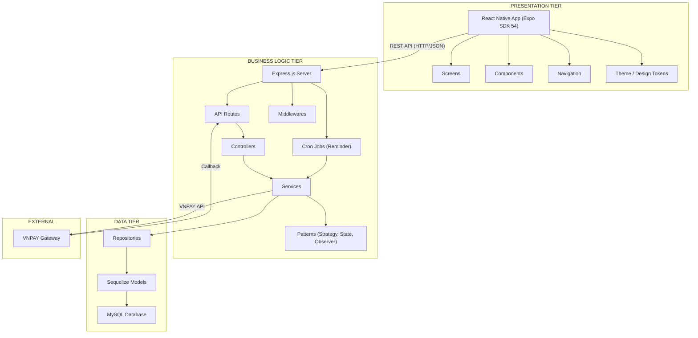
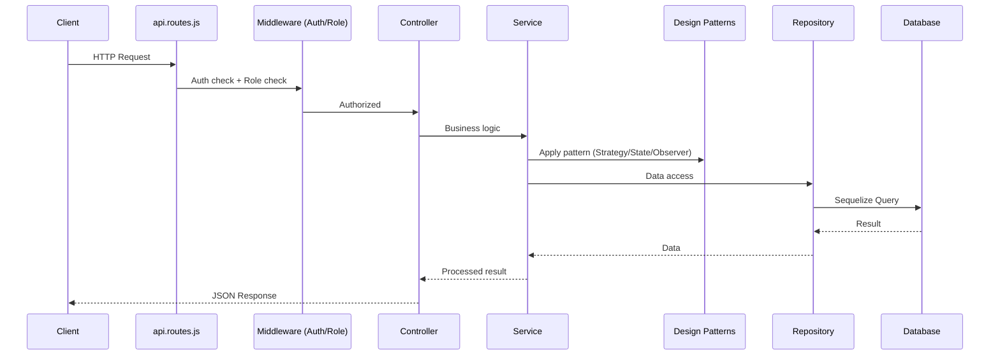

# 🏗️ Kiến trúc Hệ thống — BookingPro

## 1. Tổng quan Kiến trúc

BookingPro sử dụng kiến trúc **3-Tier (3 tầng)** kết hợp mô hình **MVC** ở tầng Backend.

### Tại sao chọn 3-Tier?

| Tiêu chí | Giải thích |
|----------|-----------|
| **Tách biệt quan tâm** | Thay đổi UI không ảnh hưởng logic, thay DB không ảnh hưởng API |
| **Bảo trì dễ dàng** | Mỗi tầng phát triển và sửa lỗi độc lập |
| **Mở rộng** | Có thể scale từng tầng riêng biệt (thêm server backend khi tải tăng) |
| **Bảo mật** | Client không truy cập trực tiếp database |

---

## 2. Sơ đồ Kiến trúc tổng thể



---

## 3. Chi tiết từng Tầng

### 3.1 Presentation Tier (React Native + Expo)

**Vai trò:** Hiển thị giao diện, thu thập input từ người dùng, gửi request đến Backend.

```
frontend/src/
├── theme/
│   └── theme.js               # Design tokens: colors, spacing, typography, shadows
├── components/
│   ├── Common.js               # Shared UI: Button, Card, Input, Badge...
│   └── BottomNav.js            # Bottom navigation bar
├── navigation/
│   ├── AppNavigator.js         # Root navigator (Auth flow vs Main flow)
│   └── MainTabNavigator.js     # Bottom tab navigator (Home, History, Notification, Profile)
├── screens/
│   ├── LoginScreen.js          # Đăng nhập
│   ├── RegisterScreen.js       # Đăng ký
│   ├── HomeScreen.js           # Trang chủ — danh sách dịch vụ theo danh mục
│   ├── ExploreScreen.js        # Khám phá dịch vụ
│   ├── BookingScreen.js        # Đặt lịch: chọn nhân viên, ngày, slot
│   ├── PaymentScreen.js        # Chọn phương thức thanh toán
│   ├── VNPayScreen.js          # WebView hiển thị trang VNPAY
│   ├── HistoryScreen.js        # Lịch sử đặt lịch + hủy booking
│   ├── NotificationScreen.js   # Danh sách thông báo
│   ├── ProfileScreen.js        # Hồ sơ cá nhân
│   ├── StaffDashboardScreen.js     # Dashboard nhân viên
│   ├── AdminDashboardScreen.js     # Dashboard quản trị viên
│   ├── ManageCategoriesScreen.js   # CRUD danh mục dịch vụ
│   ├── ManageServicesScreen.js     # CRUD dịch vụ
│   ├── ManageStaffScreen.js        # Quản lý nhân viên + lịch làm việc
│   └── RevenueScreen.js            # Báo cáo doanh thu
└── services/
    └── api.js                  # Axios instance + tất cả API endpoints
```

**Nguyên tắc:**
- KHÔNG chứa business logic
- Chỉ gọi API và hiển thị dữ liệu
- Validate form cơ bản (trống, format email)
- Design tokens tập trung trong `theme.js`

### 3.2 Business Logic Tier (Node.js + Express)

**Vai trò:** Xử lý toàn bộ nghiệp vụ, áp dụng design patterns, quản lý authentication, chạy cron jobs.

```
backend/src/
├── app.js                     # Express setup, middleware, route, cron jobs registration
├── config/
│   └── database.js            # Sequelize connection config (đọc từ .env)
├── routes/
│   └── api.routes.js          # Tập trung tất cả route definitions
├── controllers/
│   ├── auth.controller.js     # Register, Login
│   ├── booking.controller.js  # CRUD booking + confirm/complete/cancel
│   ├── category.controller.js # CRUD danh mục
│   ├── service.controller.js  # CRUD dịch vụ
│   ├── staff.controller.js    # Quản lý nhân viên + lịch làm việc
│   └── payment.controller.js  # Tạo thanh toán, VNPAY callback
├── services/
│   ├── auth.service.js        # Xác thực, hash password, generate JWT
│   ├── booking.service.js     # Nghiệp vụ đặt lịch, kiểm tra slot, chuyển trạng thái
│   ├── payment.service.js     # Nghiệp vụ thanh toán (dùng Strategy Pattern)
│   └── reminder.service.js    # Cron job: tự động hủy booking quá hạn
├── middlewares/
│   └── index.js               # JWT verification + Role-based access control
├── patterns/
│   ├── strategy/              # Payment Strategy Pattern
│   │   ├── payment.strategy.js    # Abstract class
│   │   ├── payment.context.js     # Context (chọn strategy)
│   │   ├── vnpay.strategy.js      # VNPAY implementation
│   │   └── cod.strategy.js        # COD implementation
│   ├── state/                 # Booking State Pattern
│   │   ├── booking.state.js       # Abstract class
│   │   ├── booking.context.js     # Context (quản lý state)
│   │   └── booking.states.js      # PendingState, ConfirmedState, CompletedState, CancelledState
│   └── observer/              # Notification Observer Pattern
│       ├── subject.js             # Subject (EventEmitter)
│       ├── observer.js            # Observer interface
│       ├── notification.observer.js   # Gửi thông báo DB
│       └── logging.observer.js        # Ghi log hệ thống
```

**Luồng xử lý Request (MVC):**



### 3.3 Data Tier (MySQL + Sequelize)

**Vai trò:** Lưu trữ dữ liệu, đảm bảo tính toàn vẹn, cung cấp truy vấn hiệu quả.

```
├── models/                    # Sequelize Model definitions
│   ├── index.js               # Model loader + associations
│   ├── user.model.js          # Users (customer, staff, admin)
│   ├── category.model.js      # Danh mục dịch vụ
│   ├── service.model.js       # Dịch vụ
│   ├── staffSchedule.model.js # Lịch làm việc nhân viên
│   ├── booking.model.js       # Đặt lịch
│   ├── payment.model.js       # Thanh toán
│   └── notification.model.js  # Thông báo
├── repositories/              # Repository Pattern
│   ├── base.repository.js         # Base CRUD operations
│   ├── user.repository.js         # User queries
│   ├── service.repository.js      # Service queries
│   ├── staffSchedule.repository.js # StaffSchedule queries
│   ├── booking.repository.js      # Booking queries (slot conflict, filter)
│   ├── payment.repository.js      # Payment queries
│   └── notification.repository.js # Notification queries
```

**Tại sao dùng Repository Pattern ở đây?**
- Tách biệt query logic khỏi business logic
- Service không cần biết dùng MySQL hay MongoDB
- Dễ viết unit test (mock repository)

---

## 4. Giao tiếp giữa các Tầng

| Từ → Đến | Phương thức | Format |
|-----------|------------|--------|
| Frontend → Backend | HTTP REST API | JSON |
| Backend → Database | Sequelize ORM | SQL queries |
| Backend → VNPAY | HTTPS POST/GET | Query string + HMAC SHA512 |
| VNPAY → Backend | HTTPS Callback | Query string |

### API Convention

```
Base URL: http://localhost:3000/api

Authentication:
  POST   /api/auth/register          → Đăng ký
  POST   /api/auth/login             → Đăng nhập

Categories:
  GET    /api/categories              → Danh sách danh mục
  POST   /api/categories              → Tạo danh mục (admin)
  PUT    /api/categories/:id          → Cập nhật danh mục (admin)
  DELETE /api/categories/:id          → Xóa danh mục (admin)

Services:
  GET    /api/services                → Danh sách dịch vụ
  POST   /api/services                → Tạo dịch vụ (admin)
  PUT    /api/services/:id            → Cập nhật dịch vụ (admin)
  DELETE /api/services/:id            → Xóa dịch vụ (admin)

Bookings:
  POST   /api/bookings                → Tạo booking
  GET    /api/bookings/my             → Booking của tôi (customer)
  GET    /api/bookings/:id            → Chi tiết booking
  PATCH  /api/bookings/:id/confirm    → Xác nhận booking (staff/admin)
  PATCH  /api/bookings/:id/complete   → Hoàn thành booking (staff/admin)
  PATCH  /api/bookings/:id/cancel     → Hủy booking

Payments:
  POST   /api/payments/create-vnpay   → Tạo URL thanh toán VNPAY
  GET    /api/payments/vnpay-return   → Callback từ VNPAY

Staff Management:
  GET    /api/staff                   → Danh sách nhân viên
  GET    /api/staff/:id/schedules     → Lịch làm việc nhân viên
  POST   /api/staff/:id/schedules     → Tạo lịch làm việc (admin)

Notifications:
  GET    /api/notifications           → Danh sách thông báo
  PATCH  /api/notifications/:id/read  → Đánh dấu đã đọc
```

---

## 5. Bảo mật

| Lớp bảo mật | Cơ chế |
|-------------|--------|
| Authentication | JWT Token (access token) |
| Authorization | Role-based middleware (customer, staff, admin) |
| Data Validation | Middleware validate input trước khi xử lý |
| Password | Bcrypt.js hashing |
| VNPAY | HMAC SHA512 signature verification |
| Environment | `.env` file cho sensitive config |

---

## 6. So sánh với các kiến trúc khác

| Kiến trúc | Ưu điểm | Nhược điểm | Phù hợp |
|-----------|---------|-----------|---------|
| **2-Tier** | Đơn giản | Không tách biệt logic | App nhỏ |
| **3-Tier ✅** | Tách biệt rõ, dễ mở rộng | Phức tạp hơn 2-tier | App trung bình - lớn |
| **Microservices** | Scale cực tốt | Quá phức tạp cho đề tài | Hệ thống enterprise |

→ **3-Tier** là lựa chọn tối ưu cho quy mô đề tài này: đủ phức tạp để chứng minh tư duy kiến trúc, nhưng không quá phức tạp để triển khai.
