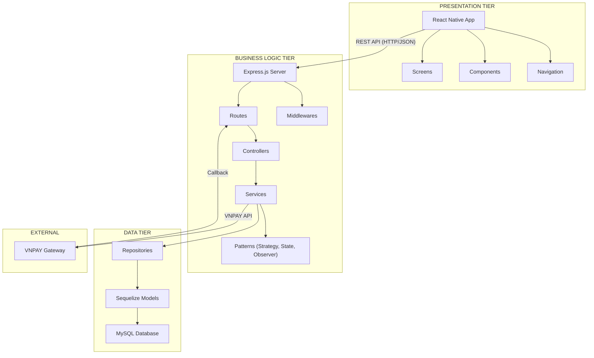
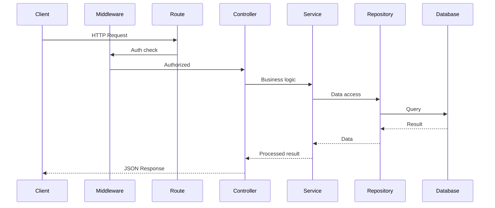

# 🏗️ Kiến trúc Hệ thống — BookingPro

## 1. Tổng quan Kiến trúc

BookingPro sử dụng kiến trúc **3-Tier (3 tầng)** kết hợp mô hình **MVC** ở tầng Backend.

### Tại sao chọn 3-Tier?

| Tiêu chí | Giải thích |
|----------|-----------|
| **Tách biệt quan tâm** | Thay đổi UI không ảnh hưởng logic, thay DB không ảnh hưởng API |
| **Bảo trì dễ dàng** | Mỗi tầng phát triển và sửa lỗi độc lập |
| **Mở rộng** | Có thể scale từng tầng riêng biệt (thêm server backend khi tải tăng) |
| **Bảo mật** | Client không truy cập trực tiếp database |

---

## 2. Sơ đồ Kiến trúc tổng thể



---

## 3. Chi tiết từng Tầng

### 3.1 Presentation Tier (React Native)

**Vai trò:** Hiển thị giao diện, thu thập input từ người dùng, gửi request đến Backend.

```
frontend/src/
├── screens/           # Các màn hình chính
│   ├── auth/          # Login, Register
│   ├── home/          # Trang chủ, danh sách dịch vụ
│   ├── booking/       # Đặt lịch, chọn slot
│   ├── payment/       # Thanh toán
│   ├── history/       # Lịch sử đặt lịch
│   └── admin/         # Quản lý (admin)
├── components/        # Component tái sử dụng
│   ├── Button.js
│   ├── Card.js
│   └── Modal.js
├── services/          # Gọi API
│   └── api.js         # Axios instance + endpoints
├── navigation/        # React Navigation config
└── utils/             # Helpers (format date, price...)
```

**Nguyên tắc:**
- KHÔNG chứa business logic
- Chỉ gọi API và hiển thị dữ liệu
- Validate form cơ bản (trống, format email)

### 3.2 Business Logic Tier (Node.js + Express)

**Vai trò:** Xử lý toàn bộ nghiệp vụ, áp dụng design patterns, quản lý authentication.

```
backend/src/
├── app.js              # Express setup, middleware registration
├── config/
│   └── database.js     # Sequelize connection config
├── routes/             # Định nghĩa endpoints
│   ├── auth.routes.js
│   ├── service.routes.js
│   ├── booking.routes.js
│   ├── payment.routes.js
│   └── notification.routes.js
├── controllers/        # Nhận request, gọi service, trả response
│   ├── auth.controller.js
│   ├── service.controller.js
│   ├── booking.controller.js
│   ├── payment.controller.js
│   └── notification.controller.js
├── services/           # Business logic
│   ├── auth.service.js
│   ├── booking.service.js
│   ├── payment.service.js
│   └── notification.service.js
├── middlewares/
│   ├── auth.middleware.js      # JWT verification
│   ├── role.middleware.js      # Role-based access
│   └── errorHandler.js        # Centralized error handling
├── patterns/
│   ├── strategy/               # Payment Strategy Pattern
│   ├── state/                  # Booking State Pattern
│   └── observer/               # Notification Observer Pattern
└── utils/
    ├── validators.js           # Input validation
    └── helpers.js              # Date, format helpers
```

**Luồng xử lý Request (MVC):**



### 3.3 Data Tier (MySQL + Sequelize)

**Vai trò:** Lưu trữ dữ liệu, đảm bảo tính toàn vẹn, cung cấp truy vấn hiệu quả.

```
├── models/             # Sequelize Model definitions
│   ├── index.js        # Model loader + associations
│   ├── user.model.js
│   ├── service.model.js
│   ├── staffSchedule.model.js
│   ├── booking.model.js
│   ├── payment.model.js
│   └── notification.model.js
├── repositories/       # Repository Pattern
│   ├── base.repository.js      # Base CRUD operations
│   ├── user.repository.js
│   ├── booking.repository.js
│   ├── payment.repository.js
│   └── notification.repository.js
```

**Tại sao dùng Repository Pattern?**
- Tách biệt query logic khỏi business logic
- Service không cần biết dùng MySQL hay MongoDB
- Dễ viết unit test (mock repository)

---

## 4. Giao tiếp giữa các Tầng

| Từ → Đến | Phương thức | Format |
|-----------|------------|--------|
| Frontend → Backend | HTTP REST API | JSON |
| Backend → Database | Sequelize ORM | SQL queries |
| Backend → VNPAY | HTTPS POST/GET | Query string + HMAC |
| VNPAY → Backend | HTTPS Callback | Query string |

### API Convention

```
Base URL: http://localhost:3000/api/v1

GET    /services              → Danh sách dịch vụ
GET    /services/:id          → Chi tiết dịch vụ
POST   /auth/register         → Đăng ký
POST   /auth/login            → Đăng nhập
POST   /bookings              → Tạo booking
GET    /bookings/:id          → Chi tiết booking
PATCH  /bookings/:id/confirm  → Xác nhận booking (staff)
PATCH  /bookings/:id/complete → Hoàn thành booking (staff)
PATCH  /bookings/:id/cancel   → Hủy booking
POST   /payments/create-vnpay → Tạo URL thanh toán VNPAY
GET    /payments/vnpay-return  → Callback từ VNPAY
GET    /notifications         → Danh sách thông báo
```

---

## 5. Bảo mật

| Lớp bảo mật | Cơ chế |
|-------------|--------|
| Authentication | JWT Token (access + refresh) |
| Authorization | Role-based middleware (customer, staff, admin) |
| Data Validation | Middleware validate input trước khi xử lý |
| Password | Bcrypt hashing |
| VNPAY | HMAC SHA512 signature verification |
| Environment | `.env` file cho sensitive config |

---

## 6. So sánh với các kiến trúc khác

| Kiến trúc | Ưu điểm | Nhược điểm | Phù hợp |
|-----------|---------|-----------|---------|
| **2-Tier** | Đơn giản | Không tách biệt logic | App nhỏ |
| **3-Tier ✅** | Tách biệt rõ, dễ mở rộng | Phức tạp hơn 2-tier | App trung bình - lớn |
| **Microservices** | Scale cực tốt | Quá phức tạp cho đề tài | Hệ thống enterprise |

→ **3-Tier** là lựa chọn tối ưu cho quy mô đề tài này: đủ phức tạp để chứng minh tư duy kiến trúc, nhưng không quá phức tạp để triển khai.
