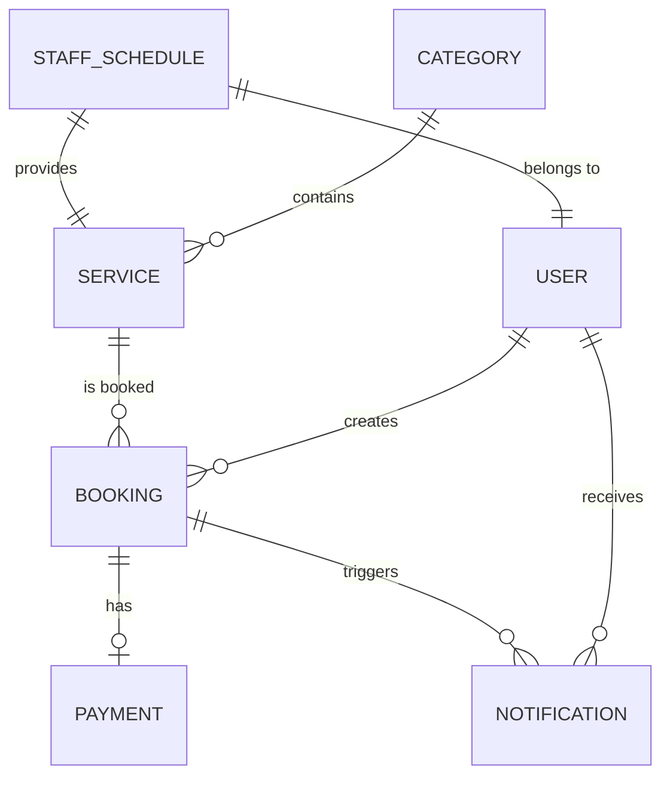
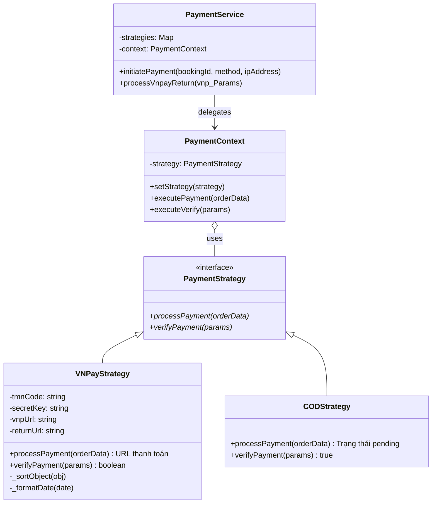
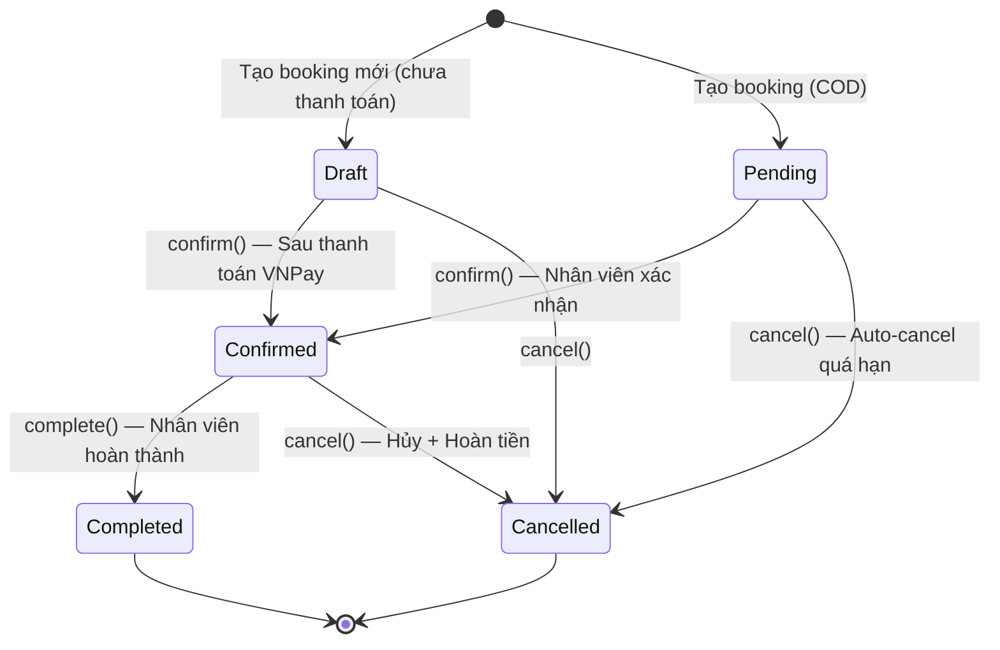
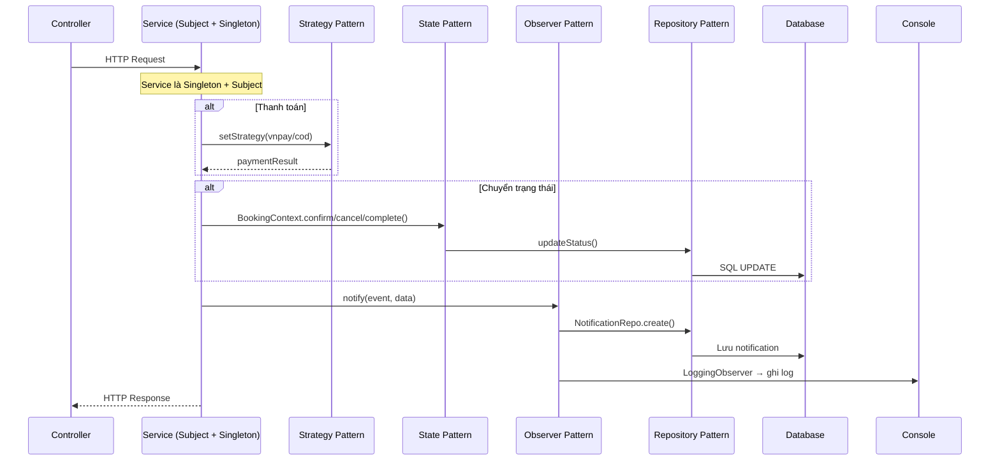

# BÁO CÁO ĐỒ ÁN MÔN HỌC
# KIẾN TRÚC VÀ THIẾT KẾ PHẦN MỀM

## Đề tài: Ứng dụng Design Pattern trong Hệ thống Quản lý Đặt lịch & Thanh toán Dịch vụ — BookingPro

---

## MỤC LỤC

1. [Giới thiệu đề tài](#1-giới-thiệu-đề-tài)
2. [Phân tích yêu cầu hệ thống](#2-phân-tích-yêu-cầu-hệ-thống)
3. [Quyết định kiến trúc hệ thống](#3-quyết-định-kiến-trúc-hệ-thống)
4. [Thiết kế hệ thống](#4-thiết-kế-hệ-thống)
5. [Phân tích và lựa chọn Design Pattern](#5-phân-tích-và-lựa-chọn-design-pattern)
6. [Hiện thực Design Pattern](#6-hiện-thực-design-pattern)
7. [Đánh giá thiết kế](#7-đánh-giá-thiết-kế)
8. [Kiểm thử hệ thống](#8-kiểm-thử-hệ-thống)
9. [Kết luận và hướng phát triển](#9-kết-luận-và-hướng-phát-triển)

---

## 1. Giới thiệu đề tài

### 1.1. Bối cảnh

Trong bối cảnh chuyển đổi số hiện nay, các doanh nghiệp dịch vụ (salon, spa, phòng khám, fitness...) cần một hệ thống đặt lịch trực tuyến chuyên nghiệp để quản lý nhân viên, lịch hẹn, thanh toán và thông báo một cách tự động, nhất quán.

### 1.2. Mục tiêu

**BookingPro** là nền tảng quản lý đặt lịch và thanh toán dịch vụ với các mục tiêu:

- Xây dựng hệ thống đặt lịch dịch vụ hoàn chỉnh (khách hàng, nhân viên, quản trị viên).
- Áp dụng kiến trúc phần mềm bài bản (3-Tier, MVC).
- **Triển khai 6 Design Patterns** có lý do rõ ràng, giải quyết các bài toán thiết kế thực tế.
- Thiết kế UML đầy đủ (Use Case, Class, Sequence, Component Diagram).
- Xử lý logic phức tạp: kiểm tra xung đột slot, quản lý vòng đời booking, tính toán hoàn tiền, thanh toán online.

### 1.3. Công nghệ sử dụng

| Thành phần | Công nghệ |
|:---|:---|
| Frontend | React Native + Expo SDK 54 |
| Backend | Node.js + Express.js |
| Database | MySQL + Sequelize ORM |
| Authentication | JWT + Bcrypt.js |
| Payment Gateway | VNPAY |
| Scheduler | node-cron |

---

## 2. Phân tích yêu cầu hệ thống

### 2.1. Các tác nhân (Actors)

| Actor | Mô tả |
|:---|:---|
| **Khách hàng (Customer)** | Đăng ký, đặt lịch, thanh toán, xem lịch sử, hủy lịch, xem thông báo |
| **Nhân viên (Staff)** | Xem lịch làm việc, xác nhận/hoàn thành booking, xem thông báo |
| **Quản trị viên (Admin)** | Quản lý danh mục, dịch vụ, nhân viên, lịch nhân viên, báo cáo doanh thu |
| **Hệ thống VNPAY** | Xử lý giao dịch thanh toán online, callback xác nhận |
| **Hệ thống (Cron Job)** | Tự động nhắc nhở & hủy booking quá hạn |

### 2.2. Yêu cầu chức năng chính

- **UC05 — Đặt lịch hẹn:** Chọn dịch vụ → nhân viên → ngày/giờ → kiểm tra xung đột slot → tạo booking.
- **UC06 — Thanh toán:** Hỗ trợ thanh toán VNPAY (online) và COD (tại quầy).
- **UC08 — Hủy lịch & hoàn tiền:** Chính sách hoàn tiền theo thời gian (100% / 50% / 0%).
- **UC11/UC12 — Xác nhận/Hoàn thành booking:** Nhân viên quản lý vòng đời booking.
- **UC20 — Auto-cancel:** Cron job tự động hủy booking quá hạn.

### 2.3. Yêu cầu phi chức năng

- Kiến trúc phân tầng rõ ràng, dễ bảo trì.
- Tuân thủ nguyên tắc SOLID, đặc biệt OCP (Open/Closed Principle).
- Khả năng mở rộng cao (thêm phương thức thanh toán, trạng thái, loại thông báo mới).
- Bảo mật: JWT, role-based access control, HMAC SHA512 verification.

---

## 3. Quyết định kiến trúc hệ thống

### 3.1. Lựa chọn kiến trúc 3-Tier

Dự án sử dụng kiến trúc **3-Tier (3 tầng)** kết hợp mô hình **MVC** ở tầng Backend.

| Kiến trúc | Ưu điểm | Nhược điểm | Phù hợp |
|:---|:---|:---|:---|
| 2-Tier | Đơn giản | Không tách biệt logic | App nhỏ |
| **3-Tier ✅** | Tách biệt rõ, dễ mở rộng | Phức tạp hơn 2-tier | App trung bình - lớn |
| Microservices | Scale cực tốt | Quá phức tạp cho đề tài | Hệ thống enterprise |

→ **3-Tier** là lựa chọn tối ưu cho quy mô đề tài: đủ phức tạp để chứng minh tư duy kiến trúc, nhưng không quá phức tạp để triển khai.

### 3.2. Sơ đồ kiến trúc tổng thể

```
┌──────────────────────────────────┐
│     PRESENTATION TIER            │
│     React Native (Expo SDK 54)   │
│     (Screens, Components, UI)    │
└──────────────┬───────────────────┘
               │ REST API (HTTP/JSON)
┌──────────────▼───────────────────┐
│     BUSINESS LOGIC TIER          │
│     Node.js + Express.js         │
│     (Controllers, Services,      │
│      Patterns, Middlewares)      │
└──────────────┬───────────────────┘
               │ Sequelize ORM
┌──────────────▼───────────────────┐
│     DATA TIER                    │
│     MySQL Database               │
│     (Tables, Relations, Indexes) │
└──────────────────────────────────┘
```

### 3.3. Luồng xử lý Request (MVC)

```
Request → Route → Middleware (Auth/Role) → Controller → Service → Repository → Model → Database
                                              ↓
                                          Response (JSON)
```

---

## 4. Thiết kế hệ thống

### 4.1. ERD (Entity Relationship Diagram)

Hệ thống gồm 7 bảng chính: `users`, `categories`, `services`, `staff_schedules`, `bookings`, `payments`, `notifications`.



### 4.2. Cấu trúc thư mục Backend

```
backend/src/
├── app.js                     # Entry point
├── config/database.js         # Sequelize connection (Singleton)
├── routes/api.routes.js       # Route definitions
├── controllers/               # 6 controllers (HTTP handlers)
├── services/                  # 4 services (Business logic)
├── repositories/              # 8 repositories (Data access)
├── models/                    # 7 models (Database schema)
├── middlewares/                # JWT + Role-based access
└── patterns/                  # Design Patterns
    ├── strategy/              # Payment Strategy Pattern (4 files)
    ├── state/                 # Booking State Pattern (3 files)
    └── observer/              # Notification Observer Pattern (4 files)
```

### 4.3. Ma trận phân tầng Controller → Service → Repository

| Controller | Service | Repository(s) sử dụng |
|:---|:---|:---|
| AuthController | AuthService | UserRepository |
| BookingController | BookingService | BookingRepo, UserRepo, ServiceRepo, PaymentRepo |
| PaymentController | PaymentService | PaymentRepo, BookingRepo, UserRepo |
| StaffController | StaffService | UserRepo, StaffScheduleRepo |
| ServiceController | ServiceService | ServiceRepository |
| CategoryController | CategoryService | CategoryRepository |
| — (Cron Job) | ReminderService | BookingRepo, NotificationRepo |

---

## 5. Phân tích và lựa chọn Design Pattern

> **Đây là phần trọng tâm của đồ án.** Mỗi pattern được lựa chọn dựa trên việc phân tích bài toán cụ thể trong hệ thống, so sánh với các giải pháp thay thế, và đánh giá lợi ích mang lại.

### 5.1. Tổng quan các Design Pattern được áp dụng

| # | Nhóm Pattern | Tên Pattern | Phạm vi áp dụng | Nguyên lý SOLID liên quan |
|:-:|:---|:---|:---|:---|
| 1 | Creational | **Singleton** | DB Connection, Services, Repositories | — |
| 2 | Behavioral | **Strategy** | Đa dạng hóa phương thức thanh toán | OCP (Open/Closed) |
| 3 | Behavioral | **State** | Quản lý vòng đời Booking | OCP, SRP |
| 4 | Behavioral | **Observer** | Hệ thống thông báo & logging | SRP (Single Responsibility) |
| 5 | Architectural | **Repository** | Tách biệt Data Access | DIP (Dependency Inversion) |
| 6 | Architectural | **Layered Architecture** | Phân tầng Controller → Service → Repository → Model | SRP (Single Responsibility) |

---

### 5.2. Strategy Pattern — Phân tích chi tiết

#### 5.2.1. Bài toán

Hệ thống cần hỗ trợ **nhiều phương thức thanh toán** (hiện tại: VNPAY và COD). Mỗi phương thức có logic hoàn toàn khác nhau:

| Phương thức | Logic xử lý |
|:---|:---|
| **VNPAY** | Tạo URL thanh toán + chữ ký HMAC SHA512, redirect user, callback verify |
| **COD** | Trả status `pending`, nhân viên xác nhận thủ công tại quầy |

#### 5.2.2. Vấn đề nếu không dùng Design Pattern

Nếu dùng `if-else` trực tiếp trong `PaymentService`:

```javascript
// ❌ Anti-pattern: If-Else trực tiếp
async initiatePayment(bookingId, method) {
  if (method === 'vnpay') {
    // 40+ dòng code tạo URL, ký HMAC, xây dựng params...
  } else if (method === 'cod') {
    // 10 dòng code xử lý COD...
  } else if (method === 'momo') {
    // Thêm mới → phải SỬA file này → Vi phạm OCP
  }
}
```

**Hậu quả:**
- Vi phạm **Open/Closed Principle (OCP)**: Mỗi lần thêm phương thức mới phải sửa code cũ.
- Vi phạm **Single Responsibility Principle (SRP)**: `PaymentService` phình to, chứa logic của tất cả các cổng thanh toán.
- Khó test: Không thể test từng phương thức thanh toán độc lập.

#### 5.2.3. Tại sao chọn Strategy?

| Tiêu chí | If-Else | Strategy Pattern ✅ |
|:---|:---|:---|
| Thêm phương thức mới | Sửa file cũ (vi phạm OCP) | Tạo class mới, không sửa code cũ |
| Test riêng lẻ | Khó (logic lẫn lộn) | Dễ (mỗi Strategy là 1 class riêng) |
| Runtime switching | Không tự nhiên | `setStrategy()` linh hoạt tại runtime |
| Kích thước file | Phình to theo số method | Mỗi file < 80 dòng |
| Tính đọc hiểu | Giảm theo thời gian | Rõ ràng, mỗi class 1 trách nhiệm |

#### 5.2.4. Cấu trúc áp dụng



#### 5.2.5. Các file liên quan

| File | Vai trò | Số dòng |
|:---|:---|:---:|
| `patterns/strategy/payment.strategy.js` | **Interface** — Định nghĩa contract | 13 |
| `patterns/strategy/vnpay.strategy.js` | **Concrete Strategy** — VNPAY | 80 |
| `patterns/strategy/cod.strategy.js` | **Concrete Strategy** — COD | 19 |
| `patterns/strategy/payment.context.js` | **Context** — Ủy quyền xử lý | 21 |
| `services/payment.service.js` | **Client** — Nơi sử dụng | 142 |

---

### 5.3. State Pattern — Phân tích chi tiết

#### 5.3.1. Bài toán

Một Booking có **vòng đời phức tạp** với 5 trạng thái: `Draft` → `Pending` → `Confirmed` → `Completed` / `Cancelled`. Mỗi trạng thái có **quy tắc chuyển đổi riêng**:

- Không thể `complete()` một booking ở trạng thái `pending` (phải confirm trước).
- Không thể `confirm()` một booking đã `completed`.
- Không thể làm gì với booking đã `cancelled`.

#### 5.3.2. Vấn đề nếu không dùng Design Pattern

```javascript
// ❌ Anti-pattern: If-Else kiểm tra trạng thái rải rác khắp nơi
async confirmBooking(bookingId) {
  const booking = await repo.findById(bookingId);
  if (booking.status === 'completed') throw new Error('Không thể xác nhận');
  if (booking.status === 'cancelled') throw new Error('Đã bị hủy');
  if (booking.status !== 'pending' && booking.status !== 'draft') throw new Error('...');
  // Logic xác nhận...
}

async cancelBooking(bookingId) {
  const booking = await repo.findById(bookingId);
  if (booking.status === 'completed') throw new Error('Không thể hủy');
  if (booking.status === 'cancelled') throw new Error('Đã hủy rồi');
  // Logic hủy... (lại phải kiểm tra tương tự)
}

async completeBooking(bookingId) {
  // Lại kiểm tra if-else trạng thái... DRY violation!
}
```

**Hậu quả:**
- Logic kiểm tra trạng thái bị **lặp lại** ở 6+ nơi (BookingService, PaymentService, ReminderService).
- Dễ bị **thiếu sót**: Quên kiểm tra ở chỗ hoàn tiền, auto-cancel...
- Thêm trạng thái mới (ví dụ `InProgress`) → phải sửa TẤT CẢ các hàm.

#### 5.3.3. Tại sao chọn State?

| Tiêu chí | If-Else | State Pattern ✅ |
|:---|:---|:---|
| Quy tắc chuyển trạng thái tập trung | Rải rác ở 6+ nơi | Đóng gói trong mỗi State class |
| Thêm trạng thái mới | Sửa tất cả hàm | Tạo 1 class mới |
| Bảo vệ khỏi transition sai | Phải nhớ kiểm tra | State tự throw Error nếu hành động không hợp lệ |
| Số nơi sử dụng | N/A | 6 nơi trong hệ thống |

#### 5.3.4. Biểu đồ trạng thái



#### 5.3.5. Bảng quy tắc chuyển trạng thái

| Trạng thái hiện tại | confirm() | complete() | cancel() |
|:---|:---:|:---:|:---:|
| **DraftState** | ✅ → Confirmed | ❌ Error | ✅ → Cancelled |
| **PendingState** | ✅ → Confirmed | ❌ Error | ✅ → Cancelled |
| **ConfirmedState** | ❌ Error | ✅ → Completed | ✅ → Cancelled |
| **CompletedState** | ❌ Error | ❌ Error | ❌ Error |
| **CancelledState** | ❌ Error | ❌ Error | ❌ Error |

#### 5.3.6. Tất cả các nơi sử dụng State Pattern

| # | Nơi sử dụng | Hành động | Mục đích |
|:-:|:---|:---|:---|
| 1 | `BookingService.confirmBooking()` | `context.confirm()` | Nhân viên xác nhận lịch hẹn |
| 2 | `BookingService.cancelBooking()` | `context.cancel()` | Khách hủy lịch |
| 3 | `BookingService.completeBooking()` | `context.complete()` | Nhân viên hoàn thành dịch vụ |
| 4 | `BookingService.refundBooking()` | `context.cancel()` | Hủy + hoàn tiền |
| 5 | `PaymentService.handlePaymentSuccess()` | `context.confirm()` | Thanh toán VNPay thành công → confirm |
| 6 | `ReminderService.initAutoCancelCron()` | `context.cancel()` | Cron job auto-cancel booking quá hạn |

---

### 5.4. Observer Pattern — Phân tích chi tiết

#### 5.4.1. Bài toán

Khi một sự kiện xảy ra (tạo booking, thanh toán thành công, hủy lịch...), **nhiều tác vụ cần thực hiện đồng thời**: Lưu notification cho khách, gửi notification cho nhân viên, ghi log hệ thống...

#### 5.4.2. Vấn đề nếu không dùng Design Pattern

```javascript
// ❌ Anti-pattern: Service phình to, trộn lẫn nhiều trách nhiệm
async confirmBooking(bookingId) {
  // ... logic xác nhận ...

  // Notification logic (không thuộc trách nhiệm của BookingService)
  await notificationRepo.create({ userId: customer.id, title: 'Xác nhận', ... });

  // Logging logic (không thuộc trách nhiệm của BookingService)
  console.log(`[${new Date()}] BOOKING_CONFIRMED: Booking #${bookingId}`);

  // Nếu thêm Email → lại phải SỬA hàm này
  // await emailService.send(customer.email, 'Xác nhận lịch hẹn', ...);
}
```

**Hậu quả:**
- Vi phạm **SRP**: BookingService vừa xử lý nghiệp vụ, vừa lo notification, vừa lo logging.
- Thêm kênh thông báo (Email, SMS) → sửa tất cả Service → Vi phạm **OCP**.
- Coupling cao: Service phụ thuộc vào cách thức thông báo cụ thể.

#### 5.4.3. Tại sao chọn Observer?

| Tiêu chí | Trực tiếp trong Service | Observer Pattern ✅ |
|:---|:---|:---|
| Tách biệt quan tâm | Service biết chi tiết notification | Service chỉ cần `notify()` |
| Thêm kênh mới (Email, SMS) | Sửa code Service | Tạo Observer mới + `attach()` |
| Coupling | Cao | Thấp (Service không biết ai lắng nghe) |
| Test riêng lẻ | Khó tách | Mỗi Observer test độc lập |

#### 5.4.4. Ma trận các sự kiện và Observer

| Event | Phát bởi | NotificationObserver | LoggingObserver |
|:---|:---|:---:|:---:|
| `booking_created` | BookingService | ✅ Thông báo cho Staff | ✅ |
| `booking_confirmed` | BookingService | ✅ Thông báo cho Customer | ✅ |
| `booking_completed` | BookingService | — | ✅ |
| `booking_cancelled` | BookingService | ✅ Thông báo cho Staff | ✅ |
| `booking_refunded` | BookingService | — | ✅ |
| `payment_success` | PaymentService | ✅ Thông báo cho Customer | ✅ |

#### 5.4.5. Ma trận đăng ký Observer

| Service (Subject) | NotificationObserver | LoggingObserver |
|:---|:---:|:---:|
| BookingService | ✅ | ✅ |
| PaymentService | ✅ | ✅ |
| ReminderService | — | ✅ |

---

### 5.5. Repository Pattern — Phân tích chi tiết

#### 5.5.1. Bài toán

Tránh việc logic nghiệp vụ (Service) bị phụ thuộc trực tiếp vào ORM (Sequelize). Nếu Service gọi `Model.findByPk()` trực tiếp, Service bị coupling chặt với Sequelize.

#### 5.5.2. Tại sao chọn Repository?

- **Abstraction Layer:** Service gọi `repository.findById()` thay vì `Model.findByPk()`.
- **DRY:** Các truy vấn phức tạp (như `findConflictingSlots`) chỉ viết 1 lần trong Repository.
- **Testability:** Dễ dàng mock Repository khi viết Unit Test cho Service.
- **Đổi DB:** Nếu sau này đổi ORM hoặc Database, chỉ sửa lớp Repository.

#### 5.5.3. Cấu trúc áp dụng

| Repository | Kế thừa | Phương thức đặc biệt |
|:---|:---|:---|
| `BaseRepository` | — (Base class) | `findAll`, `findById`, `findOne`, `create`, `update`, `delete`, `count` |
| `BookingRepository` | BaseRepository | `findByCustomer`, `findByStaff`, `findConflictingSlots`, `updateStatus` |
| `UserRepository` | BaseRepository | `findByEmail`, `findActiveStaff` |
| `PaymentRepository` | BaseRepository | `findByBookingId`, `findByTransactionId` |
| `NotificationRepository` | BaseRepository | `findByUser` |
| `ServiceRepository` | BaseRepository | `findActiveServices` |
| `StaffScheduleRepository` | BaseRepository | `findSchedulesByDay`, `findByStaffAndService` |
| `CategoryRepository` | BaseRepository | `findWithServices` |

---

### 5.6. Singleton Pattern

Hệ thống sử dụng cơ chế Module Caching của Node.js (`module.exports = new XxxService()`) để đảm bảo mỗi Service, Repository chỉ có **một instance duy nhất**:

- Tránh lãng phí tài nguyên (đặc biệt kết nối DB).
- Đảm bảo các Observer không bị đăng ký trùng lặp.
- Áp dụng cho: `database.js`, tất cả 7 Services và 8 Repositories.

---

### 5.7. Layered Architecture (Kiến trúc phân tầng)

Hệ thống áp dụng kiến trúc phân tầng để đảm bảo tính độc lập và khả năng bảo trì:

- **Tầng Controller:** Chỉ chịu trách nhiệm điều phối luồng xử lý HTTP, không chứa logic nghiệp vụ.
- **Tầng Service:** Trái tim của hệ thống, nơi áp dụng các Behavioral Patterns (State, Strategy, Observer).
- **Tầng Repository:** Đóng vai trò lớp đệm (Abstraction Layer) cho tầng dữ liệu, che giấu các chi tiết thực thi của ORM.
- **Tầng Model:** Định nghĩa cấu trúc dữ liệu và các mối quan hệ (Associations).

**Lợi ích:** Tách biệt rõ ràng các mối quan tâm (Separation of Concerns), giúp việc thay đổi công nghệ ở một tầng (ví dụ đổi DB) không ảnh hưởng đến các tầng khác.

---

## 6. Hiện thực Design Pattern

### 6.1. Strategy Pattern — Code chi tiết

#### 6.1.1. Interface: `PaymentStrategy` (Abstract Class)

```javascript
// src/patterns/strategy/payment.strategy.js
class PaymentStrategy {
  async processPayment(orderData) {
    throw new Error('Method processPayment() must be implemented');
  }

  async verifyPayment(params) {
    throw new Error('Method verifyPayment() must be implemented');
  }
}

module.exports = PaymentStrategy;
```

> **Giải thích:** JavaScript không có keyword `abstract`, nên sử dụng kỹ thuật throw Error trong lớp cha để ép buộc lớp con phải override. Bất kỳ sub-class nào quên implement sẽ bị crash ngay tại runtime.

#### 6.1.2. Concrete Strategy: `VNPayStrategy`

```javascript
// src/patterns/strategy/vnpay.strategy.js
const crypto = require('crypto');
const PaymentStrategy = require('./payment.strategy');

class VNPayStrategy extends PaymentStrategy {
  constructor() {
    super();
    this.tmnCode = process.env.VNP_TMNCODE;
    this.secretKey = process.env.VNP_HASHSECRET;
    this.vnpUrl = process.env.VNP_URL;
    this.returnUrl = process.env.VNP_RETURNURL;
  }

  async processPayment(orderData) {
    const { orderId, amount, orderInfo, ipAddress } = orderData;

    // Xây dựng tham số VNPay theo chuẩn API v2.1.0
    let vnp_Params = {};
    vnp_Params['vnp_Version'] = '2.1.0';
    vnp_Params['vnp_Command'] = 'pay';
    vnp_Params['vnp_TmnCode'] = this.tmnCode;
    vnp_Params['vnp_Locale'] = 'vn';
    vnp_Params['vnp_CurrCode'] = 'VND';
    vnp_Params['vnp_TxnRef'] = orderId;
    vnp_Params['vnp_OrderInfo'] = orderInfo;
    vnp_Params['vnp_OrderType'] = 'other';
    vnp_Params['vnp_Amount'] = amount * 100; // VNPay yêu cầu nhân 100
    vnp_Params['vnp_ReturnUrl'] = this.returnUrl;
    vnp_Params['vnp_IpAddr'] = ipAddress;
    vnp_Params['vnp_CreateDate'] = this._formatDate(new Date());

    // Sắp xếp + ký chữ ký HMAC SHA512
    vnp_Params = this._sortObject(vnp_Params);
    const querystring = require('qs');
    const signData = querystring.stringify(vnp_Params, { encode: false });
    const hmac = crypto.createHmac("sha512", this.secretKey);
    const signed = hmac.update(Buffer.from(signData, 'utf-8')).digest("hex");

    vnp_Params['vnp_SecureHash'] = signed;
    const finalUrl = this.vnpUrl + '?' + querystring.stringify(vnp_Params, { encode: false });

    return { paymentUrl: finalUrl, method: 'vnpay' };
  }

  async verifyPayment(vnp_Params) {
    const secureHash = vnp_Params['vnp_SecureHash'];
    delete vnp_Params['vnp_SecureHash'];
    delete vnp_Params['vnp_SecureHashType'];

    const sortedParams = this._sortObject(vnp_Params);
    const querystring = require('qs');
    const signData = querystring.stringify(sortedParams, { encode: false });

    const hmac = crypto.createHmac("sha512", this.secretKey);
    const signed = hmac.update(Buffer.from(signData, 'utf-8')).digest("hex");

    return secureHash === signed && vnp_Params['vnp_ResponseCode'] === '00';
  }

  // Helper: Sắp xếp object theo key (yêu cầu bởi VNPay)
  _sortObject(obj) { /* ... */ }

  // Helper: Format ngày theo chuẩn VNPay (yyyyMMddHHmmss)
  _formatDate(date) {
    return date.toISOString().replace(/[-:T]/g, '').slice(0, 14);
  }
}
```

#### 6.1.3. Concrete Strategy: `CODStrategy`

```javascript
// src/patterns/strategy/cod.strategy.js
const PaymentStrategy = require('./payment.strategy');

class CODStrategy extends PaymentStrategy {
  async processPayment(orderData) {
    // COD không cần redirect URL, chỉ trả trạng thái
    return {
      method: 'cod',
      status: 'pending',
      message: 'Đặt lịch thành công. Vui lòng thanh toán tại quầy.'
    };
  }

  async verifyPayment(params) {
    return true; // COD được xác nhận thủ công bởi nhân viên
  }
}
```

> **Nhận xét:** So sánh VNPayStrategy (80 dòng, logic phức tạp) vs CODStrategy (19 dòng, đơn giản) cho thấy Strategy Pattern giúp **cô lập sự phức tạp** riêng biệt — mỗi class chỉ chứa logic thanh toán của mình.

#### 6.1.4. Context: `PaymentContext`

```javascript
// src/patterns/strategy/payment.context.js
class PaymentContext {
  constructor(strategy) {
    this.strategy = strategy;
  }

  setStrategy(strategy) {
    this.strategy = strategy; // Runtime switching
  }

  async executePayment(orderData) {
    return await this.strategy.processPayment(orderData);
  }

  async executeVerify(params) {
    return await this.strategy.verifyPayment(params);
  }
}
```

#### 6.1.5. Client: Cách sử dụng trong `PaymentService`

```javascript
// src/services/payment.service.js
class PaymentService extends Subject {
  constructor() {
    super();
    // Map tên phương thức → Strategy instance
    this.strategies = {
      'vnpay': new VNPayStrategy(),
      'cod': new CODStrategy()
    };
    this.context = new PaymentContext();
  }

  async initiatePayment(bookingId, method, ipAddress) {
    const booking = await bookingRepository.findById(bookingId);
    if (!booking) throw new Error('Không tìm thấy lịch hẹn');

    const strategy = this.strategies[method];
    if (!strategy) throw new Error('Phương thức thanh toán không được hỗ trợ');

    // ⭐ Runtime Switching: Đổi strategy tùy theo method
    this.context.setStrategy(strategy);

    // ⭐ Ủy quyền xử lý cho Strategy thông qua Context
    const paymentResult = await this.context.executePayment({
      orderId: booking.id.toString(),
      amount: booking.totalAmount,
      orderInfo: `Thanh toan lich hen #${booking.id}`,
      ipAddress
    });

    return paymentResult;
  }
}
```

> **Điểm nổi bật:** Khi cần thêm phương thức mới (MoMo, ZaloPay), chỉ cần:
> 1. Tạo file `momo.strategy.js` extends `PaymentStrategy`.
> 2. Thêm vào map: `this.strategies['momo'] = new MoMoStrategy()`.
> 3. **Không sửa bất kỳ code logic nào** trong `PaymentService`.

---

### 6.2. State Pattern — Code chi tiết

#### 6.2.1. Abstract State: `BookingState`

```javascript
// src/patterns/state/booking.state.js
class BookingState {
  constructor(bookingContext) {
    this.bookingContext = bookingContext;
  }

  async confirm() {
    throw new Error('Hành động này không hợp lệ cho trạng thái hiện tại');
  }

  async complete() {
    throw new Error('Hành động này không hợp lệ cho trạng thái hiện tại');
  }

  async cancel() {
    throw new Error('Hành động này không hợp lệ cho trạng thái hiện tại');
  }

  getStatus() {
    throw new Error('Method getStatus() must be implemented');
  }
}
```

> **Giải thích:** Lớp cha mặc định throw Error cho mọi hành động. Chỉ những trạng thái nào cho phép hành động cụ thể mới override method tương ứng. Nhờ vậy, hệ thống **tự bảo vệ mình** khỏi các transition không hợp lệ.

#### 6.2.2. Concrete States: 5 trạng thái

```javascript
// src/patterns/state/booking.states.js
const BookingState = require('./booking.state');

class DraftState extends BookingState {
  async confirm() {
    await this.bookingContext.updateStatus('confirmed');
  }
  async cancel() {
    await this.bookingContext.updateStatus('cancelled');
  }
  getStatus() { return 'draft'; }
}

class PendingState extends BookingState {
  async confirm() {
    await this.bookingContext.updateStatus('confirmed');
  }
  async cancel() {
    await this.bookingContext.updateStatus('cancelled');
  }
  getStatus() { return 'pending'; }
}

class ConfirmedState extends BookingState {
  async complete() {
    await this.bookingContext.updateStatus('completed');
  }
  async cancel() {
    await this.bookingContext.updateStatus('cancelled');
  }
  getStatus() { return 'confirmed'; }
}

// Trạng thái cuối — không cho phép bất kỳ hành động nào
class CompletedState extends BookingState {
  getStatus() { return 'completed'; }
  // confirm(), cancel(), complete() → kế thừa throw Error từ lớp cha
}

class CancelledState extends BookingState {
  getStatus() { return 'cancelled'; }
  // confirm(), cancel(), complete() → kế thừa throw Error từ lớp cha
}
```

> **Nhận xét:** `CompletedState` và `CancelledState` là các trạng thái kết thúc (terminal state). Chúng kế thừa hoàn toàn từ `BookingState` mà không override bất kỳ method nào → mọi hành động đều bị chặn tự động bằng Error.

#### 6.2.3. Context: `BookingContext` (State Machine)

```javascript
// src/patterns/state/booking.context.js
class BookingContext {
  constructor(bookingRecord, bookingRepo) {
    this.bookingRecord = bookingRecord;
    this.bookingRepo = bookingRepo;
    this._initStateMachine();
  }

  _initStateMachine() {
    const states = {
      'draft': new DraftState(this),
      'pending': new PendingState(this),
      'confirmed': new ConfirmedState(this),
      'completed': new CompletedState(this),
      'cancelled': new CancelledState(this)
    };
    this.state = states[this.bookingRecord.status];

    if (!this.state) {
      throw new Error(`Trạng thái không hợp lệ: ${this.bookingRecord.status}`);
    }
  }

  async updateStatus(newStatus) {
    // Cập nhật DB thông qua Repository Pattern
    await this.bookingRepo.updateStatus(this.bookingRecord.id, newStatus);
    this.bookingRecord.status = newStatus;
    this._initStateMachine(); // Refresh state object
  }

  // Ủy quyền cho State object xử lý
  async confirm() { return await this.state.confirm(); }
  async complete() { return await this.state.complete(); }
  async cancel() { return await this.state.cancel(); }
  getCurrentStatus() { return this.state.getStatus(); }
}
```

> **Điểm quan trọng:**
> - `_initStateMachine()` tự động khởi tạo State object dựa trên `status` hiện tại của booking.
> - Sau mỗi `updateStatus()`, State Machine được **refresh** để chuyển sang State mới.
> - BookingContext kết hợp với **Repository Pattern** để cập nhật DB.

#### 6.2.4. Cách sử dụng trong Service

```javascript
// BookingService — Xác nhận lịch hẹn
async confirmBooking(bookingId, staffId, userRole) {
  const booking = await bookingRepository.findById(bookingId);
  // ...kiểm tra quyền...

  // ⭐ State Pattern: Chuyển trạng thái an toàn
  const context = new BookingContext(booking, bookingRepository);
  await context.confirm();
  // Nếu booking đang ở CompletedState → tự động throw Error

  // ⭐ Observer Pattern: Thông báo
  await this.notify('booking_confirmed', { booking, customer, staff });
  return booking;
}

// PaymentService — Thanh toán thành công
async handlePaymentSuccess(payment, vnp_Params) {
  await payment.update({ status: 'success', ... });

  const booking = await bookingRepository.findById(payment.bookingId);
  // ⭐ State Pattern: DraftState.confirm() → updateStatus('confirmed')
  const context = new BookingContext(booking, bookingRepository);
  await context.confirm();

  // ⭐ Observer Pattern: Gửi thông báo
  await this.notify('payment_success', { booking, customer, staff, payment });
}

// ReminderService — Auto-cancel booking quá hạn (Cron Job)
for (const booking of overdueBookings) {
  // ⭐ State Pattern: PendingState.cancel() → updateStatus('cancelled')
  const context = new BookingContext(booking, bookingRepository);
  await context.cancel();
}
```

---

### 6.3. Observer Pattern — Code chi tiết

#### 6.3.1. Subject (Publisher)

```javascript
// src/patterns/observer/subject.js
class Subject {
  constructor() {
    this.observers = [];
  }

  attach(observer) {
    this.observers.push(observer);
  }

  detach(observer) {
    this.observers = this.observers.filter(obs => obs !== observer);
  }

  async notify(event, data) {
    for (const observer of this.observers) {
      await observer.update(event, data);
    }
  }
}
```

#### 6.3.2. Observer Interface

```javascript
// src/patterns/observer/observer.js
class Observer {
  async update(event, data) {
    throw new Error('Method update() must be implemented');
  }
}
```

#### 6.3.3. NotificationObserver — Tạo notification vào DB

```javascript
// src/patterns/observer/notification.observer.js
class NotificationObserver extends Observer {
  async update(event, data) {
    const { booking, customer, staff, payment } = data;

    const notificationMap = {
      'booking_created': {
        userId: staff.id,
        title: 'Lịch hẹn mới',
        message: `Khách hàng ${customer.fullName} vừa đặt dịch vụ #${booking.id}`,
        type: 'booking_created'
      },
      'booking_confirmed': {
        userId: customer.id,
        title: 'Lịch hẹn được xác nhận',
        message: `Lịch hẹn #${booking.id} đã được nhân viên ${staff.fullName} xác nhận`,
        type: 'booking_confirmed'
      },
      'payment_success': {
        userId: customer?.id,
        title: 'Thanh toán thành công',
        message: `Thanh toán cho booking #${booking?.id} đã thành công. Số tiền: ${payment?.amount || '0'} VNĐ`,
        type: 'payment_success'
      },
      'booking_cancelled': {
        userId: staff.id,
        title: 'Lịch hẹn đã bị hủy',
        message: `Khách hàng ${customer.fullName} đã hủy lịch hẹn #${booking.id}`,
        type: 'booking_cancelled'
      }
    };

    const config = notificationMap[event];
    if (config) {
      await notificationRepository.create({ ...config, bookingId: booking.id });
    }
  }
}
```

#### 6.3.4. LoggingObserver — Ghi log hệ thống

```javascript
// src/patterns/observer/logging.observer.js
class LoggingObserver extends Observer {
  async update(event, data) {
    const { booking, customer, staff, refundAmount, refundPercentage, payment } = data;

    const eventLogs = {
      'booking_created': {
        timestamp: new Date().toISOString(),
        event: 'BOOKING_CREATED',
        details: `Khách hàng ${customer?.fullName} đã đặt dịch vụ #${booking.id}`,
        status: 'success'
      },
      'booking_confirmed': { /* ... */ },
      'booking_completed': { /* ... */ },
      'booking_cancelled': { /* ... */ },
      'booking_refunded': {
        // Bao gồm thông tin hoàn tiền chi tiết
        details: `Hoàn tiền ${refundPercentage}% = ${refundAmount} VNĐ cho booking #${booking.id}`,
        status: 'refunded'
      },
      'payment_success': {
        details: `Thanh toán thành công cho booking #${booking?.id}. Số tiền: ${payment?.amount} VNĐ`,
        status: 'success'
      }
    };

    const logEntry = eventLogs[event];
    if (logEntry) {
      console.log(`\n📋 [${logEntry.timestamp}] ${logEntry.event}\n   ${logEntry.details}\n---`);
    }
  }
}
```

#### 6.3.5. Cách đăng ký Observer trong Service

```javascript
// BookingService — đăng ký cả 2 Observer
class BookingService extends Subject {
  constructor() {
    super();
    this.attach(new NotificationObserver());
    this.attach(new LoggingObserver());
  }

  async createBooking(bookingData) {
    // ... logic tạo booking ...

    // ⭐ Sau khi tạo xong, chỉ cần gọi notify()
    // NotificationObserver sẽ tạo notification cho staff
    // LoggingObserver sẽ ghi log ra console
    await this.notify('booking_created', { booking, customer, staff });

    return booking;
  }
}
```

---

### 6.4. Repository Pattern — Code chi tiết

#### 6.4.1. BaseRepository — Các phương thức CRUD dùng chung

```javascript
// src/repositories/base.repository.js
class BaseRepository {
  constructor(model) {
    this.model = model; // Inject Sequelize Model dependency
  }

  async findAll(options = {}) { return await this.model.findAll(options); }
  async findById(id, options = {}) { return await this.model.findByPk(id, options); }
  async findOne(options = {}) { return await this.model.findOne(options); }
  async create(data) { return await this.model.create(data); }
  async update(id, data) {
    const record = await this.findById(id);
    if (!record) return null;
    return await record.update(data);
  }
  async delete(id) {
    const record = await this.findById(id);
    if (!record) return false;
    await record.destroy();
    return true;
  }
  async count(options = {}) { return await this.model.count(options); }
}
```

> **Lợi ích:** Tất cả 8 Repositories kế thừa BaseRepository → 7 phương thức CRUD được **tái sử dụng** hoàn toàn, chỉ cần thêm phương thức đặc biệt cho từng domain.

---

### 6.5. Sơ đồ phối hợp tổng thể



---

## 7. Đánh giá thiết kế

### 7.1. Tuân thủ nguyên tắc SOLID

| Nguyên tắc | Đánh giá | Design Pattern liên quan |
|:---|:---|:---|
| **Single Responsibility** | ✅ Mỗi class/file 1 trách nhiệm (Controller xử lý HTTP, Service xử lý logic, Repository xử lý data, Observer xử lý notification) | Observer, Layered Architecture |
| **Open/Closed** | ✅ Thêm payment method/state/observer mới không cần sửa code cũ | Strategy, State, Observer |
| **Liskov Substitution** | ✅ Các Concrete Strategy/State/Observer đều có thể thay thế lẫn nhau tại nơi sử dụng Interface | Strategy, State, Observer |
| **Interface Segregation** | ✅ Các Interface gọn gàng, chỉ chứa method cần thiết | Tất cả |
| **Dependency Inversion** | ✅ Service phụ thuộc vào Repository abstraction, không phụ thuộc Sequelize trực tiếp | Repository |

### 7.2. Thống kê kích thước module

| Module | Số file | Trung bình dòng/file |
|:---|:---:|:---:|
| Strategy Pattern | 4 | ~33 |
| State Pattern | 3 | ~45 |
| Observer Pattern | 4 | ~41 |
| Repositories | 8 | ~40 |
| Services | 7 | ~100 |
| Controllers | 6 | ~60 |

→ Code được chia nhỏ, dễ đọc, dễ bảo trì. Không file nào vượt quá 250 dòng.

### 7.3. Ưu điểm

1. **Dễ bảo trì:** Mỗi file/class chỉ có 1 trách nhiệm duy nhất.
2. **Tính mở rộng cao:** Thêm phương thức thanh toán, trạng thái booking, hoặc kênh thông báo mới cực kỳ nhanh chóng.
3. **Dễ kiểm thử:** Có thể viết Unit Test cho từng Strategy, State, Observer, Repository riêng lẻ.
4. **Luồng dữ liệu rõ ràng:** Controller → Service → Pattern → Repository → Model → DB.

### 7.4. Hạn chế

1. **Complexity ban đầu:** Số lượng file cao hơn so với cách viết trực tiếp (11 file cho 3 patterns).
2. **Learning curve:** Đối với developer mới, cần hiểu rõ các pattern trước khi đọc code.
3. **Observer tuần tự:** Hiện tại Observer chạy tuần tự (`for...of` + `await`) — nếu một Observer chậm sẽ ảnh hưởng tổng thời gian response.

---

## 8. Kiểm thử hệ thống

### 8.1. Phương pháp kiểm thử

Do quy mô đồ án, nhóm thực hiện kiểm thử thủ công (Manual Testing) thông qua các kịch bản sau:

### 8.2. Kịch bản kiểm thử chính

| # | Kịch bản | Kết quả mong đợi | Trạng thái |
|:-:|:---|:---|:---:|
| 1 | Đặt lịch thành công → Chọn VNPay → Thanh toán → Callback | Booking chuyển `draft` → `confirmed`, Payment status = success | ✅ |
| 2 | Đặt lịch COD → Nhân viên xác nhận | Booking `pending` → `confirmed` | ✅ |
| 3 | Hủy booking khi còn > 1 tiếng | Hoàn tiền 100% | ✅ |
| 4 | Hủy booking khi còn < 1 tiếng | Hoàn tiền 50% | ✅ |
| 5 | Hủy booking đã qua giờ hẹn | Không hoàn tiền (0%) | ✅ |
| 6 | Xác nhận booking đã completed | Error: "Hành động không hợp lệ cho trạng thái hiện tại" | ✅ |
| 7 | Hủy booking đã cancelled | Error: "Hành động không hợp lệ" | ✅ |
| 8 | Đặt lịch slot đã có người | Error: "Nhân viên đã có lịch trong khung giờ này" | ✅ |
| 9 | Cron Job hủy booking pending quá hạn | Auto-cancel + gửi notification | ✅ |
| 10 | Tạo booking → Notification gửi cho Staff | NotificationObserver tạo record trong DB | ✅ |
| 11 | Thanh toán VNPay thành công → Log xuất hiện | LoggingObserver ghi log PAYMENT_SUCCESS | ✅ |

### 8.3. Kiểm thử State Pattern — Ma trận kết quả

| Hành động \\ Trạng thái | Draft | Pending | Confirmed | Completed | Cancelled |
|:---|:---:|:---:|:---:|:---:|:---:|
| `confirm()` | ✅ Pass | ✅ Pass | ❌ Error ✅ | ❌ Error ✅ | ❌ Error ✅ |
| `complete()` | ❌ Error ✅ | ❌ Error ✅ | ✅ Pass | ❌ Error ✅ | ❌ Error ✅ |
| `cancel()` | ✅ Pass | ✅ Pass | ✅ Pass | ❌ Error ✅ | ❌ Error ✅ |

→ Tất cả 15 tổ hợp đều cho kết quả đúng như thiết kế.

---

## 9. Kết luận và hướng phát triển

### 9.1. Kết luận

Đồ án đã thành công trong việc:

1. **Xây dựng hệ thống BookingPro hoàn chỉnh** với đầy đủ tính năng: đặt lịch, thanh toán online/COD, quản lý nhân viên, thông báo, báo cáo doanh thu.

2. **Áp dụng 6 Design Patterns một cách có hệ thống:**
   - **Strategy Pattern** giải quyết bài toán đa dạng phương thức thanh toán.
   - **State Pattern** quản lý vòng đời booking phức tạp với 5 trạng thái.
   - **Observer Pattern** tách biệt logic thông báo & logging khỏi nghiệp vụ chính.
   - **Repository Pattern** tạo lớp trừu tượng cho Data Access.
   - **Singleton Pattern** tối ưu tài nguyên và nhất quán trạng thái các Service/Repository.
   - **Layered Architecture** phân tầng trách nhiệm rõ ràng, tăng khả năng bảo trì.

3. **Tuân thủ nguyên tắc SOLID** xuyên suốt dự án, đặc biệt OCP và SRP.

4. **Thiết kế UML đầy đủ** với các biểu đồ: Use Case, Class, Sequence, Component, State, ERD.

### 9.2. Hướng phát triển

| # | Hướng phát triển | Design Pattern liên quan |
|:-:|:---|:---|
| 1 | Thêm phương thức thanh toán MoMo, ZaloPay | Strategy (chỉ tạo class mới) |
| 2 | Thêm trạng thái `InProgress` cho booking | State (chỉ tạo class mới) |
| 3 | Thêm EmailObserver, SMSObserver | Observer (chỉ tạo class mới + attach) |
| 4 | Chuyển Observer sang bất đồng bộ (queue) | Observer + Message Queue |
| 5 | Thêm Unit Test tự động cho từng Pattern | Tận dụng thiết kế tách biệt |
| 6 | Cache thông tin dịch vụ hay truy vấn | Repository + Decorator Pattern |
| 7 | Tích hợp Push Notification (Firebase) | Observer Pattern |

---

> **Ghi chú:** Báo cáo này được biên soạn dựa trên source code thực tế của dự án BookingPro. Tất cả các đoạn code minh họa đều được trích xuất từ các file tương ứng trong repository.
