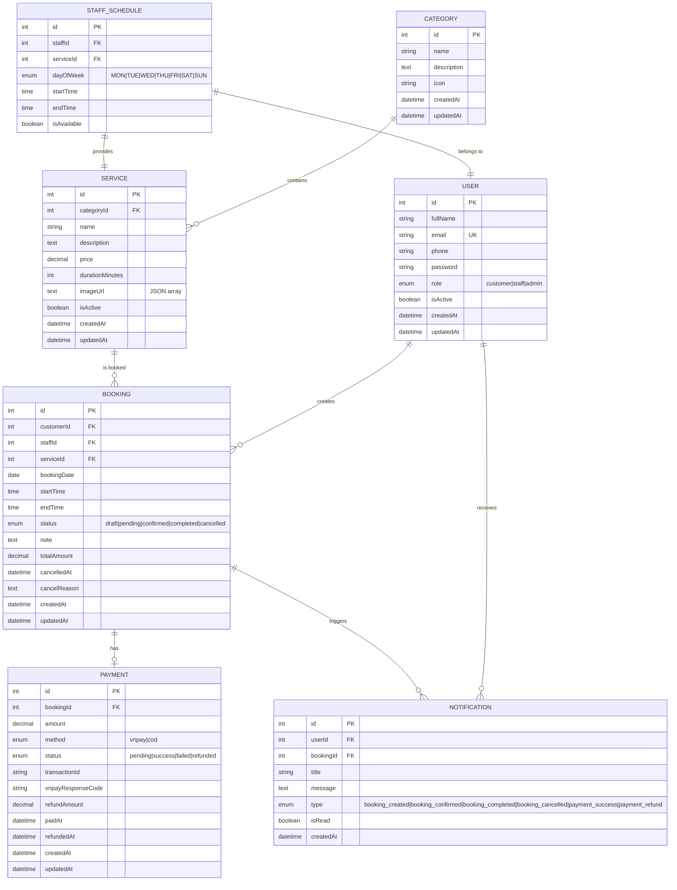

# 🗄️ Thiết kế Database — BookingPro

## 1. Tổng quan

Database sử dụng **MySQL** với **Sequelize ORM**, thiết kế theo mô hình quan hệ (Relational).

---

## 2. ERD (Entity Relationship Diagram)



---

## 3. Chi tiết các bảng

### 3.1 Bảng `users`

Lưu thông tin tất cả người dùng (khách hàng, nhân viên, quản trị viên).

| Cột | Kiểu | Ràng buộc | Mô tả |
|-----|------|-----------|-------|
| id | INT | PK, AUTO_INCREMENT | Mã người dùng |
| fullName | VARCHAR(100) | NOT NULL | Họ tên |
| email | VARCHAR(100) | NOT NULL, UNIQUE | Email đăng nhập |
| phone | VARCHAR(15) | NOT NULL | Số điện thoại |
| password | VARCHAR(255) | NOT NULL | Mật khẩu (hashed) |
| role | ENUM('customer','staff','admin') | NOT NULL, DEFAULT 'customer' | Vai trò |
| isActive | BOOLEAN | DEFAULT true | Trạng thái hoạt động |
| createdAt | DATETIME | DEFAULT CURRENT_TIMESTAMP | Ngày tạo |
| updatedAt | DATETIME | ON UPDATE CURRENT_TIMESTAMP | Ngày cập nhật |

### 3.2 Bảng `categories`

Danh mục phân loại dịch vụ.

| Cột | Kiểu | Ràng buộc | Mô tả |
|-----|------|-----------|-------|
| id | INT | PK, AUTO_INCREMENT | Mã danh mục |
| name | VARCHAR(255) | NOT NULL | Tên danh mục |
| description | TEXT | | Mô tả |
| icon | VARCHAR(255) | | Icon hiển thị |
| createdAt | DATETIME | DEFAULT CURRENT_TIMESTAMP | |
| updatedAt | DATETIME | ON UPDATE CURRENT_TIMESTAMP | |

### 3.3 Bảng `services`

Danh sách các dịch vụ được cung cấp, thuộc về một danh mục.

| Cột | Kiểu | Ràng buộc | Mô tả |
|-----|------|-----------|-------|
| id | INT | PK, AUTO_INCREMENT | Mã dịch vụ |
| categoryId | INT | FK → categories.id | Danh mục |
| name | VARCHAR(100) | NOT NULL | Tên dịch vụ |
| description | TEXT | | Mô tả chi tiết |
| price | DECIMAL(10,2) | NOT NULL | Giá dịch vụ (VNĐ) |
| durationMinutes | INT | NOT NULL | Thời lượng (phút) |
| imageUrl | TEXT | | Ảnh minh họa (JSON array) |
| isActive | BOOLEAN | DEFAULT true | Còn hoạt động |
| createdAt | DATETIME | DEFAULT CURRENT_TIMESTAMP | |
| updatedAt | DATETIME | ON UPDATE CURRENT_TIMESTAMP | |

### 3.4 Bảng `staff_schedules`

Lịch làm việc của nhân viên, xác định nhân viên nào cung cấp dịch vụ nào vào ngày/giờ nào.

| Cột | Kiểu | Ràng buộc | Mô tả |
|-----|------|-----------|-------|
| id | INT | PK, AUTO_INCREMENT | |
| staffId | INT | FK → users.id, NOT NULL | Nhân viên |
| serviceId | INT | FK → services.id, NOT NULL | Dịch vụ |
| dayOfWeek | ENUM('MON','TUE','WED','THU','FRI','SAT','SUN') | NOT NULL | Ngày trong tuần |
| startTime | TIME | NOT NULL | Giờ bắt đầu |
| endTime | TIME | NOT NULL | Giờ kết thúc |
| isAvailable | BOOLEAN | DEFAULT true | Có nhận lịch |

**Unique Constraint:** `(staffId, serviceId, dayOfWeek, startTime)`

### 3.5 Bảng `bookings`

Thông tin đặt lịch — bảng trung tâm của hệ thống.

| Cột | Kiểu | Ràng buộc | Mô tả |
|-----|------|-----------|-------|
| id | INT | PK, AUTO_INCREMENT | Mã booking |
| customerId | INT | FK → users.id, NOT NULL | Khách đặt |
| staffId | INT | FK → users.id, NOT NULL | Nhân viên phục vụ |
| serviceId | INT | FK → services.id, NOT NULL | Dịch vụ |
| bookingDate | DATE | NOT NULL | Ngày hẹn |
| startTime | TIME | NOT NULL | Giờ bắt đầu |
| endTime | TIME | NOT NULL | Giờ kết thúc |
| status | ENUM('draft','pending','confirmed','completed','cancelled') | DEFAULT 'pending' | Trạng thái |
| note | TEXT | | Ghi chú của khách |
| totalAmount | DECIMAL(10,2) | NOT NULL | Tổng tiền |
| cancelledAt | DATETIME | | Thời điểm hủy |
| cancelReason | TEXT | | Lý do hủy |
| createdAt | DATETIME | DEFAULT CURRENT_TIMESTAMP | |
| updatedAt | DATETIME | ON UPDATE CURRENT_TIMESTAMP | |

**Indexes:**
- `idx_booking_customer` ON `(customerId, status)`
- `idx_booking_staff_date` ON `(staffId, bookingDate, startTime)`
- `idx_booking_status` ON `(status)`

### 3.6 Bảng `payments`

Thông tin thanh toán liên kết với booking.

| Cột | Kiểu | Ràng buộc | Mô tả |
|-----|------|-----------|-------|
| id | INT | PK, AUTO_INCREMENT | Mã thanh toán |
| bookingId | INT | FK → bookings.id, NOT NULL, UNIQUE | Booking tương ứng |
| amount | DECIMAL(10,2) | NOT NULL | Số tiền |
| method | ENUM('vnpay','cod') | NOT NULL | Phương thức |
| status | ENUM('pending','success','failed','refunded') | DEFAULT 'pending' | Trạng thái |
| transactionId | VARCHAR(100) | | Mã giao dịch VNPAY |
| vnpayResponseCode | VARCHAR(10) | | Mã phản hồi từ VNPAY |
| refundAmount | DECIMAL(10,2) | DEFAULT 0 | Số tiền hoàn |
| paidAt | DATETIME | | Thời điểm thanh toán |
| refundedAt | DATETIME | | Thời điểm hoàn tiền |
| createdAt | DATETIME | DEFAULT CURRENT_TIMESTAMP | |
| updatedAt | DATETIME | ON UPDATE CURRENT_TIMESTAMP | |

### 3.7 Bảng `notifications`

Thông báo gửi đến người dùng khi trạng thái booking thay đổi.

| Cột | Kiểu | Ràng buộc | Mô tả |
|-----|------|-----------|-------|
| id | INT | PK, AUTO_INCREMENT | Mã thông báo |
| userId | INT | FK → users.id, NOT NULL | Người nhận |
| bookingId | INT | FK → bookings.id | Booking liên quan |
| title | VARCHAR(200) | NOT NULL | Tiêu đề |
| message | TEXT | NOT NULL | Nội dung |
| type | ENUM(...) | NOT NULL | Loại thông báo |
| isRead | BOOLEAN | DEFAULT false | Đã đọc chưa |
| createdAt | DATETIME | DEFAULT CURRENT_TIMESTAMP | |

---

## 4. Quan hệ giữa các bảng

| Quan hệ | Kiểu | Mô tả |
|----------|------|-------|
| Category → Service | 1:N | Một danh mục chứa nhiều dịch vụ |
| User → Booking | 1:N | Một khách hàng có nhiều booking |
| User → Booking (staff) | 1:N | Một nhân viên phục vụ nhiều booking |
| Service → Booking | 1:N | Một dịch vụ được đặt nhiều lần |
| Booking → Payment | 1:1 | Mỗi booking có 1 thanh toán |
| User → Notification | 1:N | Một user nhận nhiều thông báo |
| Booking → Notification | 1:N | Một booking sinh nhiều thông báo |
| User → StaffSchedule | 1:N | Một nhân viên có nhiều lịch làm việc |
| Service → StaffSchedule | 1:N | Một dịch vụ có nhiều nhân viên cung cấp |

---

## 5. SQL Schema

```sql
-- =============================================
-- BookingPro Database Schema
-- =============================================

CREATE DATABASE IF NOT EXISTS bookingpro
  CHARACTER SET utf8mb4
  COLLATE utf8mb4_unicode_ci;

USE bookingpro;

-- ----- USERS -----
CREATE TABLE users (
  id INT AUTO_INCREMENT PRIMARY KEY,
  fullName VARCHAR(100) NOT NULL,
  email VARCHAR(100) NOT NULL UNIQUE,
  phone VARCHAR(15) NOT NULL,
  password VARCHAR(255) NOT NULL,
  role ENUM('customer', 'staff', 'admin') NOT NULL DEFAULT 'customer',
  isActive BOOLEAN DEFAULT TRUE,
  createdAt DATETIME DEFAULT CURRENT_TIMESTAMP,
  updatedAt DATETIME DEFAULT CURRENT_TIMESTAMP ON UPDATE CURRENT_TIMESTAMP
) ENGINE=InnoDB;

-- ----- CATEGORIES -----
CREATE TABLE categories (
  id INT AUTO_INCREMENT PRIMARY KEY,
  name VARCHAR(255) NOT NULL,
  description TEXT,
  icon VARCHAR(255),
  createdAt DATETIME DEFAULT CURRENT_TIMESTAMP,
  updatedAt DATETIME DEFAULT CURRENT_TIMESTAMP ON UPDATE CURRENT_TIMESTAMP
) ENGINE=InnoDB;

-- ----- SERVICES -----
CREATE TABLE services (
  id INT AUTO_INCREMENT PRIMARY KEY,
  categoryId INT,
  name VARCHAR(100) NOT NULL,
  description TEXT,
  price DECIMAL(10, 2) NOT NULL,
  durationMinutes INT NOT NULL,
  imageUrl TEXT,
  isActive BOOLEAN DEFAULT TRUE,
  createdAt DATETIME DEFAULT CURRENT_TIMESTAMP,
  updatedAt DATETIME DEFAULT CURRENT_TIMESTAMP ON UPDATE CURRENT_TIMESTAMP,
  FOREIGN KEY (categoryId) REFERENCES categories(id) ON DELETE SET NULL
) ENGINE=InnoDB;

-- ----- STAFF SCHEDULES -----
CREATE TABLE staff_schedules (
  id INT AUTO_INCREMENT PRIMARY KEY,
  staffId INT NOT NULL,
  serviceId INT NOT NULL,
  dayOfWeek ENUM('MON', 'TUE', 'WED', 'THU', 'FRI', 'SAT', 'SUN') NOT NULL,
  startTime TIME NOT NULL,
  endTime TIME NOT NULL,
  isAvailable BOOLEAN DEFAULT TRUE,
  FOREIGN KEY (staffId) REFERENCES users(id) ON DELETE CASCADE,
  FOREIGN KEY (serviceId) REFERENCES services(id) ON DELETE CASCADE,
  UNIQUE KEY uk_staff_schedule (staffId, serviceId, dayOfWeek, startTime)
) ENGINE=InnoDB;

-- ----- BOOKINGS -----
CREATE TABLE bookings (
  id INT AUTO_INCREMENT PRIMARY KEY,
  customerId INT NOT NULL,
  staffId INT NOT NULL,
  serviceId INT NOT NULL,
  bookingDate DATE NOT NULL,
  startTime TIME NOT NULL,
  endTime TIME NOT NULL,
  status ENUM('draft', 'pending', 'confirmed', 'completed', 'cancelled') DEFAULT 'pending',
  note TEXT,
  totalAmount DECIMAL(10, 2) NOT NULL,
  cancelledAt DATETIME,
  cancelReason TEXT,
  createdAt DATETIME DEFAULT CURRENT_TIMESTAMP,
  updatedAt DATETIME DEFAULT CURRENT_TIMESTAMP ON UPDATE CURRENT_TIMESTAMP,
  FOREIGN KEY (customerId) REFERENCES users(id) ON DELETE CASCADE,
  FOREIGN KEY (staffId) REFERENCES users(id) ON DELETE CASCADE,
  FOREIGN KEY (serviceId) REFERENCES services(id) ON DELETE CASCADE,
  INDEX idx_booking_customer (customerId, status),
  INDEX idx_booking_staff_date (staffId, bookingDate, startTime),
  INDEX idx_booking_status (status)
) ENGINE=InnoDB;

-- ----- PAYMENTS -----
CREATE TABLE payments (
  id INT AUTO_INCREMENT PRIMARY KEY,
  bookingId INT NOT NULL UNIQUE,
  amount DECIMAL(10, 2) NOT NULL,
  method ENUM('vnpay', 'cod') NOT NULL,
  status ENUM('pending', 'success', 'failed', 'refunded') DEFAULT 'pending',
  transactionId VARCHAR(100),
  vnpayResponseCode VARCHAR(10),
  refundAmount DECIMAL(10, 2) DEFAULT 0,
  paidAt DATETIME,
  refundedAt DATETIME,
  createdAt DATETIME DEFAULT CURRENT_TIMESTAMP,
  updatedAt DATETIME DEFAULT CURRENT_TIMESTAMP ON UPDATE CURRENT_TIMESTAMP,
  FOREIGN KEY (bookingId) REFERENCES bookings(id) ON DELETE CASCADE
) ENGINE=InnoDB;

-- ----- NOTIFICATIONS -----
CREATE TABLE notifications (
  id INT AUTO_INCREMENT PRIMARY KEY,
  userId INT NOT NULL,
  bookingId INT,
  title VARCHAR(200) NOT NULL,
  message TEXT NOT NULL,
  type ENUM(
    'booking_created',
    'booking_confirmed',
    'booking_completed',
    'booking_cancelled',
    'payment_success',
    'payment_refund'
  ) NOT NULL,
  isRead BOOLEAN DEFAULT FALSE,
  createdAt DATETIME DEFAULT CURRENT_TIMESTAMP,
  FOREIGN KEY (userId) REFERENCES users(id) ON DELETE CASCADE,
  FOREIGN KEY (bookingId) REFERENCES bookings(id) ON DELETE SET NULL,
  INDEX idx_notification_user (userId, isRead)
) ENGINE=InnoDB;
```

---

## 6. Seed Data (Dữ liệu mẫu)

```sql
-- Admin
INSERT INTO users (fullName, email, phone, password, role) VALUES
('Admin System', 'admin@bookingpro.vn', '0900000001', '$2b$10$hashedpassword', 'admin');

-- Staff
INSERT INTO users (fullName, email, phone, password, role) VALUES
('Nguyễn Văn A', 'staff1@bookingpro.vn', '0900000002', '$2b$10$hashedpassword', 'staff'),
('Trần Thị B', 'staff2@bookingpro.vn', '0900000003', '$2b$10$hashedpassword', 'staff');

-- Customer
INSERT INTO users (fullName, email, phone, password, role) VALUES
('Lê Văn C', 'customer1@gmail.com', '0900000004', '$2b$10$hashedpassword', 'customer');

-- Services
INSERT INTO services (name, description, price, durationMinutes) VALUES
('Cắt tóc nam', 'Cắt tóc theo yêu cầu, gội đầu, sấy tạo kiểu', 100000, 45),
('Gội đầu dưỡng sinh', 'Gội đầu thư giãn kết hợp massage đầu vai cổ', 80000, 30),
('Nhuộm tóc', 'Nhuộm tóc thời trang, tư vấn màu phù hợp', 350000, 90),
('Uốn tóc', 'Uốn tóc setting hoặc uốn phồng tự nhiên', 400000, 120);

-- Staff Schedules
INSERT INTO staff_schedules (staffId, serviceId, dayOfWeek, startTime, endTime) VALUES
(2, 1, 'MON', '08:00', '17:00'),
(2, 1, 'TUE', '08:00', '17:00'),
(2, 2, 'MON', '08:00', '17:00'),
(3, 1, 'WED', '09:00', '18:00'),
(3, 3, 'THU', '09:00', '18:00');
```
