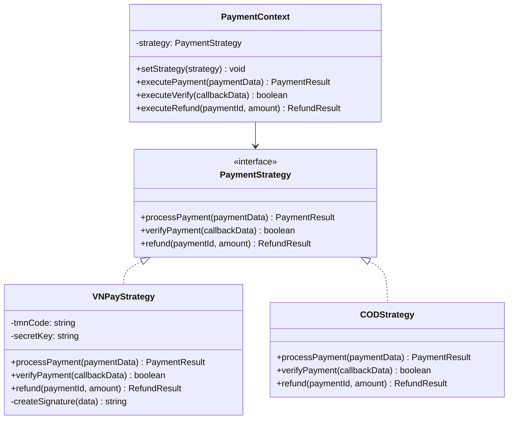
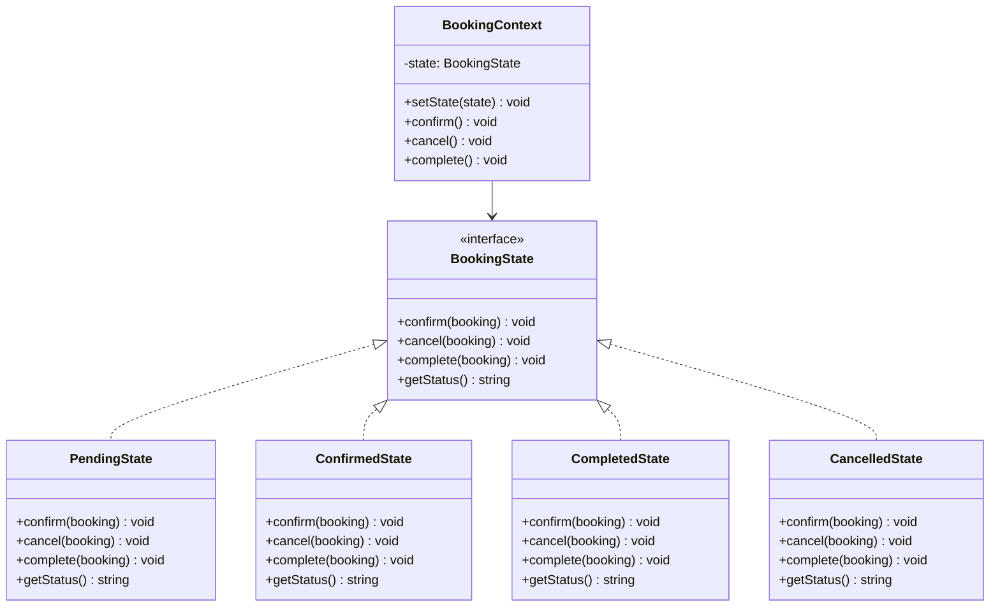
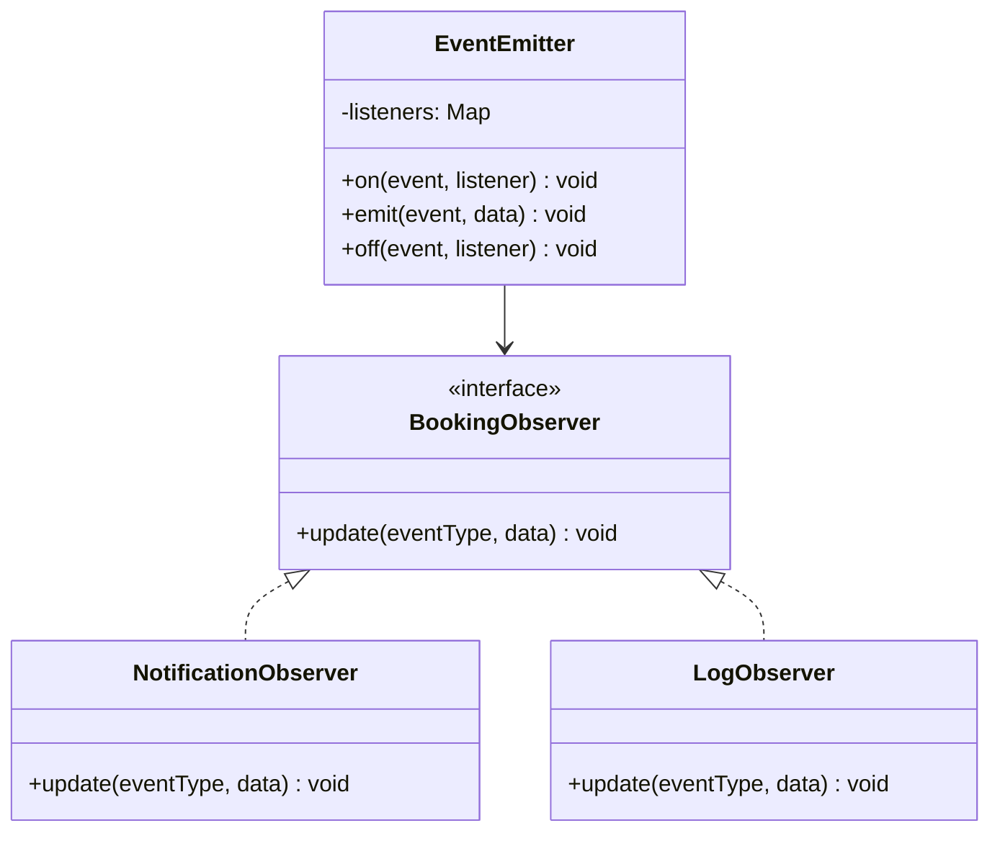
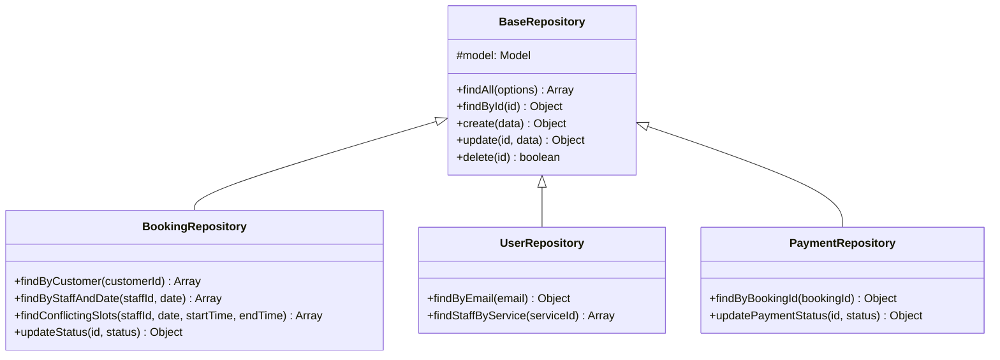

# 🧩 Design Patterns — BookingPro

## Tổng quan

BookingPro áp dụng **4 Design Patterns** tại tầng Business Logic, mỗi pattern được chọn với lý do cụ thể, giải quyết vấn đề thực tế trong hệ thống.

---

## 1. Strategy Pattern — Phương thức Thanh toán

### 📌 Vấn đề cần giải quyết

Hệ thống hỗ trợ nhiều phương thức thanh toán (VNPAY, COD, có thể mở rộng thêm Momo, ZaloPay...). Nếu dùng if-else:

```javascript
// ❌ KHÔNG NÊN — Vi phạm Open/Closed Principle
function processPayment(method, amount) {
  if (method === 'vnpay') {
    // 30 dòng code VNPAY
  } else if (method === 'cod') {
    // 15 dòng code COD
  } else if (method === 'momo') {
    // 30 dòng code Momo — phải SỬA file này
  }
}
```

→ Mỗi lần thêm phương thức mới = sửa file cũ → rủi ro lỗi.

### ✅ Giải pháp: Strategy Pattern



### 💻 Code minh họa

```javascript
// strategies/paymentStrategy.js — Interface
class PaymentStrategy {
  async processPayment(paymentData) {
    throw new Error('Phải implement processPayment()');
  }
  async verifyPayment(callbackData) {
    throw new Error('Phải implement verifyPayment()');
  }
  async refund(paymentId, amount) {
    throw new Error('Phải implement refund()');
  }
}

// strategies/vnpayStrategy.js
class VNPayStrategy extends PaymentStrategy {
  constructor() {
    super();
    this.tmnCode = process.env.VNPAY_TMN_CODE;
    this.secretKey = process.env.VNPAY_SECRET_KEY;
  }

  async processPayment({ orderId, amount, returnUrl }) {
    // Tạo URL thanh toán VNPAY với HMAC signature
    const vnpUrl = this._buildPaymentUrl(orderId, amount, returnUrl);
    return { paymentUrl: vnpUrl, method: 'vnpay' };
  }

  async verifyPayment(callbackData) {
    // Xác thực signature từ VNPAY callback
    return this._verifySignature(callbackData);
  }

  async refund(paymentId, amount) {
    // Gọi VNPAY Refund API
    return { success: true, refundAmount: amount };
  }
}

// strategies/codStrategy.js
class CODStrategy extends PaymentStrategy {
  async processPayment({ orderId, amount }) {
    // COD không cần URL, chỉ tạo record
    return { method: 'cod', status: 'pending' };
  }

  async verifyPayment() {
    return true; // COD xác nhận thủ công
  }

  async refund(paymentId, amount) {
    return { success: true, refundAmount: amount, note: 'Hoàn tiền mặt' };
  }
}

// context/paymentContext.js
class PaymentContext {
  setStrategy(strategy) {
    this.strategy = strategy;
  }

  async executePayment(paymentData) {
    return this.strategy.processPayment(paymentData);
  }
}

// Sử dụng trong PaymentService
const strategies = { vnpay: new VNPayStrategy(), cod: new CODStrategy() };
const context = new PaymentContext();
context.setStrategy(strategies[method]); // method = 'vnpay' | 'cod'
const result = await context.executePayment(paymentData);
```

### 🤔 Nếu không dùng Strategy?
- Phải dùng if-else dài trong PaymentService
- Thêm phương thức mới → **sửa code cũ** → vi phạm **Open/Closed Principle**
- Khó test từng phương thức riêng lẻ

---

## 2. State Pattern — Trạng thái Booking

### 📌 Vấn đề cần giải quyết

Booking có 4 trạng thái: `pending`, `confirmed`, `completed`, `cancelled`. Mỗi trạng thái có hành vi khác nhau và quy tắc chuyển đổi nghiêm ngặt:

```javascript
// ❌ KHÔNG NÊN — if-else lồng nhau khó quản lý
function handleAction(booking, action) {
  if (booking.status === 'pending') {
    if (action === 'confirm') { /* ok */ }
    else if (action === 'cancel') { /* ok */ }
    else if (action === 'complete') { /* KHÔNG HỢP LỆ */ }
  } else if (booking.status === 'confirmed') {
    // ... lặp lại pattern tương tự
  }
}
```

### ✅ Giải pháp: State Pattern



### 💻 Code minh họa

```javascript
// states/bookingState.js
class BookingState {
  confirm(context) { throw new Error('Hành động không hợp lệ'); }
  cancel(context) { throw new Error('Hành động không hợp lệ'); }
  complete(context) { throw new Error('Hành động không hợp lệ'); }
}

// states/pendingState.js
class PendingState extends BookingState {
  confirm(context) {
    console.log('Booking chuyển từ PENDING → CONFIRMED');
    context.setState(new ConfirmedState());
  }

  cancel(context) {
    console.log('Booking chuyển từ PENDING → CANCELLED');
    context.setState(new CancelledState());
  }

  // complete() → throw Error (không thể complete khi chưa confirm)
  getStatus() { return 'pending'; }
}

// states/confirmedState.js
class ConfirmedState extends BookingState {
  complete(context) {
    console.log('Booking chuyển từ CONFIRMED → COMPLETED');
    context.setState(new CompletedState());
  }

  cancel(context) {
    console.log('Booking chuyển từ CONFIRMED → CANCELLED');
    context.setState(new CancelledState());
  }

  // confirm() → throw Error (đã confirm rồi)
  getStatus() { return 'confirmed'; }
}

// BookingContext
class BookingContext {
  constructor(initialStatus) {
    const stateMap = {
      pending: new PendingState(),
      confirmed: new ConfirmedState(),
      completed: new CompletedState(),
      cancelled: new CancelledState(),
    };
    this.state = stateMap[initialStatus];
  }

  setState(state) { this.state = state; }
  confirm() { this.state.confirm(this); }
  cancel() { this.state.cancel(this); }
  complete() { this.state.complete(this); }
  getStatus() { return this.state.getStatus(); }
}
```

### 🤔 Nếu không dùng State?
- if-else phức tạp, dễ bỏ sót case
- Thêm trạng thái mới (VD: `in_progress`) → sửa **tất cả** if-else
- Khó kiểm soát chuyển trạng thái hợp lệ

---

## 3. Observer Pattern — Hệ thống Notification

### 📌 Vấn đề cần giải quyết

Khi trạng thái booking thay đổi, cần thông báo đến nhiều bên:
- Thông báo cho khách hàng
- Thông báo cho nhân viên
- Lưu log hệ thống
- (Tương lai) Gửi email, SMS

Nếu viết trực tiếp trong BookingService:

```javascript
// ❌ BookingService bị "phình to" với logic không thuộc về nó
async confirmBooking(id) {
  // ... logic confirm
  await notificationRepo.create({ userId: customerId, ... });
  await notificationRepo.create({ userId: staffId, ... });
  await emailService.send(customerEmail, ...);
  await smsService.send(customerPhone, ...);
  // BookingService đang làm quá nhiều việc!
}
```

### ✅ Giải pháp: Observer Pattern



### 💻 Code minh họa

```javascript
// observer/eventEmitter.js
class BookingEventEmitter {
  constructor() {
    this.listeners = new Map();
  }

  on(event, listener) {
    if (!this.listeners.has(event)) {
      this.listeners.set(event, []);
    }
    this.listeners.get(event).push(listener);
  }

  emit(event, data) {
    const eventListeners = this.listeners.get(event) || [];
    eventListeners.forEach(listener => listener.update(event, data));
  }
}

// observer/notificationObserver.js
class NotificationObserver {
  constructor(notificationRepository) {
    this.notificationRepo = notificationRepository;
  }

  async update(eventType, { booking, customer, staff }) {
    const messages = {
      'booking:confirmed': {
        title: 'Lịch hẹn đã được xác nhận',
        message: `Lịch hẹn #${booking.id} đã được xác nhận`,
      },
      'booking:cancelled': {
        title: 'Lịch hẹn đã bị hủy',
        message: `Lịch hẹn #${booking.id} đã bị hủy`,
      },
      'booking:completed': {
        title: 'Dịch vụ hoàn thành',
        message: `Lịch hẹn #${booking.id} đã hoàn thành`,
      },
    };

    const msg = messages[eventType];
    if (!msg) return;

    // Thông báo cho khách hàng
    await this.notificationRepo.create({
      userId: customer.id,
      bookingId: booking.id,
      ...msg,
      type: eventType.replace('booking:', 'booking_'),
    });

    // Thông báo cho nhân viên
    await this.notificationRepo.create({
      userId: staff.id,
      bookingId: booking.id,
      ...msg,
      type: eventType.replace('booking:', 'booking_'),
    });
  }
}

// Đăng ký observer trong app.js
const emitter = new BookingEventEmitter();
emitter.on('booking:confirmed', new NotificationObserver(notifRepo));
emitter.on('booking:cancelled', new NotificationObserver(notifRepo));
emitter.on('booking:completed', new NotificationObserver(notifRepo));

// BookingService chỉ cần emit event
async confirmBooking(id) {
  // ... logic confirm
  this.emitter.emit('booking:confirmed', { booking, customer, staff });
  // Sạch sẽ, không cần biết ai đang lắng nghe
}
```

### 🤔 Nếu không dùng Observer?
- BookingService bị coupling chặt với NotificationService, EmailService, SMSService
- Thêm kênh thông báo mới → sửa BookingService → vi phạm **Single Responsibility**
- Khó test BookingService vì phụ thuộc nhiều service khác

---

## 4. Repository Pattern — Tầng truy xuất dữ liệu

### 📌 Vấn đề cần giải quyết

Nếu Service gọi trực tiếp Sequelize Model:

```javascript
// ❌ Service bị coupling chặt với Sequelize
class BookingService {
  async getByCustomer(customerId) {
    return await Booking.findAll({
      where: { customerId },
      include: [{ model: Service }, { model: User, as: 'staff' }],
      order: [['createdAt', 'DESC']],
    });
  }
}
```

→ Nếu đổi sang MongoDB → phải sửa **tất cả** service files.

### ✅ Giải pháp: Repository Pattern



### 💻 Code minh họa

```javascript
// repositories/base.repository.js
class BaseRepository {
  constructor(model) {
    this.model = model;
  }

  async findAll(options = {}) {
    return this.model.findAll(options);
  }

  async findById(id, options = {}) {
    return this.model.findByPk(id, options);
  }

  async create(data) {
    return this.model.create(data);
  }

  async update(id, data) {
    const record = await this.findById(id);
    if (!record) throw new Error('Không tìm thấy bản ghi');
    return record.update(data);
  }

  async delete(id) {
    const record = await this.findById(id);
    if (!record) throw new Error('Không tìm thấy bản ghi');
    await record.destroy();
    return true;
  }
}

// repositories/booking.repository.js
class BookingRepository extends BaseRepository {
  constructor(bookingModel, serviceModel, userModel) {
    super(bookingModel);
    this.serviceModel = serviceModel;
    this.userModel = userModel;
  }

  async findByCustomer(customerId) {
    return this.model.findAll({
      where: { customerId },
      include: [
        { model: this.serviceModel },
        { model: this.userModel, as: 'staff', attributes: ['id', 'fullName'] },
      ],
      order: [['createdAt', 'DESC']],
    });
  }

  async findConflictingSlots(staffId, bookingDate, startTime, endTime) {
    const { Op } = require('sequelize');
    return this.model.findAll({
      where: {
        staffId,
        bookingDate,
        status: { [Op.in]: ['pending', 'confirmed'] },
        [Op.or]: [
          { startTime: { [Op.between]: [startTime, endTime] } },
          { endTime: { [Op.between]: [startTime, endTime] } },
        ],
      },
    });
  }
}

// Service sạch sẽ, không biết chi tiết query
class BookingService {
  constructor(bookingRepository) {
    this.bookingRepo = bookingRepository;
  }

  async getCustomerBookings(customerId) {
    return this.bookingRepo.findByCustomer(customerId);
  }
}
```

### 🤔 Nếu không dùng Repository?
- Service bị coupling chặt với ORM cụ thể (Sequelize)
- Đổi database → sửa **tất cả** service files
- Khó viết unit test (phải mock Sequelize)

---

## 📊 Tổng kết

| Pattern | Nguyên tắc SOLID | Vấn đề giải quyết |
|---------|-----------------|-------------------|
| Strategy | Open/Closed | Mở rộng phương thức thanh toán |
| State | Single Responsibility | Quản lý trạng thái booking |
| Observer | Single Responsibility | Tách biệt notification logic |
| Repository | Dependency Inversion | Tách biệt data access logic |
