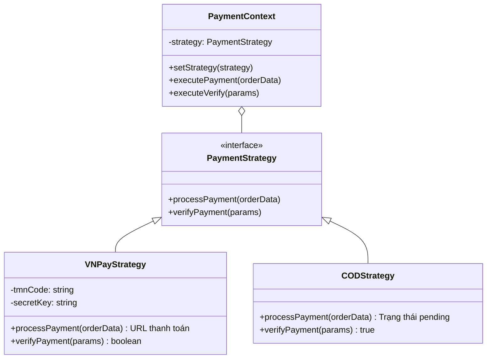
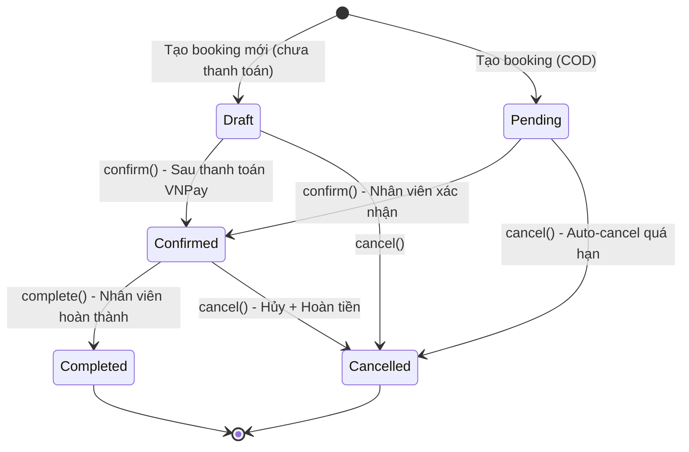
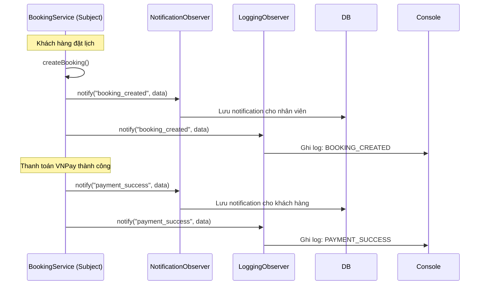
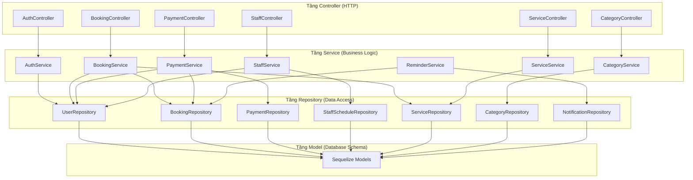
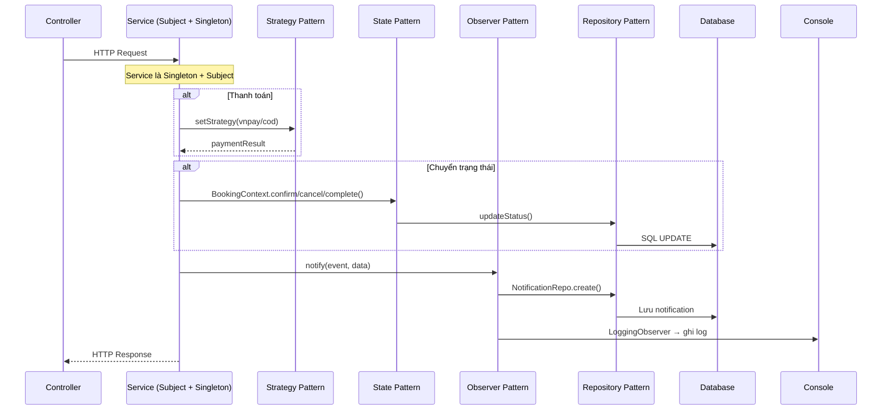

# 🧩 Phân Tích Design Patterns trong BookingPro

Tài liệu này phân tích chi tiết cách áp dụng các mẫu thiết kế (Design Patterns) trong dự án BookingPro. Các mẫu được lựa chọn dựa trên yêu cầu về tính linh hoạt, khả năng mở rộng và tuân thủ các nguyên tắc thiết kế sạch (Clean Architecture).

---

## 🏛️ Tổng quan các nhóm Design Pattern được sử dụng

| # | Nhóm Pattern | Tên Pattern | Phạm vi áp dụng | Số file liên quan |
|:-:|:---|:---|:---|:---:|
| 1 | **Creational** (Khởi tạo) | **Singleton** | Quản lý kết nối Database và tất cả Services/Repositories. | 15+ |
| 2 | **Behavioral** (Hành vi) | **Strategy** | Đa dạng hóa phương thức thanh toán (VNPay, COD). | 4 |
| 3 | **Behavioral** (Hành vi) | **State** | Quản lý vòng đời phức tạp của một lịch hẹn (Booking). | 3 |
| 4 | **Behavioral** (Hành vi) | **Observer** | Hệ thống thông báo và ghi log tự động khi có sự kiện. | 4 |
| 5 | **Architectural** (Kiến trúc) | **Repository** | Tách biệt logic truy xuất dữ liệu khỏi logic nghiệp vụ. | 8 |
| 6 | **Architectural** (Kiến trúc) | **Layered Architecture** | Phân tầng Controller → Service → Repository → Model. | Toàn bộ |

---

## 1️⃣ Nhóm Creational: Singleton Pattern

### 📌 Vấn đề cần giải quyết
Hệ thống cần đảm bảo chỉ có **một instance duy nhất** của kết nối cơ sở dữ liệu, cũng như các Service và Repository, để tối ưu tài nguyên và tránh xung đột trạng thái.

### 🤔 Tại sao chọn Singleton?
- **Kết nối DB** chỉ nên tồn tại 1 instance để dùng connection pool hiệu quả. Nhiều instance sẽ gây lãng phí tài nguyên, xung đột kết nối.
- **Services/Repositories** chứa các Observer đã đăng ký. Nếu tạo nhiều instance, các Observer sẽ bị trùng lặp, gây ra notification/log bị gửi nhiều lần.

### ✅ Các file áp dụng

| File | Cách triển khai |
|:---|:---|
| `config/database.js` | `module.exports = sequelize` — cơ chế `require()` caching của Node.js |
| `services/booking.service.js` | `module.exports = new BookingService()` |
| `services/payment.service.js` | `module.exports = new PaymentService()` |
| `services/auth.service.js` | `module.exports = new AuthService()` |
| `services/category.service.js` | `module.exports = new CategoryService()` |
| `services/service.service.js` | `module.exports = new ServiceService()` |
| `services/staff.service.js` | `module.exports = new StaffService()` |
| `repositories/*.repository.js` | Tất cả 8 repositories đều export Singleton |

### 💻 Code minh họa (`config/database.js`)
```javascript
const { Sequelize } = require('sequelize');
const sequelize = new Sequelize(/* cấu hình từ biến môi trường */);

// Mọi lệnh require file này đều trả về chung 1 instance 'sequelize'
module.exports = sequelize;
```

---

## 2️⃣ Nhóm Behavioral: Strategy Pattern

### 📌 Vấn đề cần giải quyết
Hệ thống cần hỗ trợ **nhiều phương thức thanh toán** (hiện tại: VNPay và COD). Nếu dùng `if-else` trong `PaymentService`, code sẽ trở nên cực kỳ khó duy trì khi thêm phương thức mới — **vi phạm nguyên tắc Open/Closed (OCP)**.

### 🤔 Tại sao chọn Strategy?
- Mỗi phương thức thanh toán có logic riêng biệt hoàn toàn (VNPay cần tạo URL + chữ ký HMAC, COD chỉ cần trả status).
- Khi thêm phương thức mới (ví dụ: MoMo, ZaloPay), chỉ cần tạo **1 class mới** kế thừa `PaymentStrategy` mà **không sửa đổi bất kỳ code nào** đã tồn tại.
- Cho phép **runtime switching** — chọn chiến lược thanh toán phù hợp tại thời điểm xử lý request.

### ✅ Các file áp dụng

| File | Vai trò |
|:---|:---|
| `patterns/strategy/payment.strategy.js` | **Interface** — Định nghĩa contract `processPayment()` + `verifyPayment()` |
| `patterns/strategy/vnpay.strategy.js` | **Concrete Strategy** — Logic tạo URL VNPay + xác minh chữ ký |
| `patterns/strategy/cod.strategy.js` | **Concrete Strategy** — Logic COD (thanh toán tại quầy) |
| `patterns/strategy/payment.context.js` | **Context** — Chứa strategy hiện tại, ủy quyền gọi |
| `services/payment.service.js` | **Client** — Nơi sử dụng Strategy Pattern |

### 📐 Biểu đồ lớp


### 💻 Code minh họa — Cách sử dụng trong `PaymentService`
```javascript
class PaymentService extends Subject {
  constructor() {
    super();
    // Map tên method → Strategy instance
    this.strategies = {
      'vnpay': new VNPayStrategy(),
      'cod': new CODStrategy()
    };
    this.context = new PaymentContext();
  }

  async initiatePayment(bookingId, method, ipAddress) {
    const strategy = this.strategies[method];
    if (!strategy) throw new Error('Phương thức thanh toán không được hỗ trợ');
    
    // Runtime switching: Đổi strategy tùy theo method
    this.context.setStrategy(strategy);
    
    // Ủy quyền xử lý cho Strategy
    const paymentResult = await this.context.executePayment({ ... });
    return paymentResult;
  }
}
```

---

## 3️⃣ Nhóm Behavioral: State Pattern

### 📌 Vấn đề cần giải quyết
Một Booking có **vòng đời phức tạp** với nhiều trạng thái: `Draft` → `Pending` → `Confirmed` → `Completed`. Mỗi trạng thái có những **hành động hợp lệ khác nhau**. Ví dụ: Không thể hủy một lịch hẹn đã hoàn thành, không thể xác nhận một lịch đã bị hủy.

### 🤔 Tại sao chọn State?
- Logic `if-else` kiểm tra trạng thái sẽ xuất hiện khắp nơi trong Service, rất dễ bị thiếu sót (ví dụ: quên kiểm tra ở chỗ hoàn tiền).
- State Pattern **đóng gói quy tắc chuyển trạng thái** bên trong từng State class → hệ thống **tự bảo vệ mình** khỏi các transition không hợp lệ bằng cách throw Error.
- Khi thêm trạng thái mới (ví dụ: `InProgress`), chỉ cần tạo class mới mà không sửa code cũ.

### ✅ Các file áp dụng

| File | Vai trò |
|:---|:---|
| `patterns/state/booking.state.js` | **Abstract State** — Định nghĩa các hành động mặc định (throw Error) |
| `patterns/state/booking.states.js` | **Concrete States** — 5 trạng thái: Draft, Pending, Confirmed, Completed, Cancelled |
| `patterns/state/booking.context.js` | **Context** — Quản lý state machine, ủy quyền hành động cho State |
| `services/booking.service.js` | **Client** — Dùng `BookingContext` tại: `confirmBooking()`, `cancelBooking()`, `completeBooking()`, `refundBooking()` |
| `services/payment.service.js` | **Client** — Dùng `BookingContext.confirm()` sau thanh toán thành công |
| `services/reminder.service.js` | **Client** — Dùng `BookingContext.cancel()` khi auto-cancel booking quá hạn |

### 📐 Biểu đồ trạng thái


### 💻 Code minh họa
```javascript
// BookingContext tự khởi tạo State dựa trên status hiện tại
class BookingContext {
  _initStateMachine() {
    const states = {
      'draft': new DraftState(this),
      'pending': new PendingState(this),
      'confirmed': new ConfirmedState(this),
      'completed': new CompletedState(this),
      'cancelled': new CancelledState(this)
    };
    this.state = states[this.bookingRecord.status];
  }

  // Ủy quyền cho State xử lý — nếu hành động không hợp lệ, State sẽ throw Error
  async confirm() { return await this.state.confirm(); }
  async cancel() { return await this.state.cancel(); }
}

// CompletedState: Trạng thái cuối → không cho phép bất kỳ hành động nào
class CompletedState extends BookingState {
  getStatus() { return 'completed'; }
  // confirm(), cancel(), complete() đều kế thừa throw Error từ lớp cha
}
```

### 📍 Tất cả các nơi sử dụng State Pattern
```javascript
// 1. BookingService — Xác nhận lịch hẹn
const context = new BookingContext(booking, bookingRepository);
await context.confirm();

// 2. BookingService — Hủy lịch hẹn
const context = new BookingContext(booking, bookingRepository);
await context.cancel();

// 3. BookingService — Hoàn thành lịch hẹn
const context = new BookingContext(booking, bookingRepository);
await context.complete();

// 4. BookingService — Hoàn tiền (hủy qua State → rồi xử lý payment)
const context = new BookingContext(booking, bookingRepository);
await context.cancel();

// 5. PaymentService — Thanh toán thành công → confirm booking
const context = new BookingContext(booking, bookingRepository);
await context.confirm();

// 6. ReminderService — Auto-cancel booking quá hạn
const context = new BookingContext(booking, bookingRepository);
await context.cancel();
```

---

## 4️⃣ Nhóm Behavioral: Observer Pattern

### 📌 Vấn đề cần giải quyết
Khi một sự kiện xảy ra (tạo booking, thanh toán thành công, hủy lịch...), **nhiều tác vụ cần thực hiện đồng thời**: Lưu notification cho khách, gửi notification cho nhân viên, ghi log hệ thống... Nếu viết tất cả vào Service, Service sẽ bị "phình to" quá mức và vi phạm **Single Responsibility Principle (SRP)**.

### 🤔 Tại sao chọn Observer?
- **Tách biệt mối quan tâm (Separation of Concerns):** Service chỉ cần `notify()` một sự kiện. Logic xử lý thông báo, logging được tách ra thành các Observer riêng biệt.
- **Dễ mở rộng:** Thêm observer mới (ví dụ: EmailObserver, SMSObserver) chỉ cần tạo class mới + `attach()` — không sửa bất kỳ code nào trong Service.
- **Giảm coupling:** Service không cần biết ai đang lắng nghe sự kiện của mình.

### ✅ Các file áp dụng

| File | Vai trò |
|:---|:---|
| `patterns/observer/subject.js` | **Subject (Publisher)** — Quản lý danh sách Observer + `notify()` |
| `patterns/observer/observer.js` | **Observer Interface** — Định nghĩa contract `update()` |
| `patterns/observer/notification.observer.js` | **Concrete Observer** — Tạo notification vào DB cho khách/nhân viên |
| `patterns/observer/logging.observer.js` | **Concrete Observer** — Ghi log chi tiết ra console |
| `services/booking.service.js` | **Subject** — `extends Subject`, phát events: booking_created, confirmed, completed, cancelled, refunded |
| `services/payment.service.js` | **Subject** — `extends Subject`, phát event: payment_success |
| `services/reminder.service.js` | **Subject** — `extends Subject`, ghi log khi auto-cancel |

### 📐 Luồng hoạt động


### 📊 Ma trận đăng ký Observer

| Service (Subject) | NotificationObserver | LoggingObserver |
|:---|:---:|:---:|
| `BookingService` | ✅ | ✅ |
| `PaymentService` | ✅ | ✅ |
| `ReminderService` | — | ✅ |

### 📊 Ma trận Event Types

| Event | NotificationObserver | LoggingObserver |
|:---|:---:|:---:|
| `booking_created` | ✅ Thông báo cho Staff | ✅ |
| `booking_confirmed` | ✅ Thông báo cho Customer | ✅ |
| `booking_completed` | — | ✅ |
| `booking_cancelled` | ✅ Thông báo cho Staff | ✅ |
| `booking_refunded` | — | ✅ |
| `payment_success` | ✅ Thông báo cho Customer | ✅ |

---

## 5️⃣ Nhóm Architectural: Repository Pattern

### 📌 Vấn đề cần giải quyết
Tránh việc logic nghiệp vụ (Service) bị phụ thuộc trực tiếp vào ORM (Sequelize). Nếu sau này đổi Database hoặc ORM, ta chỉ cần sửa lớp Repository mà **không sửa bất kỳ Service nào**.

### 🤔 Tại sao chọn Repository?
- **Abstraction Layer:** Service gọi `repository.findById()` thay vì `Model.findByPk()`. Service không biết và không cần biết Sequelize tồn tại.
- **DRY (Don't Repeat Yourself):** Các truy vấn phức tạp (như `findConflictingSlots`) chỉ viết 1 lần trong Repository, các Service khác nhau đều dùng lại.
- **Testability:** Dễ dàng mock Repository khi viết Unit Test cho Service.

### ✅ Các file áp dụng

| File | Kế thừa | Phương thức đặc biệt |
|:---|:---|:---|
| `repositories/base.repository.js` | — (Base class) | `findAll`, `findById`, `findOne`, `create`, `update`, `delete`, `count` |
| `repositories/booking.repository.js` | `BaseRepository` | `findByCustomer`, `findByStaff`, `findConflictingSlots`, `updateStatus` |
| `repositories/user.repository.js` | `BaseRepository` | `findByEmail`, `findActiveStaff` |
| `repositories/service.repository.js` | `BaseRepository` | `findActiveServices` |
| `repositories/payment.repository.js` | `BaseRepository` | `findByBookingId`, `findByTransactionId` |
| `repositories/notification.repository.js` | `BaseRepository` | `findByUser` |
| `repositories/staffSchedule.repository.js` | `BaseRepository` | `findSchedulesByDay`, `findByStaffAndService` |
| `repositories/category.repository.js` | `BaseRepository` | `findWithServices` |

### 💻 Code minh họa (`base.repository.js`)
```javascript
class BaseRepository {
  constructor(model) {
    this.model = model;  // Inject Model dependency
  }

  async findById(id, options = {}) {
    return await this.model.findByPk(id, options);
  }

  async create(data) {
    return await this.model.create(data);
  }

  async update(id, data) {
    const record = await this.findById(id);
    if (!record) return null;
    return await record.update(data);
  }
  // ... các phương thức CRUD dùng chung
}
```

---

## 6️⃣ Layered Architecture (Kiến trúc phân tầng)

### 📌 Vấn đề cần giải quyết
Nếu Controller truy cập Database trực tiếp, hệ thống sẽ mất tính bảo trì. Logic nghiệp vụ bị rải rác ở nhiều nơi, không thể tái sử dụng.

### 🤔 Tại sao chọn Layered Architecture?
- **Ranh giới rõ ràng:** Mỗi tầng có 1 trách nhiệm duy nhất.
- **Controller** chỉ xử lý HTTP request/response — không chứa logic nghiệp vụ.
- **Service** chứa toàn bộ business logic — là nơi kết hợp các Design Pattern (State, Observer, Strategy).
- **Repository** chỉ lo truy xuất/lưu trữ dữ liệu — đóng vai trò abstraction layer cho Database.

### 📐 Sơ đồ kiến trúc


### 📊 Ma trận Controller → Service → Repository

| Controller | Service | Repository(s) sử dụng |
|:---|:---|:---|
| `AuthController` | `AuthService` | `UserRepository` |
| `BookingController` | `BookingService` | `BookingRepository`, `UserRepository`, `ServiceRepository`, `PaymentRepository` |
| `PaymentController` | `PaymentService` | `PaymentRepository`, `BookingRepository`, `UserRepository` |
| `StaffController` | `StaffService` | `UserRepository`, `StaffScheduleRepository` |
| `ServiceController` | `ServiceService` | `ServiceRepository` |
| `CategoryController` | `CategoryService` | `CategoryRepository` |
| — (Cron Job) | `ReminderService` | `BookingRepository`, `NotificationRepository` |

---

## 🔗 Tổng hợp: Cách các Pattern phối hợp với nhau



---

## 🚀 Tổng kết lợi ích mang lại

1. **Dễ bảo trì (Maintainability):** Code được chia nhỏ thành các module có chức năng riêng biệt. Mỗi file dưới 100 dòng (trung bình).
2. **Tính mở rộng (Extensibility):** Thêm tính năng mới (loại thanh toán mới, trạng thái mới, observer mới) cực kỳ nhanh chóng mà không sợ ảnh hưởng đến tính năng cũ.
3. **Dễ kiểm thử (Testability):** Có thể viết Unit Test cho từng Strategy, State, Observer, Repository một cách độc lập.
4. **Tuân thủ SOLID:**
   - **Single Responsibility:** Mỗi class 1 việc (Controller xử lý HTTP, Service xử lý logic, Repository xử lý data).
   - **Open/Closed:** Mở để mở rộng (thêm Strategy/State/Observer mới), đóng để sửa đổi.
   - **Dependency Inversion:** Service phụ thuộc vào abstraction (Repository interface), không phụ thuộc vào Sequelize trực tiếp.