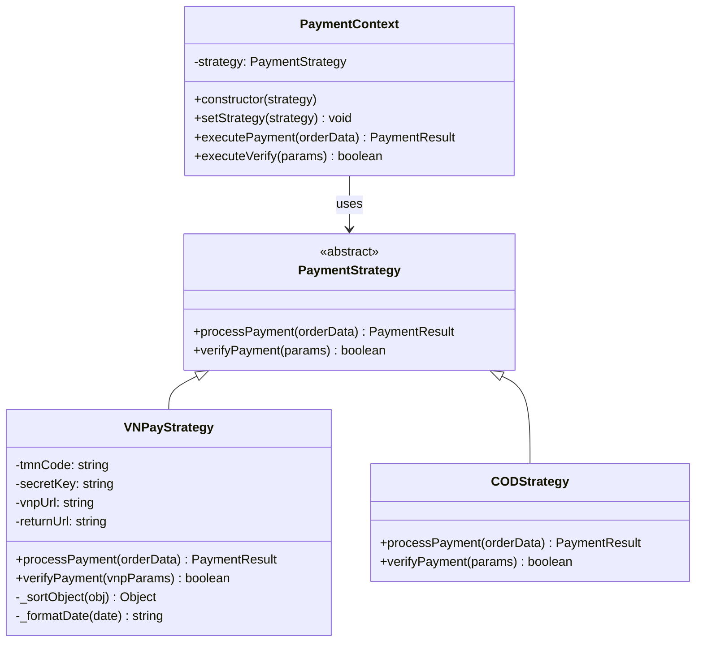
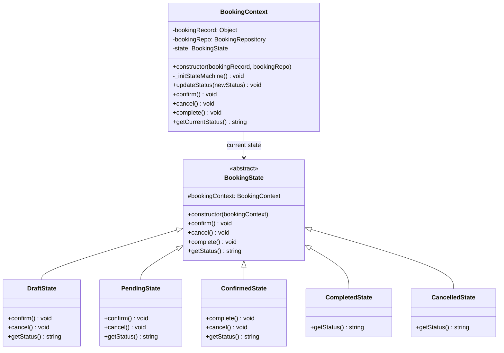
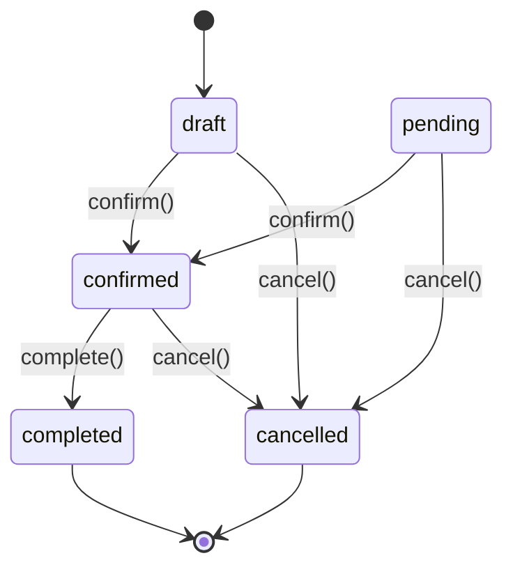
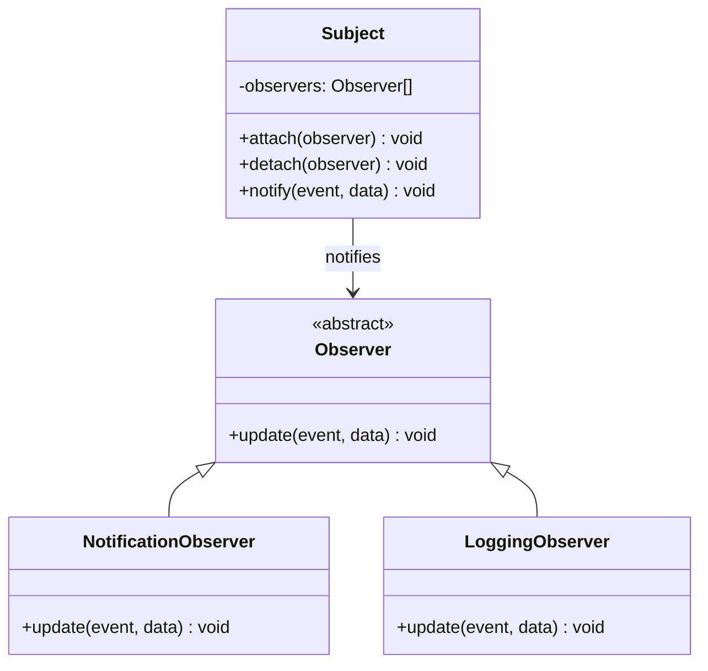
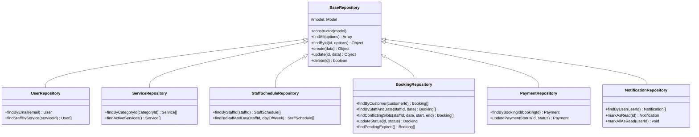
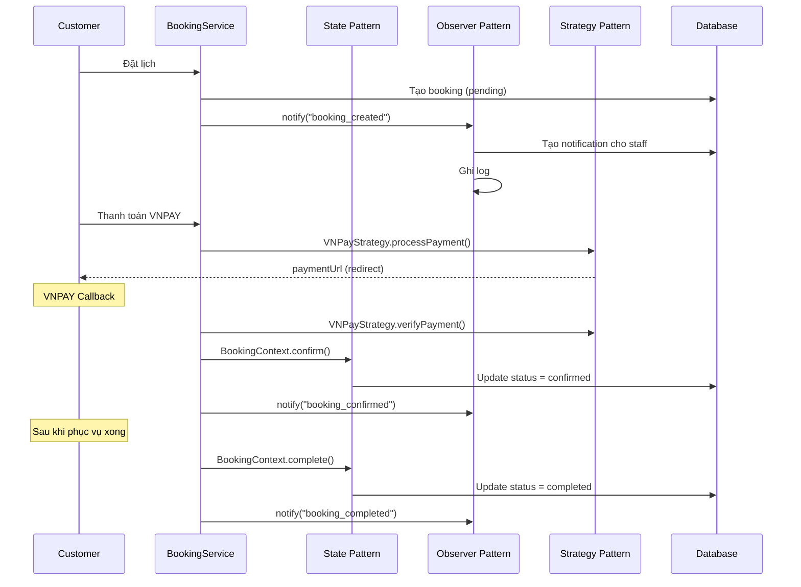

# 🧩 Design Patterns — BookingPro

## Tổng quan

BookingPro áp dụng **4 Design Patterns** tại tầng Business Logic, mỗi pattern được chọn với lý do cụ thể, giải quyết vấn đề thực tế trong hệ thống.

| # | Pattern | File chính | Nguyên tắc SOLID |
|---|---------|-----------|-----------------|
| 1 | **Strategy** | `patterns/strategy/` | Open/Closed Principle |
| 2 | **State** | `patterns/state/` | Single Responsibility Principle |
| 3 | **Observer** | `patterns/observer/` | Single Responsibility Principle |
| 4 | **Repository** | `repositories/` | Dependency Inversion Principle |

---

## 1. Strategy Pattern — Phương thức Thanh toán

### 📌 Vấn đề cần giải quyết

Hệ thống hỗ trợ nhiều phương thức thanh toán (VNPAY, COD, có thể mở rộng thêm Momo, ZaloPay...). Nếu dùng if-else:

```javascript
// ❌ KHÔNG NÊN — Vi phạm Open/Closed Principle
function processPayment(method, amount) {
  if (method === 'vnpay') {
    // 30 dòng code VNPAY
  } else if (method === 'cod') {
    // 15 dòng code COD
  } else if (method === 'momo') {
    // 30 dòng code Momo — phải SỬA file này
  }
}
```

→ Mỗi lần thêm phương thức mới = sửa file cũ → rủi ro lỗi.

### ✅ Giải pháp: Strategy Pattern



### 💻 Code thực tế trong project

**Interface — `payment.strategy.js`:**
```javascript
class PaymentStrategy {
  async processPayment(orderData) {
    throw new Error('Method processPayment() must be implemented');
  }

  async verifyPayment(params) {
    throw new Error('Method verifyPayment() must be implemented');
  }
}
```

**VNPAY — `vnpay.strategy.js`:**
```javascript
class VNPayStrategy extends PaymentStrategy {
  constructor() {
    super();
    this.tmnCode = process.env.VNP_TMNCODE;
    this.secretKey = process.env.VNP_HASHSECRET;
    this.vnpUrl = process.env.VNP_URL;
    this.returnUrl = process.env.VNP_RETURNURL;
  }

  async processPayment({ orderId, amount, orderInfo, ipAddress }) {
    // Tạo params VNPAY v2.1.0
    // Sắp xếp params → Tạo HMAC SHA512 signature → Build URL
    return { paymentUrl: finalUrl, method: 'vnpay' };
  }

  async verifyPayment(vnp_Params) {
    // Xác thực signature từ VNPAY callback
    // So sánh HMAC SHA512 + kiểm tra vnp_ResponseCode === '00'
    return secureHash === signed && vnp_Params['vnp_ResponseCode'] === '00';
  }
}
```

**COD — `cod.strategy.js`:**
```javascript
class CODStrategy extends PaymentStrategy {
  async processPayment(orderData) {
    return {
      method: 'cod',
      status: 'pending',
      message: 'Đặt lịch thành công. Vui lòng thanh toán tại quầy.'
    };
  }

  async verifyPayment(params) {
    return true; // COD xác nhận thủ công bởi nhân viên
  }
}
```

**Context — `payment.context.js`:**
```javascript
class PaymentContext {
  constructor(strategy) {
    this.strategy = strategy;
  }

  setStrategy(strategy) {
    this.strategy = strategy;
  }

  async executePayment(orderData) {
    return await this.strategy.processPayment(orderData);
  }

  async executeVerify(params) {
    return await this.strategy.verifyPayment(params);
  }
}
```

**Sử dụng trong PaymentService:**
```javascript
const strategies = { vnpay: new VNPayStrategy(), cod: new CODStrategy() };
const context = new PaymentContext(strategies[method]);
const result = await context.executePayment(orderData);
```

### 🤔 Nếu không dùng Strategy?
- Phải dùng if-else dài trong PaymentService
- Thêm phương thức mới → **sửa code cũ** → vi phạm **Open/Closed Principle**
- Khó test từng phương thức riêng lẻ

---

## 2. State Pattern — Trạng thái Booking

### 📌 Vấn đề cần giải quyết

Booking có 5 trạng thái: `draft`, `pending`, `confirmed`, `completed`, `cancelled`. Mỗi trạng thái có hành vi khác nhau và quy tắc chuyển đổi nghiêm ngặt:

```javascript
// ❌ KHÔNG NÊN — if-else lồng nhau khó quản lý
function handleAction(booking, action) {
  if (booking.status === 'pending') {
    if (action === 'confirm') { /* ok */ }
    else if (action === 'cancel') { /* ok */ }
    else if (action === 'complete') { /* KHÔNG HỢP LỆ */ }
  } else if (booking.status === 'confirmed') {
    // ... lặp lại pattern tương tự
  }
}
```

### ✅ Giải pháp: State Pattern



### State Transition Diagram



### 💻 Code thực tế trong project

**Abstract State — `booking.state.js`:**
```javascript
class BookingState {
  constructor(bookingContext) {
    this.bookingContext = bookingContext;
  }

  async confirm() {
    throw new Error('Hành động này không hợp lệ cho trạng thái hiện tại');
  }

  async complete() {
    throw new Error('Hành động này không hợp lệ cho trạng thái hiện tại');
  }

  async cancel() {
    throw new Error('Hành động này không hợp lệ cho trạng thái hiện tại');
  }

  getStatus() {
    throw new Error('Method getStatus() must be implemented');
  }
}
```

**Concrete States — `booking.states.js`:**
```javascript
class PendingState extends BookingState {
  async confirm() {
    await this.bookingContext.updateStatus('confirmed');
  }
  async cancel() {
    await this.bookingContext.updateStatus('cancelled');
  }
  getStatus() { return 'pending'; }
}

class ConfirmedState extends BookingState {
  async complete() {
    await this.bookingContext.updateStatus('completed');
  }
  async cancel() {
    await this.bookingContext.updateStatus('cancelled');
  }
  getStatus() { return 'confirmed'; }
}

class CompletedState extends BookingState {
  // Trạng thái cuối, không cho phép thao tác gì thêm
  getStatus() { return 'completed'; }
}

class CancelledState extends BookingState {
  // Trạng thái cuối, không cho phép thao tác gì thêm
  getStatus() { return 'cancelled'; }
}

class DraftState extends BookingState {
  async confirm() {
    await this.bookingContext.updateStatus('confirmed');
  }
  async cancel() {
    await this.bookingContext.updateStatus('cancelled');
  }
  getStatus() { return 'draft'; }
}
```

**Context — `booking.context.js`:**
```javascript
class BookingContext {
  constructor(bookingRecord, bookingRepo) {
    this.bookingRecord = bookingRecord;
    this.bookingRepo = bookingRepo;
    this._initStateMachine();
  }

  _initStateMachine() {
    const states = {
      'draft': new DraftState(this),
      'pending': new PendingState(this),
      'confirmed': new ConfirmedState(this),
      'completed': new CompletedState(this),
      'cancelled': new CancelledState(this)
    };
    this.state = states[this.bookingRecord.status];
  }

  async updateStatus(newStatus) {
    await this.bookingRepo.updateStatus(this.bookingRecord.id, newStatus);
    this.bookingRecord.status = newStatus;
    this._initStateMachine(); // Refresh state object
  }

  async confirm() { return await this.state.confirm(); }
  async cancel() { return await this.state.cancel(); }
  async complete() { return await this.state.complete(); }
  getCurrentStatus() { return this.state.getStatus(); }
}
```

### 🤔 Nếu không dùng State?
- if-else phức tạp, dễ bỏ sót case
- Thêm trạng thái mới (VD: `in_progress`) → sửa **tất cả** if-else
- Khó kiểm soát chuyển trạng thái hợp lệ

---

## 3. Observer Pattern — Hệ thống Notification & Logging

### 📌 Vấn đề cần giải quyết

Khi trạng thái booking thay đổi, cần thực hiện nhiều tác vụ phụ:
- Tạo thông báo (notification) trong DB cho khách/nhân viên
- Ghi log hệ thống
- (Tương lai) Gửi email, SMS, push notification

Nếu viết trực tiếp trong BookingService:

```javascript
// ❌ BookingService bị "phình to" với logic không thuộc về nó
async confirmBooking(id) {
  // ... logic confirm
  await notificationRepo.create({ userId: customerId, ... });
  await notificationRepo.create({ userId: staffId, ... });
  console.log(`[LOG] Booking ${id} confirmed...`);
  // BookingService đang làm quá nhiều việc!
}
```

### ✅ Giải pháp: Observer Pattern



### 💻 Code thực tế trong project

**Subject — `subject.js`:**
```javascript
class Subject {
  constructor() {
    this.observers = [];
  }

  attach(observer) {
    this.observers.push(observer);
  }

  detach(observer) {
    this.observers = this.observers.filter(obs => obs !== observer);
  }

  async notify(event, data) {
    for (const observer of this.observers) {
      await observer.update(event, data);
    }
  }
}
```

**Observer Interface — `observer.js`:**
```javascript
class Observer {
  async update(event, data) {
    throw new Error('Method update() must be implemented');
  }
}
```

**NotificationObserver — `notification.observer.js`:**
```javascript
class NotificationObserver extends Observer {
  async update(event, data) {
    const { booking, customer, staff, payment } = data;

    const notificationMap = {
      'booking_created': {
        userId: staff.id,
        title: 'Lịch hẹn mới',
        message: `Khách hàng ${customer.fullName} vừa đặt dịch vụ #${booking.id}`,
        type: 'booking_created'
      },
      'booking_confirmed': {
        userId: customer.id,
        title: 'Lịch hẹn được xác nhận',
        message: `Lịch hẹn #${booking.id} đã được nhân viên ${staff.fullName} xác nhận`,
        type: 'booking_confirmed'
      },
      'payment_success': {
        userId: customer?.id,
        title: 'Thanh toán thành công',
        message: `Thanh toán cho booking #${booking?.id} đã thành công`,
        type: 'payment_success'
      },
      'booking_cancelled': {
        userId: staff.id,
        title: 'Lịch hẹn đã bị hủy',
        message: `Khách hàng ${customer.fullName} đã hủy lịch hẹn #${booking.id}`,
        type: 'booking_cancelled'
      }
    };

    const config = notificationMap[event];
    if (config) {
      await notificationRepository.create({ ...config, bookingId: booking.id });
    }
  }
}
```

**LoggingObserver — `logging.observer.js`:**
```javascript
class LoggingObserver extends Observer {
  async update(event, data) {
    const { booking, customer, staff, refundAmount, refundPercentage, payment } = data;

    const eventLogs = {
      'booking_created': { event: 'BOOKING_CREATED', ... },
      'booking_confirmed': { event: 'BOOKING_CONFIRMED', ... },
      'booking_completed': { event: 'BOOKING_COMPLETED', ... },
      'booking_cancelled': { event: 'BOOKING_CANCELLED', ... },
      'booking_refunded': { event: 'BOOKING_REFUNDED', ... },
      'payment_success': { event: 'PAYMENT_SUCCESS', ... }
    };

    const logEntry = eventLogs[event];
    if (logEntry) {
      console.log(`📋 [${logEntry.timestamp}] ${logEntry.event} — ${logEntry.details}`);
    }
  }
}
```

**Đăng ký observer trong service:**
```javascript
const bookingSubject = new Subject();
bookingSubject.attach(new NotificationObserver());
bookingSubject.attach(new LoggingObserver());

// BookingService chỉ cần notify
async confirmBooking(id) {
  // ... logic confirm
  await bookingSubject.notify('booking_confirmed', { booking, customer, staff });
  // Sạch sẽ, không cần biết ai đang lắng nghe
}
```

### Events được hỗ trợ

| Event | Trigger | NotificationObserver | LoggingObserver |
|-------|---------|---------------------|-----------------|
| `booking_created` | Tạo booking mới | ✅ Thông báo staff | ✅ Log |
| `booking_confirmed` | Xác nhận booking | ✅ Thông báo customer | ✅ Log |
| `booking_completed` | Hoàn thành dịch vụ | | ✅ Log |
| `booking_cancelled` | Hủy booking | ✅ Thông báo staff | ✅ Log |
| `booking_refunded` | Hoàn tiền | | ✅ Log |
| `payment_success` | Thanh toán thành công | ✅ Thông báo customer | ✅ Log |

### 🤔 Nếu không dùng Observer?
- BookingService bị coupling chặt với NotificationRepository, LoggingService
- Thêm kênh thông báo mới → sửa BookingService → vi phạm **Single Responsibility**
- Khó test BookingService vì phụ thuộc nhiều service khác

---

## 4. Repository Pattern — Tầng truy xuất dữ liệu

### 📌 Vấn đề cần giải quyết

Nếu Service gọi trực tiếp Sequelize Model:

```javascript
// ❌ Service bị coupling chặt với Sequelize
class BookingService {
  async getByCustomer(customerId) {
    return await Booking.findAll({
      where: { customerId },
      include: [{ model: Service }, { model: User, as: 'staff' }],
      order: [['createdAt', 'DESC']],
    });
  }
}
```

→ Nếu đổi sang MongoDB → phải sửa **tất cả** service files.

### ✅ Giải pháp: Repository Pattern



### 💻 Code thực tế trong project

**BaseRepository — `base.repository.js`:**
```javascript
class BaseRepository {
  constructor(model) {
    this.model = model;
  }

  async findAll(options = {}) {
    return this.model.findAll(options);
  }

  async findById(id, options = {}) {
    return this.model.findByPk(id, options);
  }

  async create(data) {
    return this.model.create(data);
  }

  async update(id, data) {
    const record = await this.findById(id);
    if (!record) throw new Error('Không tìm thấy bản ghi');
    return record.update(data);
  }

  async delete(id) {
    const record = await this.findById(id);
    if (!record) throw new Error('Không tìm thấy bản ghi');
    await record.destroy();
    return true;
  }
}
```

**BookingRepository — `booking.repository.js` (ví dụ):**
```javascript
class BookingRepository extends BaseRepository {
  async findByCustomer(customerId) {
    return this.model.findAll({
      where: { customerId },
      include: [/* Service, Staff */],
      order: [['createdAt', 'DESC']],
    });
  }

  async findConflictingSlots(staffId, bookingDate, startTime, endTime) {
    return this.model.findAll({
      where: {
        staffId,
        bookingDate,
        status: { [Op.in]: ['pending', 'confirmed'] },
        [Op.or]: [
          { startTime: { [Op.between]: [startTime, endTime] } },
          { endTime: { [Op.between]: [startTime, endTime] } },
        ],
      },
    });
  }
}
```

**Service sạch sẽ, không biết chi tiết query:**
```javascript
class BookingService {
  constructor(bookingRepository) {
    this.bookingRepo = bookingRepository;
  }

  async getCustomerBookings(customerId) {
    return this.bookingRepo.findByCustomer(customerId);
  }
}
```

### 🤔 Nếu không dùng Repository?
- Service bị coupling chặt với ORM cụ thể (Sequelize)
- Đổi database → sửa **tất cả** service files
- Khó viết unit test (phải mock Sequelize)

---

## 📊 Tổng kết

| Pattern | Nguyên tắc SOLID | Vấn đề giải quyết | File trong project |
|---------|-----------------|-------------------|-------------------|
| Strategy | Open/Closed | Mở rộng phương thức thanh toán | `patterns/strategy/` |
| State | Single Responsibility | Quản lý trạng thái booking (5 states) | `patterns/state/` |
| Observer | Single Responsibility | Tách biệt notification + logging logic | `patterns/observer/` |
| Repository | Dependency Inversion | Tách biệt data access logic | `repositories/` |

### Sơ đồ tổng hợp: Design Patterns trong luồng Booking


