# 📐 Class Diagram — BookingPro

## 1. Class Diagram tổng thể

```mermaid
classDiagram
    %% ===== MODELS =====
    class User {
        -int id
        -string fullName
        -string email
        -string phone
        -string password
        -enum role
        -boolean isActive
        -datetime createdAt
        -datetime updatedAt
        +getBookings() Booking[]
        +getNotifications() Notification[]
        +getSchedules() StaffSchedule[]
    }

    class Category {
        -int id
        -string name
        -string description
        -boolean isActive
        -datetime createdAt
        -datetime updatedAt
        +getServices() Service[]
    }

    class Service {
        -int id
        -string name
        -string description
        -decimal price
        -int durationMinutes
        -string imageUrl
        -int categoryId
        -boolean isActive
        -datetime createdAt
        -datetime updatedAt
        +getCategory() Category
        +getStaffSchedules() StaffSchedule[]
    }

    class StaffSchedule {
        -int id
        -int staffId
        -int serviceId
        -enum dayOfWeek
        -time startTime
        -time endTime
        -boolean isAvailable
        +getStaff() User
        +getService() Service
    }

    class Booking {
        -int id
        -int customerId
        -int staffId
        -int serviceId
        -date bookingDate
        -time startTime
        -time endTime
        -enum status
        -string note
        -decimal totalAmount
        -datetime cancelledAt
        -string cancelReason
        -datetime createdAt
        -datetime updatedAt
        +getCustomer() User
        +getStaff() User
        +getService() Service
        +getPayment() Payment
    }

    class Payment {
        -int id
        -int bookingId
        -decimal amount
        -enum method
        -enum status
        -string transactionId
        -string vnpayResponseCode
        -decimal refundAmount
        -datetime paidAt
        -datetime refundedAt
        +getBooking() Booking
    }

    class Notification {
        -int id
        -int userId
        -int bookingId
        -string title
        -string message
        -enum type
        -boolean isRead
        -datetime createdAt
        +getUser() User
        +getBooking() Booking
    }

    %% ===== MODEL RELATIONSHIPS =====
    Category "1" --> "*" Service : contains
    User "1" --> "*" Booking : creates
    User "1" --> "*" Booking : serves
    User "1" --> "*" StaffSchedule : has
    User "1" --> "*" Notification : receives
    Service "1" --> "*" Booking : booked in
    Service "1" --> "*" StaffSchedule : provided by
    Booking "1" --> "0..1" Payment : has
    Booking "1" --> "*" Notification : triggers

    %% ===== REPOSITORIES =====
    class BaseRepository {
        #model: Model
        +findAll(options) Array
        +findById(id) Object
        +create(data) Object
        +update(id, data) Object
        +delete(id) boolean
    }

    class UserRepository {
        +findByEmail(email) User
        +findStaffByService(serviceId) User[]
    }

    class ServiceRepository {
        +findByCategoryId(categoryId) Service[]
        +findActiveServices() Service[]
    }

    class StaffScheduleRepository {
        +findByStaffId(staffId) StaffSchedule[]
        +findByStaffAndDay(staffId, dayOfWeek) StaffSchedule[]
        +findByServiceId(serviceId) StaffSchedule[]
    }

    class BookingRepository {
        +findByCustomer(customerId) Booking[]
        +findByStaffAndDate(staffId, date) Booking[]
        +findConflictingSlots(staffId, date, start, end) Booking[]
        +updateStatus(id, status) Booking
        +findPendingExpired() Booking[]
    }

    class PaymentRepository {
        +findByBookingId(bookingId) Payment
        +updatePaymentStatus(id, status) Payment
    }

    class NotificationRepository {
        +findByUser(userId) Notification[]
        +markAsRead(id) Notification
        +markAllAsRead(userId) void
    }

    BaseRepository <|-- UserRepository
    BaseRepository <|-- ServiceRepository
    BaseRepository <|-- StaffScheduleRepository
    BaseRepository <|-- BookingRepository
    BaseRepository <|-- PaymentRepository
    BaseRepository <|-- NotificationRepository

    %% ===== SERVICES =====
    class AuthService {
        -userRepository: UserRepository
        +register(data) User
        +login(email, password) Token
        -hashPassword(password) string
        -comparePassword(plain, hashed) boolean
        -generateToken(user) string
    }

    class BookingService {
        -bookingRepo: BookingRepository
        -scheduleRepo: StaffScheduleRepository
        -stateContext: BookingContext
        -eventEmitter: BookingSubject
        +createBooking(data) Booking
        +confirmBooking(id) Booking
        +completeBooking(id) Booking
        +cancelBooking(id, reason) Booking
        +getCustomerBookings(customerId) Booking[]
        -checkSlotConflict(staffId, date, start, end) boolean
        -calculateRefund(booking) decimal
    }

    class PaymentService {
        -paymentRepo: PaymentRepository
        -paymentContext: PaymentContext
        +createPayment(bookingId, method) PaymentResult
        +handleVnpayCallback(data) Payment
        +processRefund(paymentId, amount) RefundResult
    }

    class ReminderService {
        -bookingRepo: BookingRepository
        +cancelExpiredBookings() void
    }

    %% ===== Service Dependencies =====
    AuthService --> UserRepository
    BookingService --> BookingRepository
    BookingService --> StaffScheduleRepository
    BookingService --> BookingContext
    BookingService --> BookingSubject
    PaymentService --> PaymentRepository
    PaymentService --> PaymentContext
    ReminderService --> BookingRepository

    %% ===== STRATEGY PATTERN =====
    class PaymentStrategy {
        <<interface>>
        +processPayment(data) PaymentResult
        +verifyPayment(data) boolean
        +refund(id, amount) RefundResult
    }

    class VNPayStrategy {
        -tmnCode: string
        -secretKey: string
        +processPayment(data) PaymentResult
        +verifyPayment(data) boolean
        +refund(id, amount) RefundResult
        -createSignature(data) string
        -buildPaymentUrl(orderId, amount, returnUrl) string
    }

    class CODStrategy {
        +processPayment(data) PaymentResult
        +verifyPayment(data) boolean
        +refund(id, amount) RefundResult
    }

    class PaymentContext {
        -strategy: PaymentStrategy
        +setStrategy(strategy) void
        +executePayment(data) PaymentResult
        +executeVerify(data) boolean
        +executeRefund(id, amount) RefundResult
    }

    PaymentStrategy <|.. VNPayStrategy
    PaymentStrategy <|.. CODStrategy
    PaymentContext --> PaymentStrategy

    %% ===== STATE PATTERN =====
    class BookingState {
        <<interface>>
        +confirm(context) void
        +cancel(context) void
        +complete(context) void
        +getStatus() string
    }

    class PendingState {
        +confirm(context) void
        +cancel(context) void
        +complete(context) void
        +getStatus() string
    }

    class ConfirmedState {
        +confirm(context) void
        +cancel(context) void
        +complete(context) void
        +getStatus() string
    }

    class CompletedState {
        +confirm(context) void
        +cancel(context) void
        +complete(context) void
        +getStatus() string
    }

    class CancelledState {
        +confirm(context) void
        +cancel(context) void
        +complete(context) void
        +getStatus() string
    }

    class BookingContext {
        -state: BookingState
        +setState(state) void
        +confirm() void
        +cancel() void
        +complete() void
        +getStatus() string
    }

    BookingState <|.. PendingState
    BookingState <|.. ConfirmedState
    BookingState <|.. CompletedState
    BookingState <|.. CancelledState
    BookingContext --> BookingState

    %% ===== OBSERVER PATTERN =====
    class BookingSubject {
        -observers: Map
        +subscribe(event, observer) void
        +unsubscribe(event, observer) void
        +notify(event, data) void
    }

    class BookingObserver {
        <<interface>>
        +update(eventType, data) void
    }

    class NotificationObserver {
        -notifRepo: NotificationRepository
        +update(eventType, data) void
    }

    class LoggingObserver {
        +update(eventType, data) void
    }

    BookingObserver <|.. NotificationObserver
    BookingObserver <|.. LoggingObserver
    BookingSubject --> BookingObserver

    %% ===== CONTROLLERS =====
    class AuthController {
        -authService: AuthService
        +register(req, res) void
        +login(req, res) void
    }

    class BookingController {
        -bookingService: BookingService
        +create(req, res) void
        +getById(req, res) void
        +getMyBookings(req, res) void
        +confirm(req, res) void
        +complete(req, res) void
        +cancel(req, res) void
    }

    class CategoryController {
        +getAll(req, res) void
        +create(req, res) void
        +update(req, res) void
        +delete(req, res) void
    }

    class ServiceController {
        +getAll(req, res) void
        +create(req, res) void
        +update(req, res) void
        +delete(req, res) void
    }

    class StaffController {
        +getStaffList(req, res) void
        +getStaffSchedules(req, res) void
        +createSchedule(req, res) void
    }

    class PaymentController {
        -paymentService: PaymentService
        +createVnpayUrl(req, res) void
        +vnpayCallback(req, res) void
    }

    AuthController --> AuthService
    BookingController --> BookingService
    PaymentController --> PaymentService
```

---

## 2. Giải thích quan hệ chính

### Models
| Quan hệ | Kiểu | Ý nghĩa |
|---------|------|---------|
| Category → Service | 1:N | Một danh mục chứa nhiều dịch vụ |
| User → Booking (customer) | 1:N | Khách tạo nhiều booking |
| User → Booking (staff) | 1:N | Nhân viên phục vụ nhiều booking |
| Service → Booking | 1:N | Dịch vụ được đặt nhiều lần |
| Booking → Payment | 1:1 | Mỗi booking có 1 thanh toán |
| Booking → Notification | 1:N | Mỗi booking sinh nhiều thông báo |
| User → StaffSchedule | 1:N | Nhân viên có nhiều lịch làm việc |
| Service → StaffSchedule | 1:N | Dịch vụ có nhiều nhân viên cung cấp |

### Layers
| Tầng | Class | Phụ thuộc |
|------|-------|-----------| 
| Controller | AuthController, BookingController, CategoryController, ServiceController, StaffController, PaymentController | → Service |
| Service | AuthService, BookingService, PaymentService, ReminderService | → Repository + Patterns |
| Repository | UserRepository, ServiceRepository, StaffScheduleRepository, BookingRepository, PaymentRepository, NotificationRepository | → Model (extends BaseRepository) |
| Patterns | Strategy, State, Observer | Được inject vào Service |

---

## 3. Nguyên tắc thiết kế

1. **Dependency Injection**: Service nhận Repository qua constructor, không tạo trực tiếp
2. **Interface Segregation**: Mỗi pattern có interface riêng (PaymentStrategy, BookingState, BookingObserver)
3. **Single Responsibility**: Controller chỉ nhận/trả request, Service xử lý logic, Repository truy vấn data
4. **Open/Closed**: Thêm payment method mới = tạo class mới implement PaymentStrategy, không sửa code cũ
5. **Liskov Substitution**: Mọi concrete state (PendingState, ConfirmedState...) đều thay thế được BookingState interface
