# 🧱 Component Diagram — BookingPro

## 1. Sơ đồ Component tổng thể

```mermaid
graph TB
    subgraph "FRONTEND — React Native (Expo SDK 54)"
        direction TB

        subgraph "Navigation"
            NAV_APP[AppNavigator]
            NAV_TAB[MainTabNavigator]
            NAV_APP --> NAV_TAB
        end

        subgraph "Auth Screens"
            SCR_LOGIN[LoginScreen]
            SCR_REG[RegisterScreen]
        end

        subgraph "Customer Screens"
            SCR_HOME[HomeScreen]
            SCR_EXPLORE[ExploreScreen]
            SCR_BOOKING[BookingScreen]
            SCR_PAY[PaymentScreen]
            SCR_VNPAY[VNPayScreen]
            SCR_HISTORY[HistoryScreen]
            SCR_NOTIF[NotificationScreen]
            SCR_PROFILE[ProfileScreen]
        end

        subgraph "Staff Screens"
            SCR_STAFF[StaffDashboardScreen]
        end

        subgraph "Admin Screens"
            SCR_ADMIN[AdminDashboardScreen]
            SCR_CAT[ManageCategoriesScreen]
            SCR_SVC[ManageServicesScreen]
            SCR_MSTAFF[ManageStaffScreen]
            SCR_REV[RevenueScreen]
        end

        subgraph "Shared"
            CMP_COMMON[Common Components]
            CMP_NAV[BottomNav]
            THEME[Theme / Design Tokens]
            API_SVC[api.js — Axios Client]
        end

        SCR_HOME --> API_SVC
        SCR_BOOKING --> API_SVC
        SCR_PAY --> API_SVC
        SCR_HISTORY --> API_SVC
        SCR_NOTIF --> API_SVC
        SCR_ADMIN --> API_SVC
        SCR_STAFF --> API_SVC
    end

    subgraph "BACKEND — Node.js + Express.js"
        direction TB

        subgraph "Entry Point"
            APP[app.js]
        end

        subgraph "Routing"
            ROUTES[api.routes.js]
        end

        subgraph "Middlewares"
            MW_AUTH["Auth Middleware (JWT)"]
            MW_ROLE["Role Middleware"]
        end

        subgraph "Controllers"
            CTRL_AUTH[AuthController]
            CTRL_BOOK[BookingController]
            CTRL_CAT[CategoryController]
            CTRL_SVC[ServiceController]
            CTRL_STAFF[StaffController]
            CTRL_PAY[PaymentController]
        end

        subgraph "Services"
            SVC_AUTH[AuthService]
            SVC_BOOK[BookingService]
            SVC_PAY[PaymentService]
            SVC_REMIND[ReminderService]
        end

        subgraph "Design Patterns"
            direction TB
            subgraph "Strategy Pattern"
                PAT_STRAT_CTX[PaymentContext]
                PAT_STRAT_IF[PaymentStrategy]
                PAT_VNPAY[VNPayStrategy]
                PAT_COD[CODStrategy]
                PAT_STRAT_CTX --> PAT_STRAT_IF
                PAT_STRAT_IF -.-> PAT_VNPAY
                PAT_STRAT_IF -.-> PAT_COD
            end

            subgraph "State Pattern"
                PAT_STATE_CTX[BookingContext]
                PAT_STATE_IF[BookingState]
                PAT_DRAFT[DraftState]
                PAT_PENDING[PendingState]
                PAT_CONFIRMED[ConfirmedState]
                PAT_COMPLETED[CompletedState]
                PAT_CANCELLED[CancelledState]
                PAT_STATE_CTX --> PAT_STATE_IF
                PAT_STATE_IF -.-> PAT_DRAFT
                PAT_STATE_IF -.-> PAT_PENDING
                PAT_STATE_IF -.-> PAT_CONFIRMED
                PAT_STATE_IF -.-> PAT_COMPLETED
                PAT_STATE_IF -.-> PAT_CANCELLED
            end

            subgraph "Observer Pattern"
                PAT_SUBJECT[Subject]
                PAT_OBS_IF[Observer]
                PAT_NOTIF_OBS[NotificationObserver]
                PAT_LOG_OBS[LoggingObserver]
                PAT_SUBJECT --> PAT_OBS_IF
                PAT_OBS_IF -.-> PAT_NOTIF_OBS
                PAT_OBS_IF -.-> PAT_LOG_OBS
            end
        end

        subgraph "Repositories"
            REPO_BASE[BaseRepository]
            REPO_USER[UserRepository]
            REPO_SVC[ServiceRepository]
            REPO_SCHED[StaffScheduleRepository]
            REPO_BOOK[BookingRepository]
            REPO_PAY[PaymentRepository]
            REPO_NOTIF[NotificationRepository]
            REPO_BASE -.-> REPO_USER
            REPO_BASE -.-> REPO_SVC
            REPO_BASE -.-> REPO_SCHED
            REPO_BASE -.-> REPO_BOOK
            REPO_BASE -.-> REPO_PAY
            REPO_BASE -.-> REPO_NOTIF
        end

        subgraph "Models"
            MDL_USER[User]
            MDL_CAT[Category]
            MDL_SVC[Service]
            MDL_SCHED[StaffSchedule]
            MDL_BOOK[Booking]
            MDL_PAY[Payment]
            MDL_NOTIF[Notification]
        end

        APP --> ROUTES
        ROUTES --> MW_AUTH
        ROUTES --> MW_ROLE
        ROUTES --> CTRL_AUTH
        ROUTES --> CTRL_BOOK
        ROUTES --> CTRL_CAT
        ROUTES --> CTRL_SVC
        ROUTES --> CTRL_STAFF
        ROUTES --> CTRL_PAY

        CTRL_AUTH --> SVC_AUTH
        CTRL_BOOK --> SVC_BOOK
        CTRL_PAY --> SVC_PAY

        SVC_BOOK --> PAT_STATE_CTX
        SVC_BOOK --> PAT_SUBJECT
        SVC_PAY --> PAT_STRAT_CTX

        SVC_AUTH --> REPO_USER
        SVC_BOOK --> REPO_BOOK
        SVC_BOOK --> REPO_SVC
        SVC_BOOK --> REPO_USER
        SVC_PAY --> REPO_PAY
        SVC_REMIND --> REPO_BOOK

        REPO_USER --> MDL_USER
        REPO_SVC --> MDL_SVC
        REPO_SCHED --> MDL_SCHED
        REPO_BOOK --> MDL_BOOK
        REPO_PAY --> MDL_PAY
        REPO_NOTIF --> MDL_NOTIF
    end

    subgraph "DATA TIER"
        DB[(MySQL Database)]
    end

    subgraph "EXTERNAL"
        VNPAY_GW[VNPAY Gateway]
        CRON[node-cron Scheduler]
    end

    API_SVC -->|"REST API (HTTP/JSON)"| ROUTES
    MDL_USER -->|Sequelize ORM| DB
    MDL_CAT -->|Sequelize ORM| DB
    MDL_SVC -->|Sequelize ORM| DB
    MDL_SCHED -->|Sequelize ORM| DB
    MDL_BOOK -->|Sequelize ORM| DB
    MDL_PAY -->|Sequelize ORM| DB
    MDL_NOTIF -->|Sequelize ORM| DB

    PAT_VNPAY -->|"HTTPS + HMAC SHA512"| VNPAY_GW
    VNPAY_GW -->|"Callback"| ROUTES
    CRON --> SVC_REMIND
```



---

## 2. Mô tả chi tiết các Component

### Frontend Components

| Component | File | Mô tả |
|-----------|------|-------|
| **AppNavigator** | `navigation/AppNavigator.js` | Điều hướng root: Auth Stack ↔ Main Tab |
| **MainTabNavigator** | `navigation/MainTabNavigator.js` | Bottom tab: Home, History, Notification, Profile |
| **Common** | `components/Common.js` | Shared UI (Button, Card, Input, Badge...) |
| **BottomNav** | `components/BottomNav.js` | Bottom navigation bar |
| **Theme** | `theme/theme.js` | Design tokens: colors, spacing, typography, shadows |
| **api.js** | `services/api.js` | Axios instance + tất cả API endpoints |

### Backend Components

| Component | File(s) | Mô tả |
|-----------|---------|-------|
| **app.js** | `app.js` | Express setup, middleware, route registration, cron jobs |
| **api.routes.js** | `routes/api.routes.js` | Tập trung tất cả route definitions |
| **Auth Middleware** | `middlewares/index.js` | JWT verification |
| **Role Middleware** | `middlewares/index.js` | Role-based access control |
| **Controllers** | `controllers/*.js` | Nhận request → gọi service → trả response |
| **Services** | `services/*.js` | Business logic (dùng patterns) |
| **Repositories** | `repositories/*.js` | Data access layer (extends BaseRepository) |
| **Models** | `models/*.js` | Sequelize model definitions + associations |

### Design Pattern Components

| Pattern | Files | Role |
|---------|-------|------|
| **PaymentStrategy** | `patterns/strategy/payment.strategy.js` | Abstract class (interface) |
| **VNPayStrategy** | `patterns/strategy/vnpay.strategy.js` | Concrete: VNPAY payment |
| **CODStrategy** | `patterns/strategy/cod.strategy.js` | Concrete: Cash on delivery |
| **PaymentContext** | `patterns/strategy/payment.context.js` | Context: chọn strategy |
| **BookingState** | `patterns/state/booking.state.js` | Abstract class (interface) |
| **BookingStates** | `patterns/state/booking.states.js` | 5 concrete states |
| **BookingContext** | `patterns/state/booking.context.js` | Context: quản lý state machine |
| **Subject** | `patterns/observer/subject.js` | Subject (attach/detach/notify) |
| **Observer** | `patterns/observer/observer.js` | Abstract class (interface) |
| **NotificationObserver** | `patterns/observer/notification.observer.js` | Concrete: tạo notification DB |
| **LoggingObserver** | `patterns/observer/logging.observer.js` | Concrete: console log |

---

## 3. Quan hệ giữa các Component

### Luồng dữ liệu chính

```
Frontend (api.js)
  → REST API (HTTP/JSON)
    → api.routes.js
      → Middleware (Auth → Role)
        → Controller
          → Service
            → Design Pattern (Strategy / State / Observer)
            → Repository
              → Model
                → MySQL Database
```

### Dependency Rules

| Quy tắc | Mô tả |
|----------|-------|
| **Controller → Service** | Controller KHÔNG gọi Repository trực tiếp |
| **Service → Repository** | Service KHÔNG gọi Model trực tiếp (trừ trường hợp đặc biệt) |
| **Service → Pattern** | Service sử dụng Pattern để xử lý nghiệp vụ phức tạp |
| **Repository → Model** | Repository là nơi duy nhất tương tác với Sequelize |
| **Frontend → api.js** | Screens KHÔNG gọi API trực tiếp, phải qua api.js |

### External Integrations

| Component | External | Protocol |
|-----------|----------|----------|
| VNPayStrategy | VNPAY Gateway | HTTPS + HMAC SHA512 |
| node-cron | ReminderService | In-process scheduler |
| VNPayScreen | VNPAY Gateway | WebView (HTTPS) |
