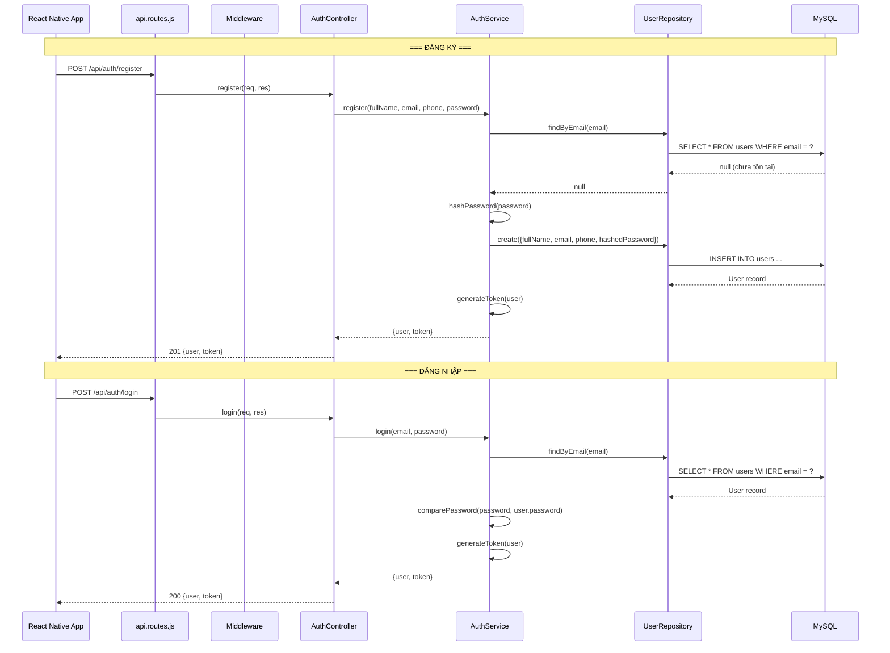
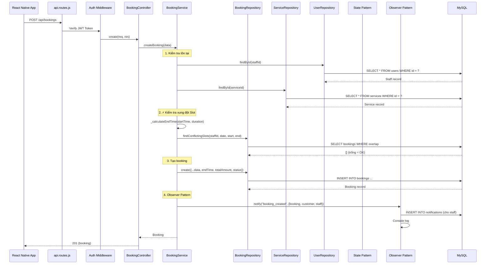
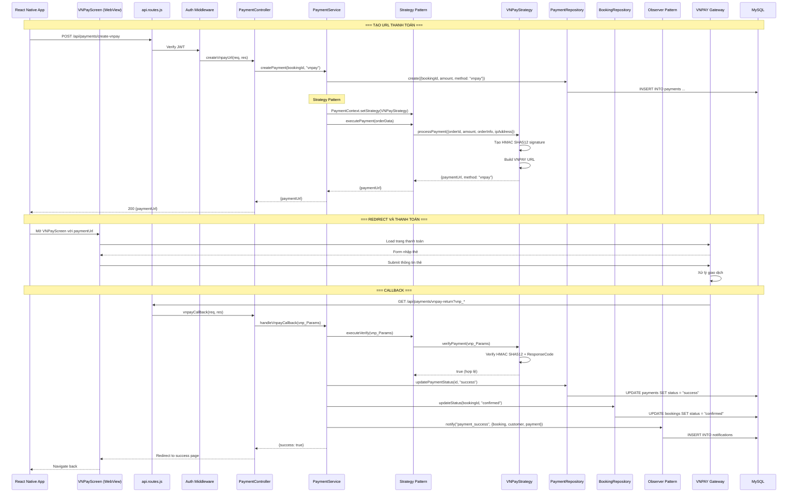
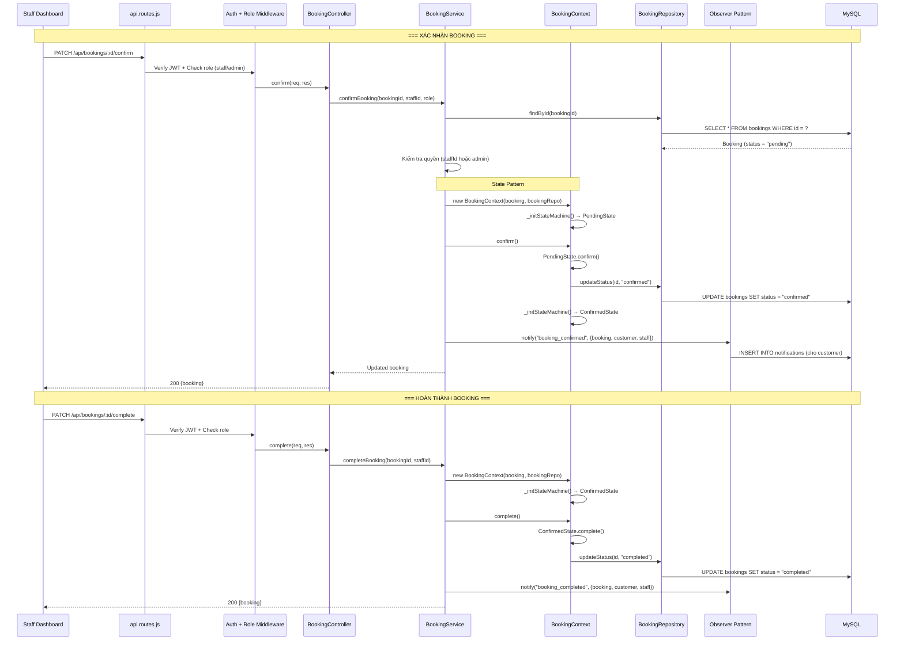
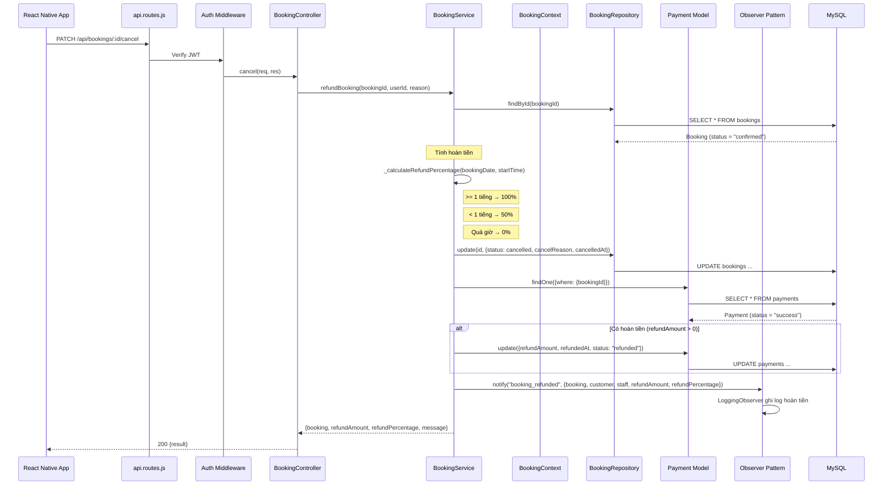
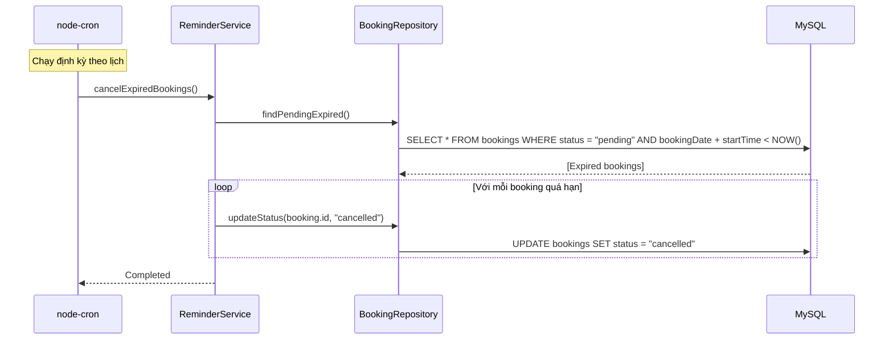

# 🔄 Sequence Diagrams — BookingPro

## 1. Luồng Đăng ký & Đăng nhập

---

## 2. Luồng Đặt lịch hẹn ⭐ (UC05)

---

## 3. Luồng Thanh toán VNPAY (UC06 + Strategy Pattern)

---

## 4. Luồng Xác nhận & Hoàn thành Booking (UC11, UC12 + State Pattern)

---

## 5. Luồng Hủy lịch & Hoàn tiền (UC08)

---

## 6. Luồng Cron Job — Tự động hủy booking quá hạn (UC20)

