# 📋 Use Case Diagram — BookingPro

## 1. Sơ đồ Use Case tổng thể

```mermaid
graph TB
    subgraph "Hệ thống BookingPro"

        UC1["UC01: Đăng ký tài khoản"]
        UC2["UC02: Đăng nhập"]
        UC3["UC03: Xem danh sách dịch vụ"]
        UC4["UC04: Xem chi tiết dịch vụ"]
        UC5["UC05: Đặt lịch hẹn"]
        UC6["UC06: Thanh toán"]
        UC7["UC07: Xem lịch sử đặt lịch"]
        UC8["UC08: Hủy lịch hẹn"]
        UC9["UC09: Xem thông báo"]

        UC10["UC10: Xem lịch làm việc"]
        UC11["UC11: Xác nhận booking"]
        UC12["UC12: Hoàn thành booking"]

        UC13["UC13: Quản lý danh mục dịch vụ"]
        UC14["UC14: Quản lý dịch vụ (CRUD)"]
        UC15["UC15: Quản lý nhân viên"]
        UC16["UC16: Quản lý lịch nhân viên"]
        UC17["UC17: Xem báo cáo doanh thu"]

        UC18["UC18: Xử lý thanh toán online"]
        UC19["UC19: Callback xác nhận"]

        UC20["UC20: Tự động hủy booking quá hạn"]
    end

    Customer["👤 Khách hàng"]
    Staff["👨‍💼 Nhân viên"]
    Admin["👑 Quản trị viên"]
    VNPAY["🏦 VNPAY Gateway"]
    CRON["⏰ Hệ thống Cron Job"]

    Customer --> UC1
    Customer --> UC2
    Customer --> UC3
    Customer --> UC4
    Customer --> UC5
    Customer --> UC6
    Customer --> UC7
    Customer --> UC8
    Customer --> UC9

    Staff --> UC2
    Staff --> UC10
    Staff --> UC11
    Staff --> UC12
    Staff --> UC9

    Admin --> UC2
    Admin --> UC13
    Admin --> UC14
    Admin --> UC15
    Admin --> UC16
    Admin --> UC17

    UC6 --> VNPAY
    VNPAY --> UC18
    VNPAY --> UC19

    CRON --> UC20
```



---

## 2. Mô tả chi tiết Use Cases

### UC01: Đăng ký tài khoản

| Mục | Nội dung |
|-----|---------|
| **Actor** | Khách hàng |
| **Mô tả** | Khách hàng tạo tài khoản mới |
| **Tiền điều kiện** | Chưa có tài khoản |
| **Hậu điều kiện** | Tài khoản được tạo, có thể đăng nhập |
| **Luồng chính** | 1. Nhập họ tên, email, SĐT, mật khẩu → 2. Validate → 3. Tạo tài khoản → 4. Trả về token |
| **Luồng ngoại lệ** | Email đã tồn tại → Báo lỗi |

### UC02: Đăng nhập

| Mục | Nội dung |
|-----|---------|
| **Actor** | Khách hàng, Nhân viên, Admin |
| **Mô tả** | Người dùng đăng nhập vào hệ thống |
| **Tiền điều kiện** | Đã có tài khoản |
| **Hậu điều kiện** | Nhận JWT token, truy cập chức năng theo role |
| **Luồng chính** | 1. Nhập email + mật khẩu → 2. Xác thực → 3. Trả token + user info |
| **Luồng ngoại lệ** | Sai mật khẩu → Báo lỗi; Tài khoản bị khóa → Báo lỗi |

### UC03: Xem danh sách dịch vụ

| Mục | Nội dung |
|-----|---------|
| **Actor** | Khách hàng |
| **Mô tả** | Xem danh sách dịch vụ, lọc theo danh mục |
| **Tiền điều kiện** | Đã đăng nhập |
| **Hậu điều kiện** | Hiển thị danh sách dịch vụ phân theo danh mục |
| **Luồng chính** | 1. Mở HomeScreen → 2. Hệ thống tải danh mục + dịch vụ → 3. Hiển thị theo danh mục |

### UC05: Đặt lịch hẹn ⭐ (Use Case quan trọng nhất)

| Mục | Nội dung |
|-----|---------|
| **Actor** | Khách hàng |
| **Mô tả** | Khách hàng chọn dịch vụ, nhân viên, thời gian và đặt lịch |
| **Tiền điều kiện** | Đã đăng nhập, có dịch vụ khả dụng |
| **Hậu điều kiện** | Booking được tạo (status = pending), thông báo gửi đến staff |

**Luồng chi tiết:**
```
1. Khách chọn dịch vụ từ danh sách
2. Hệ thống hiển thị nhân viên có thể phục vụ dịch vụ này
   (dựa vào staff_schedules, lọc theo ngày được chọn)
3. Khách chọn nhân viên
4. Khách chọn ngày hẹn
5. Hệ thống hiển thị các slot thời gian còn trống
6. Khách chọn slot thời gian
7. Hệ thống kiểm tra xung đột slot (⚡ Algorithm)
   7a. Nếu có xung đột → Báo "Slot đã được đặt" → Quay lại bước 5
8. Khách nhập ghi chú (tùy chọn)
9. Khách xác nhận đặt lịch
10. Hệ thống tạo booking (status = pending)
11. Observer Pattern: Gửi thông báo cho nhân viên
12. Chuyển sang UC06 (Thanh toán)
```

### UC06: Thanh toán

| Mục | Nội dung |
|-----|---------|
| **Actor** | Khách hàng, VNPAY |
| **Mô tả** | Khách thanh toán cho booking |
| **Tiền điều kiện** | Booking đã được tạo (pending) |
| **Hậu điều kiện** | Payment record được tạo |

**Luồng chi tiết:**
```
1. Khách chọn phương thức thanh toán (VNPAY/COD)
2. Strategy Pattern: Hệ thống chọn strategy phù hợp

   [Nhánh VNPAY]
   3a. VNPayStrategy tạo URL thanh toán
   4a. Mở WebView (VNPayScreen) hiển thị trang VNPAY
   5a. Khách nhập thông tin thẻ và xác nhận
   6a. VNPAY xử lý giao dịch
   7a. VNPAY callback về hệ thống
   8a. Hệ thống verify HMAC SHA512 signature
   9a. Cập nhật payment status = success
   10a. State Pattern: booking chuyển sang confirmed

   [Nhánh COD]
   3b. CODStrategy tạo payment record (status = pending)
   4b. Nhân viên xác nhận nhận tiền khi hoàn thành dịch vụ

3. Observer Pattern: Gửi thông báo thanh toán thành công
```

### UC08: Hủy lịch hẹn

| Mục | Nội dung |
|-----|---------|
| **Actor** | Khách hàng |
| **Mô tả** | Khách hủy lịch hẹn đã đặt |
| **Tiền điều kiện** | Booking ở trạng thái pending hoặc confirmed |
| **Hậu điều kiện** | Booking chuyển sang cancelled, xử lý hoàn tiền theo rule |

**Luồng chi tiết:**
```
1. Khách vào HistoryScreen, chọn booking cần hủy
2. Nhập lý do hủy
3. State Pattern: Kiểm tra chuyển trạng thái hợp lệ
   - pending → cancelled ✅
   - confirmed → cancelled ✅
   - completed → cancelled ❌ (báo lỗi)
   - cancelled → cancelled ❌ (báo lỗi)
4. Áp dụng Cancellation Rule Engine:
   - Hủy trước >= 1 tiếng → Hoàn 100%
   - Hủy trong vòng 1 tiếng → Hoàn 50%
   - Quá giờ hẹn → Không hoàn
5. Cập nhật booking status = cancelled
6. Xử lý hoàn tiền (nếu đã thanh toán VNPAY)
7. Observer Pattern: Gửi thông báo hủy cho cả khách và nhân viên
```

### UC11: Xác nhận booking

| Mục | Nội dung |
|-----|---------|
| **Actor** | Nhân viên |
| **Mô tả** | Nhân viên xác nhận lịch hẹn |
| **Tiền điều kiện** | Booking ở trạng thái pending, nhân viên là người được phân công hoặc admin |
| **Hậu điều kiện** | Booking chuyển sang confirmed |
| **Luồng chính** | 1. Staff vào StaffDashboard → 2. Xem danh sách booking pending → 3. Chọn booking → 4. State Pattern: pending → confirmed → 5. Observer: Thông báo cho khách |

### UC12: Hoàn thành booking

| Mục | Nội dung |
|-----|---------|
| **Actor** | Nhân viên |
| **Mô tả** | Nhân viên đánh dấu dịch vụ đã hoàn thành |
| **Tiền điều kiện** | Booking ở trạng thái confirmed |
| **Hậu điều kiện** | Booking chuyển sang completed |
| **Luồng chính** | 1. Sau khi phục vụ xong → 2. Staff chọn "Hoàn thành" → 3. State Pattern: confirmed → completed → 4. Observer: Thông báo cho khách |

### UC13: Quản lý danh mục dịch vụ

| Mục | Nội dung |
|-----|---------|
| **Actor** | Quản trị viên |
| **Mô tả** | Admin CRUD danh mục để phân loại dịch vụ |
| **Tiền điều kiện** | Đã đăng nhập với role admin |
| **Hậu điều kiện** | Danh mục được tạo/sửa/xóa |
| **Luồng chính** | 1. Mở ManageCategoriesScreen → 2. Thêm/Sửa/Xóa danh mục → 3. Hệ thống cập nhật |

### UC14: Quản lý dịch vụ

| Mục | Nội dung |
|-----|---------|
| **Actor** | Quản trị viên |
| **Mô tả** | Admin CRUD dịch vụ, gắn vào danh mục |
| **Tiền điều kiện** | Đã đăng nhập với role admin |
| **Hậu điều kiện** | Dịch vụ được tạo/sửa/xóa |
| **Luồng chính** | 1. Mở ManageServicesScreen → 2. Thêm/Sửa/Xóa dịch vụ (tên, giá, thời lượng, danh mục) → 3. Hệ thống cập nhật |

### UC15: Quản lý nhân viên

| Mục | Nội dung |
|-----|---------|
| **Actor** | Quản trị viên |
| **Mô tả** | Admin quản lý danh sách nhân viên |
| **Tiền điều kiện** | Đã đăng nhập với role admin |
| **Hậu điều kiện** | Nhân viên được thêm/sửa/vô hiệu hóa |
| **Luồng chính** | 1. Mở ManageStaffScreen → 2. Xem/Thêm/Sửa nhân viên → 3. Hệ thống cập nhật |

### UC16: Quản lý lịch nhân viên

| Mục | Nội dung |
|-----|---------|
| **Actor** | Quản trị viên |
| **Mô tả** | Admin phân bổ lịch làm việc cho nhân viên theo dịch vụ và ngày trong tuần |
| **Tiền điều kiện** | Đã đăng nhập với role admin, có nhân viên và dịch vụ |
| **Hậu điều kiện** | Lịch làm việc được tạo/cập nhật |
| **Luồng chính** | 1. Chọn nhân viên → 2. Chọn dịch vụ + ngày + giờ → 3. Tạo lịch làm việc |

### UC17: Xem báo cáo doanh thu

| Mục | Nội dung |
|-----|---------|
| **Actor** | Quản trị viên |
| **Mô tả** | Admin xem thống kê doanh thu theo thời gian |
| **Tiền điều kiện** | Đã đăng nhập với role admin |
| **Hậu điều kiện** | Hiển thị báo cáo |
| **Luồng chính** | 1. Mở RevenueScreen → 2. Chọn khoảng thời gian → 3. Hệ thống tính tổng doanh thu từ payments (status = success) → 4. Hiển thị theo ngày/tuần/tháng |

### UC20: Tự động hủy booking quá hạn

| Mục | Nội dung |
|-----|---------|
| **Actor** | Hệ thống (Cron Job) |
| **Mô tả** | Hệ thống tự động hủy các booking pending đã quá thời gian hẹn |
| **Tiền điều kiện** | Booking ở trạng thái pending, đã qua ngày/giờ hẹn |
| **Hậu điều kiện** | Booking chuyển sang cancelled |
| **Luồng chính** | 1. Cron job chạy định kỳ (ReminderService) → 2. Tìm booking pending quá hạn → 3. State Pattern: pending → cancelled → 4. Observer: Gửi thông báo |

---

## 3. Ma trận Actor — Use Case

| Use Case | Customer | Staff | Admin | VNPAY | Cron |
|----------|----------|-------|-------|-------|------|
| UC01: Đăng ký | ✅ | | | | |
| UC02: Đăng nhập | ✅ | ✅ | ✅ | | |
| UC03: Xem dịch vụ | ✅ | | | | |
| UC04: Chi tiết dịch vụ | ✅ | | | | |
| UC05: Đặt lịch | ✅ | | | | |
| UC06: Thanh toán | ✅ | | | ✅ | |
| UC07: Lịch sử | ✅ | | | | |
| UC08: Hủy lịch | ✅ | | | | |
| UC09: Thông báo | ✅ | ✅ | | | |
| UC10: Lịch làm việc | | ✅ | | | |
| UC11: Xác nhận booking | | ✅ | | | |
| UC12: Hoàn thành booking | | ✅ | | | |
| UC13: Quản lý danh mục | | | ✅ | | |
| UC14: Quản lý dịch vụ | | | ✅ | | |
| UC15: Quản lý nhân viên | | | ✅ | | |
| UC16: Quản lý lịch NV | | | ✅ | | |
| UC17: Báo cáo doanh thu | | | ✅ | | |
| UC20: Auto hủy booking | | | | | ✅ |
